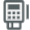
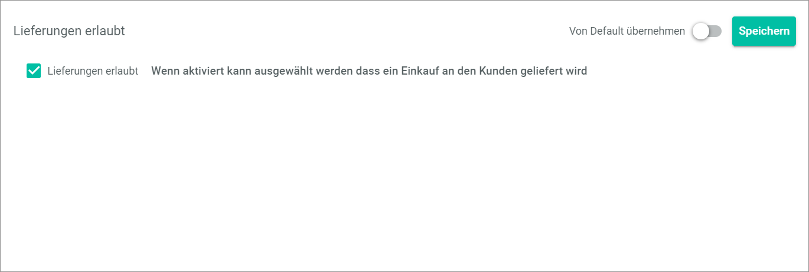
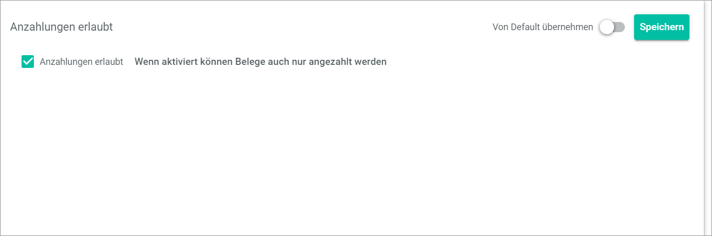

[!!Configure the global settings for POS](../Integration/05_ConfigureGlobalSettings.md)

# Global settings

*POS > Management > Tab GLOBAL SETTINGS*

In the *GLOBAL SETTINGS* tab, you define basic settings for all your stores.

> [Info] Global settings are valid for all stores as long as no different settings are defined for the respective stores or pay desks.

In principle, the more specific setting always overrides the more general setting.

In the left part of the page, the selection list *Settings* is displayed. The list is divided in the following sections:
- [GENERAL](#general)
- [CURRENCIES](#währungen)
- [RETURNS](#retouren)
- [RECSEIPT PRINT](#belegdruck)
- [DATENÜBERTRAGUNG RETAILSUITE FAKTURA](#datenübertragung-retailsuite-faktura)

In the right part of the page, a view of the selected setting is displayed when clicking on it.

In the following, each setting and its view is explained.

[comment]: <> (no section name for the first section -> Pay Desk and Payments?)

## GENERAL

In this section, you define all pay desk and payment settings.

### Format laufende Nummer

*POSgement > Tab GLOBAL SETTINGS > Entry Format laufende Nummer*

Configure the details of the POS specific cash receipt number. The cash receipt number is independent of the receipt number in the *Order management* module and is therefore selected from a different number range to be defined here.

- *Apply from default*    
    Activate this toggle to apply the default settings or disable this toggle to specify custom settings. When the toggle is enabled, all fields in the view are locked. By default, this toggle is enabled.

- [Speichern]    
    Click this button to save any changes.

- *Format*   
    Define the format of the sequential number. It is mandatory to include the store identifier (S) and the sequential number (L). The place holders are indicated on the right side.

- *Length of the sequential number*   
    Define the length of the sequential number.
    
  [comment]: <> (Is it the maximum length of the number or the exact length?)

- [x] *Reset after time interval*   
    Choose whether or not to reset the sequential number after the time interval.

[comment]: <> (What does it mean?)

### Bon immer ausdrucken

*POS > Management > Tab GLOBAL SETTINGS > Entry Bon immer ausdrucken*

Activate or disable the option to print the cash receipt.

- *Apply from default*      
    Activate this toggle to apply the default settings or disable this toggle to specify custom settings. When the toggle is enabled, all fields in the view are locked. By default, this toggle is enabled.

- [Speichern]   
    Click this button to save any changes.

- [x] *Bon immer ausdrucken*   
    Choose whether or not to print the cash receipt for each transaction. If the receipt printing is deactivated, you can still initiate the receipt printing manually via the order history.

    > [Info] Remember that receipt printing is mandatory in several countries. Please inform yourself about the country-specific regulations before you disable this option.

### Anzahl Gutscheine pro Bestellung

*POS > Management > Tab GLOBAL SETTINGS > Entry Anzahl Gutscheine pro Bestellung*

Define how many vouchers may be redeemed per order.

- *Apply from default*      
    Activate this toggle to apply the default settings or disable this toggle to specify custom settings. When the toggle is enabled, all fields in the view are locked. By default, this toggle is enabled.

- [Speichern]    
    Click this button to save any changes.

- *Anzahl Gutscheine pro Bestellung*   
    Enter the number of vouchers that can be redeemed per order. By default, one voucher per order is set.

- *Apply from default*      
    Activate this toggle to apply the default settings or disable this toggle to specify custom settings. When the toggle is enabled, all fields in the view are locked. By default, this toggle is enabled.

- [Speichern]    
    Click this button to save any changes.

### Zahlungsweisen (manuelle Zahlung Terminal)

*POS > Management > Tab GLOBAL SETTINGS > Entry Zahlungsweisen (manuelle Zahlung Terminal)*

If you use an external terminal that is not connected to POS, cashless payment is completed manually through that terminal.
In POS, you can specify for statistical purposes which payment method was used for the cashless payment. You define the different payment methods in this setting.

> [Info] By default, the payments methods *debit card*, *credit card* and *PayPal* are preset.

- [Speichern]   
    Click this button to save any changes.

- *Key*   
    Enter the key of the payment method. The following keys are available:

[comment]: <> (list of keys is needed)

- *Name*   
    Enter the name of the payment method.

-  (Delete)    
    Click this button to delete the payment method left to the button.

-  (Add)    
    Click this button to add a new payment method. A new line for a payment method is displayed.

### Automatischer Discount

*POS > Management > Tab GLOBAL SETTINGS > Entry Automatischer Discount*

Define a discount that is automatically applied above a certain amount.

- *Apply from default*      
    Activate this toggle to apply the default settings or disable this toggle to specify custom settings. When the toggle is enabled, all fields in the view are locked. By default, this toggle is enabled.

- [Speichern]    
    Click this button to save any changes.

- *ab Betrag*   
    Enter the amount from which the discount is granted.

- *Discount in %*   
    Enter the amount of the discount in percent.

    > [Info] If you leave the fields blank, no automatic discount will be granted.

-  (Delete)   
    Click this button to delete the discount left to the button.

-  (Add)  
    Click this button to add a new discount. A new line for a discount is displayed.

### Kasse öffnen bei Barzahlung

*POS > Management > Tab GLOBAL SETTINGS > Entry Kasse öffnen bei Barzahlung*

Activate or deactivate the option to open the cash drawer for cash payment.

- *Apply from default*      
    Activate this toggle to apply the default settings or disable this toggle to specify custom settings. When the toggle is enabled, all fields in the view are locked. By default, this toggle is enabled.

- [Speichern]   
    Click this button to save any changes.

- [x] *Kassenschublade öffnen bei Barzahlung*   
    Choose whether or not to open the cash drawer for cash payment. By default, this option is active.

### Kasse öffnen nach bargeldlosem Zahlen

*POS > Management > Tab GLOBAL SETTINGS > Entry Kasse öffnen nach bargeldlosem Zahlen*

Enable or disable the option to open the cash drawer for cashless payment.

- *Apply from default*      
    Activate this toggle to apply the default settings or disable this toggle to specify custom settings. When the toggle is enabled, all fields in the view are locked. By default, this toggle is enabled.

- [Speichern]   
    Click this button to save any changes.

- [x] *Kasse öffnen*    
    Choose whether or not to open the cash drawer for cashless payment. By default, this option is enabled.

## USt-ID

*POS > Management > Tab GLOBAL SETTINGS > Entry USt-ID*

Define the VAT ID, which is mandatory to be indicated on receipts in some countries.

- [Speichern]    
    Click this button to save any changes.

- *USt-ID*   
    Enter your VAT ID. By default, The VAT-ID is printed on your receipts.

### Bargeldloses Zahlen

*POS > Management > Tab GLOBAL SETTINGS > Entry Bargeldloses Zahlen*

  

Activate or deactivate the options for cashless payment.

- *Apply from default*      
    Enable this toggle to apply the default settings or disable this toggle to specify custom settings. When the toggle is enabled, all fields in the view are locked. By default, this toggle is enabled.

- [Speichern]   
    Click this button to save any changes.

- [x]  *Refund auf Gutschein (refund only)*   
    Choose whether or not to refund cashless payments only on vouchers. By default, this option is inactive.

- [x]  *Manuelles Zahlen am Terminal*   
    Choose whether or not to allow cashless payments via manual payment at the terminal. If you use an external terminal that is not connected to POS, you need to enable that option. By default, this option is inactive.

### Kassenjournal auf User binden

*POS > Management > Tab GLOBAL SETTINGS > Entry Kassenjournal auf User binden*

When a pay desk is opened, it is linked to a specific user. This user is the only one who can use the pay desk until he closes it again. To allow that several users can access the same pay desk without closing it, you can deactivate the option to link the cash register to a specific user.

- *Apply from default*      
    Activate this toggle to apply the default settings or disable this toggle to specify custom settings. When the toggle is enabled, all fields in the view are locked. By default, this toggle is enabled.

- [Speichern]    
    Click this button to save any changes.

- [x] *Kassenbuch auf User gebunden*   
    Choose whether or not to link the cash register to a special user. By default, this option is active.

    > [Info] Remember that even if you deactivate this option, a user must log out to allow another user to access the pay desk.

### Skim to amount

*POS > Management > Tab GLOBAL SETTINGS > Entry Skim to amount*

Define an amount up to which the pay desk is skimmed after the pay desk closes. The amount is automatically entered in the cash register and taken as the opening float.

- [Save]  
    Click this button to save any changes.

- *Skim to amont*    
    Enter the amount up to which the pay desk is skimmed after the pay desk closing.

### Erwarteten Betrag verbergen

*POS > Management > Tab GLOBAL SETTINGS > Entry Erwarteten Betrag verbergen*

By default, the expected amount in the pay desk is indicated. Deactivate this option to hide the expected amount from the cashier in order to prevent the concealment of shortfalls.

- *Apply from default*      
    Enable this toggle to apply the default settings or disable this toggle to specify custom settings. When the toggle is enabled, all fields in the view are locked. By default, this toggle is enabled.

- [Speichern]    
    Click this button to save any changes.

- [x] *Erwarteten Betrag verbergen*   
    Choose whether or not to hide the expected amount in the pay desk from the cashier. By default, this option is inactive.

### Display age verification

<!---Check position in settings, when current sandbox is available-->

*POS > Management > Tab GLOBAL SETTINGS > Entry Display age verification*

By default, offers with an age rating can only be added to the basket if the cashier confirms an age verification.

- *Apply from default*   
    Enable this toggle to apply the default settings or disable this toggle to specify custom settings. When the toggle is enabled, all fields in the view are locked. By default, this toggle is enabled.   

- [SAVE]   
    Click this button to save any changes

- *Mode*   
   Click this drop-down list to select if and when to display the *Age verification* pop-up window when selecting an offer with age rating. For detailed information, see [Verify age](../Operation/02_SelectOffer.md#verify-the-age). The following settings are available:

   - **Always**    
    The cashier is always asked when an offer with an age verification necessary is added to the basket.

   - **Never**   
    The cashier is never asked for confirmation in case an offer with an age verification necessary is added to the basket.

   - **Once**   
    The cashier is asked once per order in case an offer with an age rating is added to the basket. If an offer with a lower age rating is added later, the cashier will be asked again.  
    This setting is the default.

### Deliveries allowed
<!---Check position in settings, when current sandbox is available-->

*POS > Management > Tab GLOBAL SETTINGS > Entry Deliveries allowed*

By default, sales are not delivered to the customer.

- *Apply from default*   
    Enable this toggle to apply the default settings or disable this toggle to specify custom settings. When the toggle is enabled, all fields in the view are locked. By default, this toggle is enabled.   

- [SAVE]   
    Click this button to save any changes

- *Deliveries allowed*   
    Activate this setting if you deliver sales to customers. If you activate this setting, the  *Delivery* toggle is available in the *Pay bill* list. By default, this setting is not activated.   
    Do not forget to adjust your order workflow accordingly, so that a delivery note is created in case the toggle is enabled.<!---stimmt das?--> 

### Down payments allowed
<!---Check position in settings, when current sandbox is available-->
*POS > Management > Tab GLOBAL SETTINGS > Down payments allowed*

By default, down payments are not allowed.

- *Apply from default*   
    Enable this toggle to apply the default settings or disable this toggle to specify custom settings. When the toggle is enabled, all fields in the view are locked. 

- [SAVE]   
    Click this button to save any changes

- *Down payments allowed*
    Activate this setting if it is allowed to down pay sales. By default, this setting is not activated. If you activate this setting, the *Down payment* section with the [+ ADD DOWN PAYMENT] button is displayed in the *Pay bill* list.
    <!---Muss man hier dafür sorgen, dass ein bestimmtes Konto gefüllt wird im Accounting bei Anzahlungen? Oder muss man den Workflow anpassen?-->

### Remind of offers
<!---Check position in settings, when current sandbox is available-->

*POS > Management > Tab GLOBAL SETTINGS > Entry Remind of offers*

- *Apply from default*   
    Enable this toggle to apply the default settings or disable this toggle to specify custom settings. When the toggle is enabled, all fields in the view are locked. By default, this toggle is enabled.   

- [SAVE]   
    Click this button to save any changes

### Customer-specific discount
<!---Check position in settings, when current sandbox is available-->

<!---Screenshot missing-->

## Currencies

In this section, you define all settings concerning the currencies in your POS system.

### Available currencies

*POS > Management > Tab GLOBAL SETTINGS > Entry Available Currencies*

Define the currencies that are available in your POS system as well as the coins and bills that exist in each currency. By default, the four currencies Euro, Swiss Franc, US Dollar and British Pound are predefined.

[comment]: <> (is that right?)

**Available Currencies**

-  Columns (x)   
    Click this button to display the column editing bar and customize the displayed columns and the order of columns in the table. The *x* indicates the number of columns that are currently displayed in the table.

- [x]     
    Select the checkbox to display the editing toolbar and to edit or delete the selected currency.

- [EDIT]   
    Click this button to edit the selected currency. The [*Edit currency*](#edit-currency) view is displayed. This button is displayed only if a currency checkbox is selected.

- [DELETE]   
    Click this button to delete the selected currency. This button is displayed only if a currency checkbox is selected.

The table displays all available currencies. All fields are read-only. Depending on the settings, the displayed columns may vary.

- *Name*  
    Name or abbreviation of the currency.

- *Abkürzung*    
    Symbol of the currency.

- *Münzen*   
    Available coins (values) of the currency.

- *Scheine*   
    Available bills (values) of the currency.

-  (Add)   
    Click this button to add a new currency to the list of currencies. The [*Create currency*](#create-currency) view is displayed where you have to define the currency settings.

- [SAVE]  
    Click this button to save any changes.

### Create currency

*POS > Management > Tab GLOBAL SETTINGS > Entry Available Currencies > Button Add*

Add a new currency to the list of available currencies and define the coins and notes of the new currency.

**DESCRIPTION**
- *Name*   
    Enter the name of the new currency.

- *Symbol*   
    Enter the symbol of the new currency.

**COINS AND NOTES**

-  (Banknote)   
    The banknote icon indicates which banknotes are defined for the respective currency. The number in the middle indicates the amount of the banknote.  
    When you hover over a banknote icon, the button  (Delete) is displayed in the upper right corner of the banknote. Click the button  (Delete) to delete the banknote.
    The banknote icon is displayed only if a banknote is defined for the currency.

-  (Coin)   
    The coin icon indicates which coins are defined for the respective currency. The number in the middle indicates the amount of the coin.   
    When you hover over a coin icon, the button  (Delete) is displayed in the upper right corner of the coin. Click the button  (Delete) to delete the coin.
    The coin icon is displayed only if a coin is defined for the currency.

- *Betrag*   
    Enter the amount of the banknote or the coin.

- *Note*   
    Click the drop-down list to select if the entered amount refers to a banknote or a coin.

-  (Add)    
    Click this button to add the specified banknote or coin to the currency.

- [CANCEL]   
    Click this button to cancel the creation of a new currency. The view *Available Currencies* is displayed again.

- [SAVE]   
    Click this button to save the new currency and add it to the list of currencies. The view *Available Currencies* is displayed again.

### Edit currency

*POS > Management > Tab GLOBAL SETTINGS > Entry Available Currencies > Button Edit*

Edit the settings of an existing currency.

**DESCRIPTION**
- *Name*   
    Enter the name of the currency.

- *Symbol*   
    Enter the symbol of the currency.

**COINS AND NOTES**

-  (Banknote)   
    The banknote icon indicates which banknotes are defined for the respective currency. The number in the middle indicates the amount of the banknote.   
    When you hover over a banknote icon, the button  (Delete) is displayed in the upper right corner of the banknote. Click the button  (Delete) to delete the banknote.
    The banknote icon is displayed only if a banknote is defined for the currency.

-  (Coin)   
    The coin icon indicates which coins are defined for the respective currency. The number in the middle indicates the amount of the coin.   
    When you hover over a coin icon, the button  (Delete) is displayed in the upper right corner of the coin. Click the button  (Delete) to delete the coin.
    The coin icon is displayed only if a coin is defined for the currency.

- *Betrag*   
    Enter the amount of the banknote or the coin.

- *Note*   
    Click the drop-down list to select if the entered amount refers to a banknote or a coin.

-  (Add)   
    Click this button to add the specified banknote or coin to the currency.

- [CANCEL]   
    Click this button to discard the changes to the currency. The view *Available Currencies* is displayed again.

- [SAVE]   
    Click this button to save all changes. The view *Available Currencies* is displayed again.

### Verwendete Währungen

*POS > Management > Tab GLOBAL SETTINGS > Entry Verwendete Währungen*

Select all currencies that are used in your POS system and define a default currency.

- *Apply from default*      
    Enable this toggle to apply the default settings or disable this toggle to specify custom settings. When the toggle is enabled, all fields in the view are locked. By default, this toggle is enabled.

- [Speichern]    
    Click this button to save any changes.

- [x] *Currency Name*   
    Choose whether or not to use this currency in your POS system.

- *Standard*   
    Click the drop-down list to select the currency that is used as default currency. All available currencies are displayed in the drop-down list. When you select a default currency that is not yet selected as used currency, that currency is automatically selected as used currency.

## RETOUREN

In this section, you define all settings concerning returns.

### Retouren-Gründe

*POS > Management > Tab GLOBAL SETTINGS > Entry Retouren-Gründe*

Define the return reasons that are available in the POS system.

- [Speichern]    
    Click this button to save any changes.

- *Schlüssel*   
    Enter the return reason key. The following keys are available:

- *Wert*   
    Enter a value for the return reason. The value is displayed when returning an order.

-  (Delete)   
    Click this button to delete the return reason left to the button.

-  (Add)   
    Click this button to add a return reason. A new line for a return reason is displayed.

### Refund nur auf gleiches Zahlungsmittel

*POS > Management > Tab GLOBAL SETTINGS > Entry Refund nur auf gleiches Zahlungsmittel*

Activate or deavate the refund to the same payment method for returns.

- *Apply from default*      
    Enable this toggle to apply the default settings or disable this toggle to specify custom settings. When the toggle is enabled, all fields in the view are locked. By default, this toggle is enabled.

- [Speichern]    
    Click this button to save any changes.

- [x] *nur auf gleiches Zahlungsmittel*   
    Choose whether or not a refund for a return can only be made to the same payment method. By default, this option is enabled.

### Retoure nur in gleichem Store

*POS > Management > Tab GLOBAL SETTINGS > Entry Retoure nur in gleichem Store*

Activate or deactivate the return to the same store.

- *Apply from default*      
    Enable this toggle to apply the default settings or disable this toggle to specify custom settings. When the toggle is enabled, all fields in the view are locked. By default, this toggle is enabled.

- [Speichern]    
    Click this button to save any changes.

- [x] *Retoure nur in gleichem Store*   
    Choose whether or not a return can only be made in the same store. By default, this option is inactive.

## BELEGDRUCK

In this section, you define all settings concerning the receipt printing.

###Händler-Beleg drucken

*POS > Management > Tab GLOBAL SETTINGS > Entry Händler-Beleg drucken*

- *Apply from default*       
    Enable this toggle to apply the default settings or disable this toggle to specify custom settings. When the toggle is enabled, all fields in the view are locked. By default, this toggle is enabled.

- [Speichern]    
    Click this button to save any changes.

Activate or deactivate the printing of a merchant receipt for cashless payment.

- [x] *Händler-Beleg drucken*   
    Choose whether or not to print a merchant receipt in addition to the customer receipt for cashless payments. By default, this option is enabled.

### Logo-Druck Kompatibilitätsmodus

*POS > Management > Tab GLOBAL SETTINGS > Entry Logo-Druck Kompatibilitätsmodus*

Activate or deactivate the compatibility mode for logo printing. As some receipt printer have issues with printing logos, it may help to activate this option.

- *Apply from default*      
    Enable this toggle to apply the default settings or disable this toggle to specify custom settings. When the toggle is enabled, all fields in the view are locked. By default, this toggle is enabled.

- [Speichern]   
    Click this button to save any changes.

- [x] *Logo-Druck Kompatibilitätsmodus*   
    Choose whether or not to use the compatibility mode for logo printing. By default, this option is inactive.

### Bon-Format
*POS > Management > Tab GLOBAL SETTINGS > Entry Bon-Format*

Define the width of the receipt, as it may vary depending on the printer.

- *Apply from default*      
    Enable this toggle to apply the default settings or disable this toggle to specify custom settings. When the toggle is enabled, all fields in the view are locked. By default, this toggle is enabled.

- [Speichern]    
    Click this button to save any changes.

- *Breite in Zeichen*   
    Define the width of the receipt in characters. This size is needed to calculate the width for the text.

    > [Info] Monospaced fonts are used for receipt printing. This means that each character has the same width.

- *Breite in Pixel*   
    Define the width of the receipt in pixels. This size is needed to calculate the width for images, for instance logos.

### Zahlenformat

*POS > Management > Tab GLOBAL SETTINGS > Entry Zahlenformat*

Define the number format on the receipt.

- *Apply from default*      
    Enable this toggle to apply the default settings or disable this toggle to specify custom settings. When the toggle is enabled, all fields in the view are locked. By default, this toggle is enabled.

- [Speichern]    
    Click this button to save any changes.

- *Decimal separator*   
    Enter the decimal separator for the numbers on your receipt. You can use any separator including a blank space. This field is mandatory.

- *Thousand separator*   
    Enter the thousand separator for the numbers on your receipt. You can use any separator including a blank space.

- *Precision*   
    Enter the number of decimal places for the numbers on your receipt or use the arrow buttons in the field to increase or decrease the number of decimal places. You can select a number between 0 and 4. This field is mandatory.

    > [Info] The sample view below the input fields displays a live preview of the number with the selected separators and decimal places.

### Logo

*POS > Management > Tab GLOBAL SETTINGS > Entry Logo*

Upload a logo for your receipts.

> [Info] The PNG format is the only image format supported for logo images. So make sure that your image logo is also saved in the PNG format before uploading it.

- [Speichern]   
    Click this button to save any changes.

- [SELECT FILE]   
    Click this button to select a logo image for your receipts. The explorer is displayed for image selection. The selected logo image is displayed in the preview box right from the button. Alternatively, you can select an image using drag & drop.

-  *Drop file here...*   
    Drag the logo image from your local folder and drop it in this dashed box to upload it. The background color of the box turns to blue when you can drop the image.  The selected logo image is displayed in the preview box right from the button. Alternatively, you can select an image using the button [SELECT FILE].

- Preview box   
    The preview box displays the uploaded logo image. If a logo image is already displayed and you upload a new one, the current logo image will be overwritten by the new logo image.
    Remove a displayed logo by clicking the button  (Remove) in the upper right corner of the logo.

## DATENÜBERTRAGUNG RETAILSUITE FAKTURA

In this section, you define all settings concerning the connection to the *Order management* module. The settings are only displayed if the accounting is correctly configured.

### Kontenzuteilung Buchhaltung

*POS > Management > Tab GLOBAL SETTINGS > Entry Kontenzuteilung Buchhaltung*

Assign the accounts to which you want to post the payments. The accounts are assigned for all stores, unless they are overwritten in the store or pay desk admin settings.
For more information, see [Admin Settings - Store](./02b_Stores.md#adminsettings-store) or [Admin Settings - Pay Desk](./02b_Stores.md#admin-settingspay-desk).

The number of accounts to be assigned depends on the number of available currencies.

- [Speichern]   
    Click this button to save any changes.

- *Type*   
    In this column, the account type is indicated. Six accounts are displayed per currency. The currency of the account is indicated in brackets after the account type name. The fields are display fields only. They cannot be changed.

    - *Bar*   
        This type of account serves as a cash account for cash payments.

    - *Redeem Voucher*    
        This type of account serves as --- add information ---

    - *Gegenkonto Cash-In*   
        This type of account serves as a clearing account against which cash deposits without customers are posted.

    - *Gegenkonto Cash-Out*   
        This type of account serves as a clearing account against which cash withdrawals without customers are posted.

    - *Refund auf Gutschein (refund only)*   
        This type of account serves as a refund account for refunds of cashless payments.

    - *Manuelles Zahlen am Terminal*   
        This type of account serves as a cash account for cashless payments.

- *Account*   
    Enter the account number for the corresponding account types. You can assign another account number for each account type.

### Korrekturbuchung auf Ursprungslager

*POS > Management > Tab GLOBAL SETTINGS > Entry Korrekturbuchung auf Ursprungslager*

Activate or deactivate the reverse posting to the original warehouse. Any discrepancies in store deliveries are automatically posted back to the original warehouse.   

- *Apply from default*      
    Enable this toggle to apply the default settings or disable this toggle to specify custom settings. When the toggle is enabled, all fields in the view are locked. By default, this toggle is enabled.

- [Speichern]   
    Click this button to save any changes.

- [x] *Korrekturbuchung auf Ursprungslager*    
    Choose whether or not to post discrepancies between the delivery receipt and the delivery are automatically posted back to the original warehouse. By default, this option is active.

    > [Info] This option is only applicable if store deliveries are activated.    
    For detailed information, see [Shop-Lieferungen aktiv](#shoplieferungen-aktiv).

### Retourenlager (Sperrlager)

*POS > Management > Tab GLOBAL SETTINGS > Entry Retourenlager (Sperrlager)*

[comment]: <> (need information; Is that right?)

Define a shelf in the quarantine warehouse for returns with defects

- [Speichern]   
    Click this button to save any changes.
- *Lager ID*   
    Enter the number of the quarantine warehouse.

[comment]: <> (Is shelf name right? Not number of the shelf?)

- *Fachname*   
    Enter the name of the shelf for the defect returns.

### Standard-Kunde

*POS > Management > Tab GLOBAL SETTINGS > Entry Standard-Kunde*

Define an invoice address for a default customer to connect the POS system with the *Order management* module. The invoice address of this default customer is used for all occasion customers.

- [Speichern]    
    Click this button to save any changes.

- *Title*   
    Enter the customer title.

- *First Name*   
    Enter the customer first name.

- *Last Name*   
    Enter the customer last name.

- *Company*   
    Enter the customer company name.

- *Email Name*   
    Enter the customer e-mail address.

- *Street*   
    Enter the street name of the customer address.

- *HouseNumber*   
    Enter the house number of the customer address.

- *ZIP*   
    Enter the ZIP code of the customer address.

- *City*   
    Enter the city name of the customer address.

[comment]: <> (Should the country field be mandatory and a drop-down list?)

- *Country*   
    Enter the country name of the customer address.

    > [Info] It is recommended to define at least the country of the customer address as it is needed for tax purposes.

### Shop-Lieferungen aktiv

*POS > Management > Tab GLOBAL SETTINGS > Entry Shop-Lieferungen aktiv*

Activate or deactivate the store deliveries. If the store deliveries are active, deliveries to the store can be entered and the POS inventory is automatically increased by the delivered products.

> [Info] Deliveries to the store can only be added if a delivery receipt for this delivery exists in the *Order management* module.

- [Speichern]    
    Click this button to save any changes.

- [x] *Shop-Lieferung aktiv*   
    Choose whether or not to activate deliveries from the store. By default, this option is inactive.   
    When the store deliveries are active, the three new tabs [*ABGESCHLOSSENE LIEFERSCHEINE*](./02e_ProcessedDeliveryNotes.md), [*OFFENE LIEFERSCHEINE*](./02f_UnprocessedDeliveryNotes.md) and  [*WARENEINGANGS-SYNC*](./02g_WareneingangsSync.md) are displayed in the menu entry *Management* and the new tab [*WARENEINGANG*](./01g_Wareneingang.md) is displayed in the menu entry *Sales*.

    > [Info] You have to save the changes and press **F5** to initialize the Core1 Platform and display the new tabs.

<!--- Gibt es diese Einstellung noch?

## Kundendaten aus RetailSuite übernehmen

*POS > Management > Tab GLOBAL SETTINGS > Entry Kundendaten aus RetailSuite übernehmen*

Enable or disable the application of customer data from RetailSuite.

- [x] *Kundendaten aus RetailSuite uebernehmen*   
    Choose whether or not to apply customer data from RetailSuite when receipts are linked to a customer. By default, this option is active.

- [Speichern]    
    Click this button to save any changes.
-->