[!!Create a store in POS](../Integration/06_CreateStore.md)
[!!Configure the warehouse for POS](../Integration/01_ConfigureWarehouse.md)
[!!Manage the cash register](../Operation/05_ManageCashRegister.md)
[!!Remove an inactive cashier from the pay desk](../Troubleshooting/03_RemoveInactiveCashier.md)

# Stores

*POS > Management > Tab STORES*

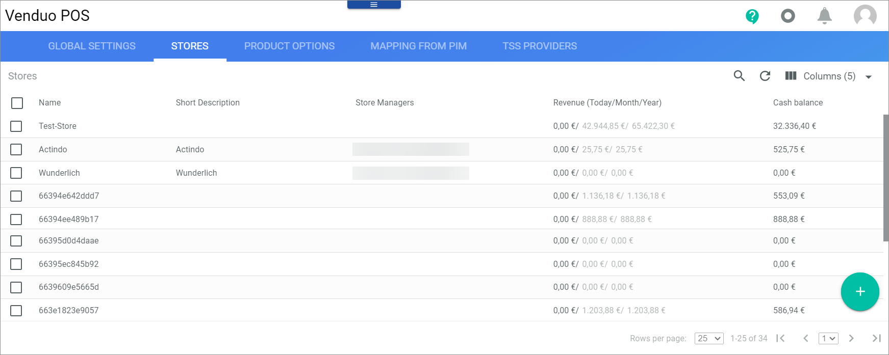

The table displays all created stores. All fields are read-only. Depending on the settings, the displayed columns may vary.

**Stores**

The following functions are available for the editing toolbar:

- [x]   
    Select the checkbox to display the editing toolbar.
  
-  (Edit)   
    Click this button to edit the selected store. This button is only displayed, when the checkbox of a store is selected. Alternatively, you can click directly a row in the table to edit a store.
<!---Neu-->
- [REBUILD CACHE]   
<!---To be enhanced-->

The following functions and fields are available in this view:

- *Name*  
    Name of the store.  

- *Short Description*  
    Short description of the store.  

- *Store Managers*   
    Managers that are assigned to the store.

- *Revenue (Today/Month/Year)*   
    Store revenue of the current day/the current month/the current year.

- *Cash Balance*   
    Current cash balance in the pay desk.

- *ID*   
    Store identification number.

-  (Add)   
    Click this button to create a new store. The two buttons [Create store via wizard (recommended)  ] and [Create Store ] are displayed.

## Create store

*POS > Management > Tab STORES > Click Add button*

- [Create store via wizard (recommended)  ]   
    Click this button to create a store via wizard.

- [Create Store  ]   
    Click this button to create a store manually.

-  (Cancel)   
    Click this button to cancel the store creation and exit the current view.

## Create store via wizard

*POS > Management > Tab STORES > Click the Add button > Click the Create store via wizard button*

### Step 1 - Create store

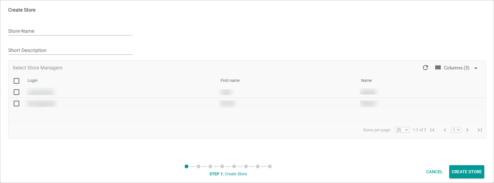

- *Store-Name*   
    Enter the store name.

- *Short description*   
    Enter a short description to the store.

**Select Store Managers**

The table displays all users who are assigned to the POS store manager group. You may select multiple users as store managers. All fields are read-only. Depending on the settings, the displayed columns may vary.

- [x]     
    Select the checkbox to select the user as store manager. If you click the checkbox in the header, all users are selected.

- *Login*   
    User name.

- *First Name*   
    First name of the user.

- *Name*   
    Last name of the user.

- *ID*   
    Identification number of the user.

- [CANCEL]   
    Click this button to cancel the store creation and close the wizard window.

- [CREATE STORE]   
    Click this button to create the store and proceed to the next step in the store wizard. The *Creating Store* window is displayed. When the store is created, the *Pay desks* wizard window is displayed.

### Step 2 - Pay desks

- *PayDesk1*   
    Enter the pay desk name.

-  (Delete)    
    Click this button to delete the pay desk left to the button. The first pay desk cannot be deleted.

-  (Add)    
    Click this button to add a new pay desk. A new line for a pay desk is displayed below.

**Select cashiers**   
The table displays all users who are assigned to the POS cashier group. All fields are read-only. Depending on the settings, the displayed columns may vary.

- [x]     
    Select the checkbox to select the user as cashier. If you click the checkbox in the header, all users are selected.

- *Login*   
    User name.

- *First Name*   
    First name of the user.

- *Name*   
    Last name of the user.

- *ID*   
    Identification number of the user.

- [< BACK]   
    Click this button to go back to the previous step. The *Create Store* wizard window is displayed.

[comment]: <> (not working)

- [CANCEL]   
    Click this button to cancel the pay desk creation and close the wizard window.

    > [Info] If you cancel the wizard now, the store is nevertheless created, but you have to configure the further store settings manually.

- [CREATE PAYDESKS]   
    Click this button to create the pay desks and proceed to the next step in the store wizard. The *Printing* wizard window is displayed.

### Step 3 - Printing

For each pay desk, a tab with the printer settings below is displayed.

**PRINTER**

- *Client*   
    Click the drop-down list to select a default APS (Actindo Print System) printer client. All available clients are displayed in the list.

- *Printer*   
    Click the drop-down list to select a default printer. All available printers are displayed in the list.

- *Tray*   
    Click the drop-down list to select a default tray. All available trays are displayed in the list.

**LAYOUT**

- Landscape rectangle   
    Click the landscape rectangle to define **landscape** as the default paper orientation.

- Portrait rectangle   
    Click the portrait rectangle to define **portrait** as the default paper orientation.

- *Format*   
    Click the drop-down list to select a default format. The formats below are available.

- [SAVE FOR PAYDESK "paydesk name"]   
    Click this button to save the printer configuration for the selected pay desk.

    > [Info] If you switch the pay desk tab without saving, all changes are rejected.  

- [CANCEL]   
    Click this button to cancel configuring the printer settings and close the wizard window.

    > [Info] If you cancel the wizard now, the store is nevertheless created, but you have to configure the further store settings manually.

- [CONTINUE]   
    Click this button to save the printer settings for the pay desks and proceed to the next step in the store wizard.  The *Store Address* wizard window is displayed. The *Saving successful* message is displayed in the upper right corner of the wizard window.

### Step 4 - Store address

For each store, at least enter the country and the ZIP code must be specified.

- *Owner*   
    Enter the name of the store owner.

- *Street*   
    Enter the street name of the store.

- *Email*   
    Enter the e-mail address of the store.

- *Phone*   
    Enter the phone number of the store.

- *ZIP*   
    Enter the ZIP code of the store address.

- *City*   
    Enter the city name of the store address.

- *Country*   
    Enter the country name of the store address.

- [< BACK]   
    Click this button to go back to the previous step. The *Printing* wizard window is displayed.

- [CANCEL]   
    Click this button to cancel defining the store address and close the wizard window.

    > [Info] If you cancel the wizard now, the store is nevertheless created, but you have to configure the further store settings manually.

- [CONTINUE]   
    Click this button to save the store address and proceed to the next step in the store wizard. The *Stock* wizard window is displayed. The *Saving successful* message is displayed in the upper right corner of the wizard window.

### Step 5 - Stock

- *Warehouse*   
    Click the drop-down list and select the warehouse you want to take the stock from. By default, you can select the warehouses **Sales warehouse**, **Own warehouse**, and **Field warehouse**. Further, you can create your own warehouses, that are displayed in this drop-down list.   
    For detailed information, see [Configure the warehouse for POS](../Integration/01_ConfigureWarehouse.md).

- [REFRESH LIST]   
    Click this button to update the *Warehouse* drop-down list.

-  *Automatically assign product to warehouse when activated in store*   
    Activate this toggle to automate the assignment process of materials to a shelf in a warehouse. It is recommended to activate this option.

- *Shelf*   
    Enter a shelf number in the warehouse to which the stock is to be assigned.

- [< BACK]   
    Click this button to go back to the previous step. The *Store Address* wizard window is displayed.

- [CANCEL]   
    Click this button to cancel defining the stock settings and close the wizard window.

    > [Info] If you cancel the wizard now, the store is nevertheless created, but you have to configure the further store settings manually.

- [CONTINUE]   
    Click this button to save the stock settings and proceed to the next step in the store wizard. The *Saving...* window is displayed. When the saving is completed, the *Inventory assignment* wizard window is displayed.

### Step 6 - Stock level assignment

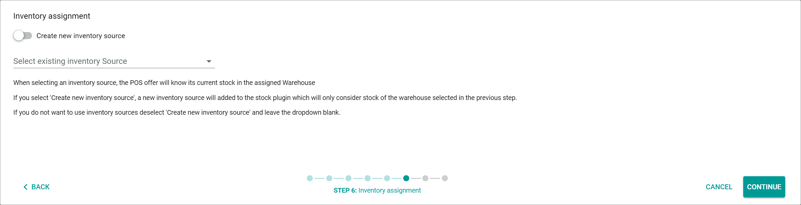

-  *Create new inventory source*   
    Activate this toggle to add a new stock source that only considers the stock level of the warehouse selected in the previous step for calculating the warehouse stock level. Deactivate this toggle to select an existing stock level source in the *Select existing inventory source* drop-down list, or to add no inventory source. This drop-down list is only displayed when the *Create new inventory source* toggle is disabled.  

- *Select existing inventory source*   
    Click the drop-down list and select a stock level source for the POS store. The stock level source specifies how the stock lebel  available in the POS system is calculated. All available stock level sources are displayed in the list. This drop-down list is only displayed when the *Create new inventory source* toggle is enabled.  

- [< BACK]   
    Click this button to go back to the previous step. The *Stock* wizard window is displayed.

- [CANCEL]   
    Click this button to cancel defining the inventory assignment and close the wizard window.

    > [Info] If you cancel the wizard now, the store is nevertheless created, but you have to configure the further store settings manually.

- [CONTINUE]   
    Click this button to assign the inventory source and proceed to the next step in the store wizard. The *Saving...* window is displayed. When the saving is completed, the *Accounting* wizard window is displayed.

### Step 7 - Accounting

-  *Account per pay desk*   
    Activate this toggle to assign the accounts to each pay desk individually. Deactivate the toggle to assign the accounts for the entire store. When you activate this toggle, the *Select Pay Desk* drop-down list is hidden. By default, this toggle is active.

- *Select Pay Desk*   
    Click the drop-down list and select the pay desk for which you want to assign the accounts. All accounts are displayed below the drop-down list for each available currency. This drop-down list is only displayed when the *Account per pay desk* toggle is active.

    > [Info] If you have multiple pay desks, switch the pay desk in the drop-down list after defining the accounts to define also the accounts for this pay desk. Repeat this procedure for all created pay desks.

The list of accounts is displayed either when you deactivate the *Account per pay desk* toggle or when you select a pay desk in the *Select Pay Desk* drop-down list.

- *Type*   
    In this column, the account type is indicated. Six accounts are displayed per currency. The currency of the account is indicated in brackets after the account type name. The fields are display fields only. They cannot be changed.

    - *Cash*   
        This type of account serves as a cash account for cash payments.

    - *Redeem Voucher*    
        This type of account serves as an accrual account, in which the sale of vouchers is posted.<!---Bitte prüfen-->

    - *Contra account Cash-In*   
        This type of account serves as a contra account against which cash deposits without customers are posted.

    - *Contra account Cash-Out*   
        This type of account serves as a contra account against which cash withdrawals without customers are posted.

    - *Refund of voucher (refund only)*   
        This type of account serves as a refund account for refunds of cashless payments.

    - *Manual payment at terminal*   
        This type of account serves as a cash account for cashless payments.

- *Account*   
    Enter the account number for the corresponding account types. You can assign another account number for each account type.

- [< BACK]   
    Click this button to go back to the previous step. The *Inventory assignment* wizard window is displayed.

- [CANCEL]   
    Click this button to cancel defining the inventory assignment and close the wizard window.

    > [Info] If you cancel the wizard now, the store is nevertheless created, but you have to configure the further store settings manually.

- [CONTINUE]   
    Click this button to assign the accounts and proceed to the next step in the store wizard. The *Loading...* window is displayed. When the saving is completed, the *Summary* wizard window is displayed.

### Step 8 - Summary

The wizard window displays a summary of the store configuration. Missing data or problems that can lead to restrictions when using the POS store are indicated with a yellow warning triangle.    

- [< BACK]   
    Click this button to go back to the previous step. The *Accounting* wizard window is displayed.

- [CANCEL]   
    Click this button to cancel the store finalization and close the wizard window.

    > [Info] If you cancel the wizard now, the store is nevertheless created, but you have to configure the further store settings manually.

- [FINALIZE]   
    Click this button to complete the store configuration and close the wizard window. The configured store is displayed in the list of stores.  

## Create store manually

*POS > Management > Tab STORES > Button Add > Button Create Store*

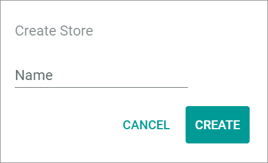

- *Name*   
    Enter the store name.

- [CANCEL]   
    Click this button to cancel the store creation and close the window.

- [CREATE]   
    Click this button to create the store. The *Creating Store* window is displayed. When the store is created, the window is closed and the *Store* view of the new store is displayed.  

## Store

*POS > Management > Tab STORES > Select Store*

- *Name*   
    Name of the store.

-  (Edit)   
    Click this button to edit the store name.

-  (Apply)   
    Click this button to apply the changes to the store name. This button is only displayed when you are editing the store name.

-  (Pay desk)   
    Number of pay desks in the selected store. The number of pay desks currently in use is displayed in the brackets. This field is read-only.

-  (Banknote)   
    Current amount of revenue from all pay desks. This field is read-only.

- *Created MM/DD/YYYY*   
    Date of store creation. This field is read-only.

- [SAVE]   
    Click this button to save any changes.

### Basic data &ndash; Store

*POS > Management > Tab STORES > Select Store > Tab Basic Data*

- *Short Description*   
    Enter a short description to the store.

- [SAVE]   
    Click this button to save any changes.

**Store Manager**

- [Add]      
    Click this button to add a store manager to the store. The *Store Managers* window is displayed.

- *First Name*   
    First name of the store manager.

- *Last Name*   
    Last name of the store manager.

- *Login*   
    User name of the store manager.

-  (Delete)   
    Click this button to delete the store manager. This button is only displayed when you hover over the store manager. Click the [SAVE] button to save the changes.

**Pay desks**

- [Add]  
    Click this button to add a pay desk to the store. The *Create pay desk* window is displayed.

- *Name*   
    Name of the pay desk.

- *Used by*   
    Full name and username of the current pay desk user. If the pay desk is currently not in use, a dash (*-*) is displayed.

-  (Edit)   
    Click this button to edit the pay desk. This button is only displayed when you hover over the pay desk. Click the [SAVE] button to save the changes.

-  (Delete)   
    Click this button to delete the pay desk. This button is only displayed when you hover over the pay desk. Click the [SAVE] button to save the changes.

#### Store managers

*POS > Management > Tab STORES > Select Store > Tab Basic Data > Add Store Manager*

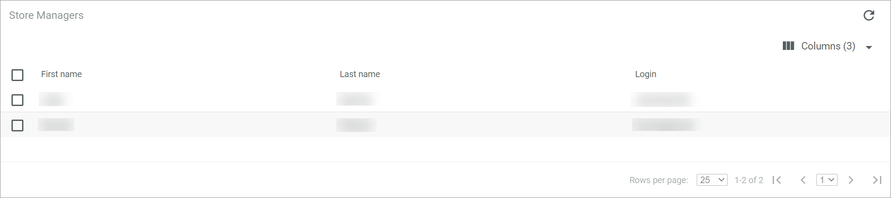

The *Store Manager* list displays the persons who are assigned to the POS store manager group.

The following functions are available for the editing toolbar:

- [x]       
    Select the checkbox to display the editing toolbar. If you click the checkbox in the header, all users are selected.

- [Add]   
    Click this button to add the selected user to the list of store managers. This button is only displayed, when the checkbox of a user is selected.

The table displays all available store managers. All fields are read-only. Depending on the settings, the displayed columns may vary.

- *First Name*   
    First name of the user.

- *Last Name*   
    Last name of the user.

- *Login*   
    Login name of the user.

- *ID*   
    Identification number of the user.

#### Create pay desk

*POS > Management > Tab STORES > Select Store > Tab Basic Data > Add Pay Desk*

- *Name*   
    Enter the name of the new pay desk.

- [CANCEL]   
    Click this button to cancel the creation of a pay desk.

- [SAVE]   
    Click this button to add the pay desk to the list of pay desks.

### Settings

*POS > Management > Tab STORES > Select Store > Tab Settings*

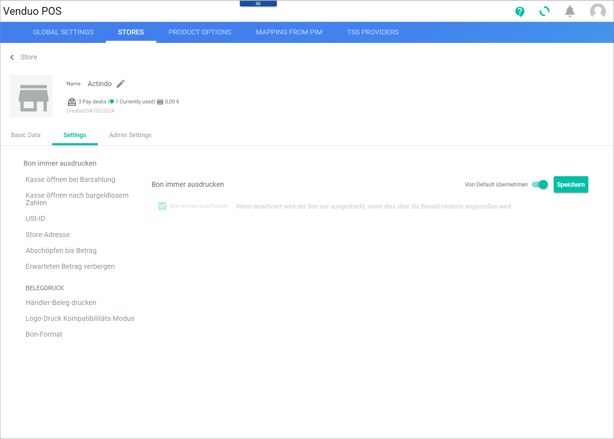

For detailed information, see the documentation of the [Global settings](./02a_GlobalSettings.md) for the respective setting. Note that if you change a setting via this tab, it will apply only to the selected store.

### Admin settings &ndash; Store

*POS > Management > Tab STORES > Select Store > Tab Admin Settings*

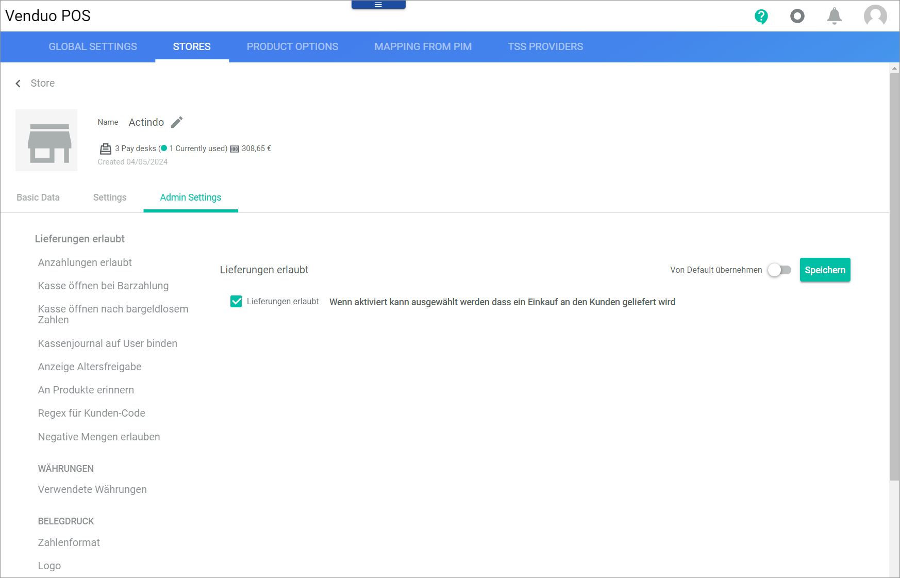

Except for the following settings, all settings are also available as Global setting. Note that if you change a setting via this tab, it will apply only to the selected store. For detailed information, see the documentation of the [Global settings](./02a_GlobalSettings.md)

**Settings not part of the global settings**

#### Customer number of store for reordering

Define a customer ID for the store to restrict the reorder query to the selected store.

- *Customer ID*   
    Enter a customer ID for the store. Only orders assigned to this ID can be queried. If you leave the field blank, all orders can be queried.

- [Save]   
    Click this button to save any changes.

#### Stock assignments of orders

Change or define the warehouse from which to take the stock.

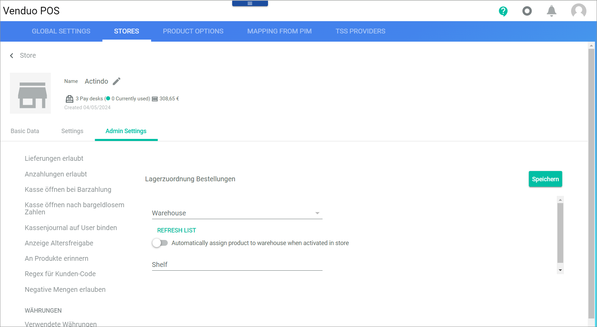

- *Warehouse*   
    Click the drop-down list and select the warehouse you want to take the stock from. By default, the following entries are available:
    - **Own warehouse** 
    - **Field warehouse**   
    Note that you can create your own warehouses that are then displayed in this drop-down list.   
    For detailed information on creating warehouses, see [Configure the warehouse for POS](../Integration/01_ConfigureWarehouse.md).

- [REFRESH LIST]   
    Click this button to update the drop-down list *Warehouse*.

-  *Automatically assign product to warehouse when activated in store*   
    Enable this toggle to automate the assignment process of products to a shelf in a warehouse. It is recommended to activate this option.

- *Shelf*   
    Enter a shelf number in the warehouse to which the stock is to be assigned.

- [Save]   
    Click this button to save any changes.

## Pay desk

*POS > Management > Tab STORES > Select Store > Tab Basic data > Select pay desk > Edit Pay desk*

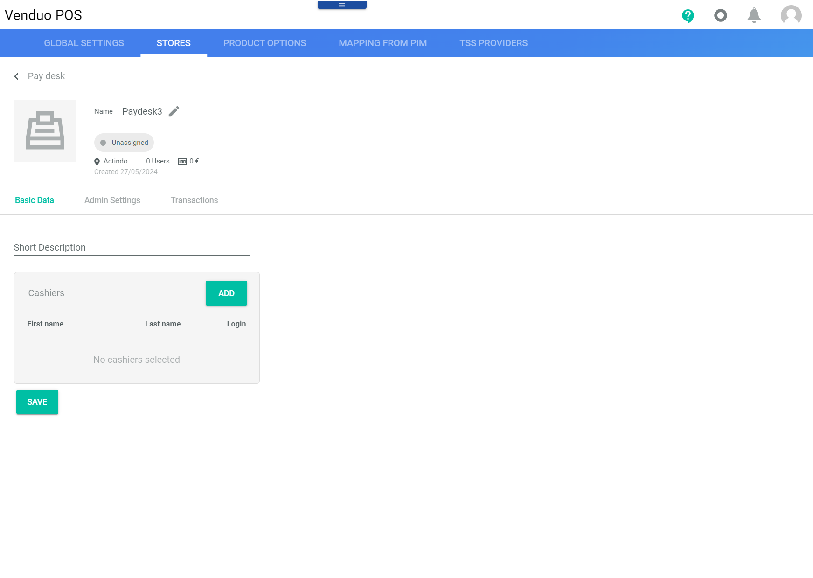

- *Name*   
    Name of the pay desk.

-  (Edit)   
    Click this button to edit the pay desk name.

-  (Apply)   
    Click this button to apply the changes to the store name. This button is only displayed when you are editing the store name.

- *Unassigned/user name*   
    Indication whether the pay desk is currently in use. If the pay desk is not in use, *Unassigned* is displayed. If the pay desk is in use, the user name of the cashier is displayed.

-  (Remove)   
    Click this button to remove the cashier from the pay desk. This button is only displayed when the pay desk is in use.

-  (Store)   
    Name of the store where the pay desk is located. This field is read-only.

- *x Users*   
    Number of cashiers assigned to the selected pay desk.

-  (Banknote)   
    Current amount of cash in the selected pay desks. This field is read-only.

- *Created MM/DD/YYYY*   
    Date of pay desk creation. This field is read-only.

[comment]: <> (Why is the format another one than for the store?)

- [SAVE]   
    Click this button to save any changes.

### Basic data &ndash; Pay desk

*POS > Management > Tab STORES > Select Store > Tab Basic data > Select pay desk > Edit Pay desk*

- *Short Description*   
    Enter a short description to the pay desk.

- [SAVE]   
    Click this button to save any changes.

**Cashiers**

- [Add]      
    Click this button to add a cashier to the pay desk. The *Cashiers* window is displayed.

- *First Name*   
    First name of the cashier.

- *Last Name*   
    Last name of the cashier.

- *Login*   
    User name of the cashier.

-  (Delete)   
    Click this button to delete the cashier. This button is only displayed when you hover over the cashier. Click the [SAVE] button to save the changes.

#### Cashiers

*POS > Management > Tab STORES > Select Store > Tab Basic data > Select pay desk > Edit Pay desk > Tab Basic Data > Add Cashier*

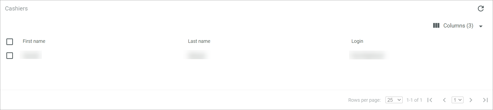

The table displays all available cashiers. All fields are read-only. Depending on the settings, the displayed columns may vary.

The following settings are available for the editing toolbar:

- [x]   
    Select the checkbox to display the editing toolbar.

- [Add]   
    Click this button to add the selected user to the list of cashiers. This button is only displayed, when the checkbox of a user is selected.

The following fields are available for the table:

- *First Name*   
    First name of the user.

- *Last Name*   
    Last name of the user.

- *Login*   
    Login name of the user.

- *ID*   
    Identification number of the user.

### Admin settings &ndash; Pay desk

*POS > Management > Tab STORES > Select Store > Edit Pay Desk > Tab Admin Settings*

For detailed information, see the documentation of the [Global settings](./02a_GlobalSettings.md) for the respective setting. Note that if you change a setting via this tab, it will apply only to the selected pay desk.

### Transactions &ndash; Pay desk

*POS > Management > Tab STORES > Select Store > Edit Pay Desk > Tab Transactions*

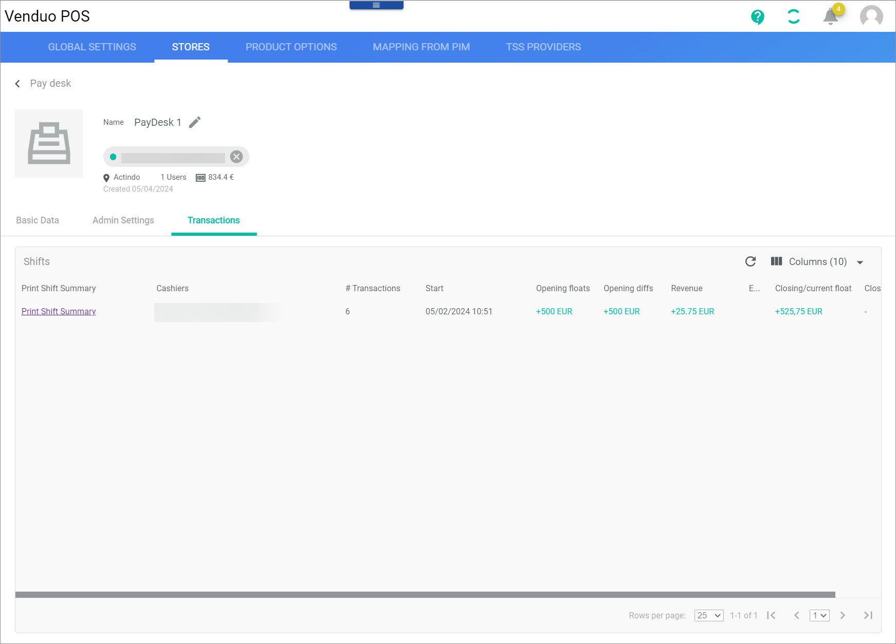

**Shifts**

The table displays the shift summaries of all shifts on the selected pay desk. Depending on the settings, the displayed columns may vary.

> [Info] A shift starts, when a pay desk is opened. It ends when the pay desk is closed.

- *Print Shift Summary*    
    Click the link to print the selected shift summary. The shift summary is displayed in a new browser tab.   
    If you want to display the detailed transactions within a shift instead of printing the shift summary, click the row with the shift (except the field *Print Shift Summary* to display the *Transactions* window).

[comments]: <> (For me, a new tab in the browser is displayed with the shift summary. Is it like that by default or do I have to configure it somewhere in the printing settings?)

- *Cashiers*   
    Full name and username of the cashier within the shift. This field is read-only.

- *# Transactions*   
    Number of transactions made within the shift. This field is read-only.

- *Start*  
    Date and time of the shift start. This field is read-only.

- *Opening floats*   
    Cash balance at the shift start. This field is read-only.

- *Opening diffs*   
    Cash difference at the shift start. This field is read-only.

- *Revenue*
    Cash revenue of the shift. This field is read-only.

- *End*   
    Date and time of the shift end. This field is read-only.

- *Closing/current float*   
    Cash balance at the shift end/Current cash balance. This field is read-only.

- *Closing diffs*   
    Cash difference at the shift end. This field is read-only.

- *ID*   
    Shift identification number. This field is read-only.

#### Transactions details

*POS > Management > Tab STORES > Select Store > Edit Pay Desk > Tab Transactions > Select Shift*

The table displays the detailed transactions of the selected shift. All fields are read-only. Depending on the settings, the displayed columns may vary.

- *Cashier*   
    Full name and user name of the cashier who made the transaction.

- *Created*   
    Date and time of the transaction.

- *Type*  
    Type of transaction. The following types are available:
    - Cash payment
    - Cashless payment
    - Cash in
    - Cash out
    - Opening diff
    - Closing diff

- *Amount*   
    Amount of transaction.

- *Bill number*   
    Bill number of the transaction.

- *Comment*   
    Comment to the transaction.

- *ID*   
    Identification number of the user.
