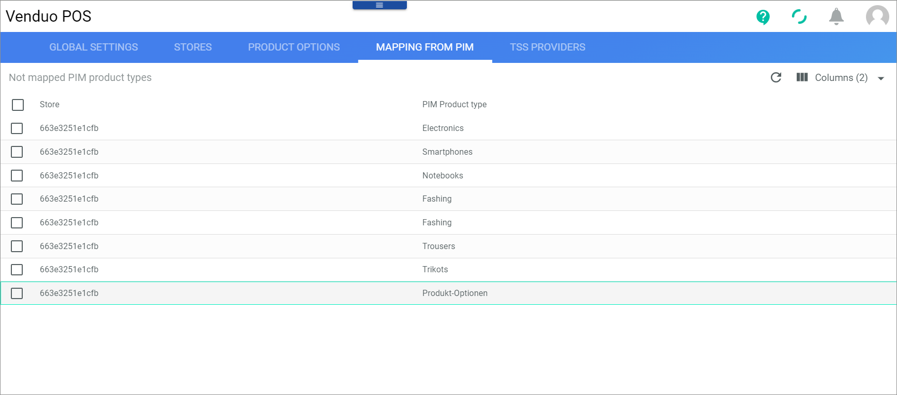

[!!Manage the offers for POS](../Integration/07_ManageOffers.md)

# Mapping from PIM

*Venduo POS > Management > Tab MAPPING FROM PIM*

**Not mapped PIM product types**   

The table displays all not mapped PIM product types. All fields are read-only. Depending on the settings, the displayed columns may vary.

The following functions are available for the editing toolbar:
- [x]    
    Select the checkbox to display the editing toolbar. If you click the checkbox in the header, all users are selected.

- [CREATE MAPPING]   
    Click this button to create the selected mapping. This button is only displayed, when the checkbox of a mapping is selected.

The following fields are available in this table:

- *Store*   
    Store name.

- *PIM Product type*   
    PIM product type to be mapped.
