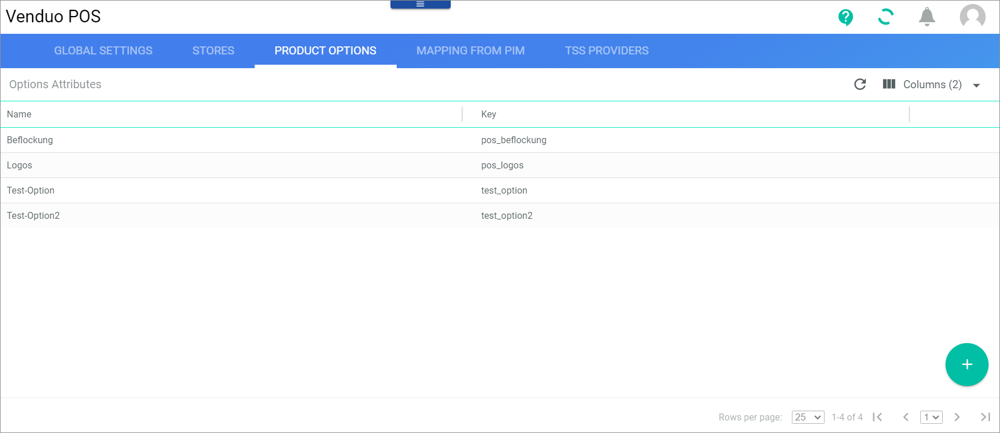
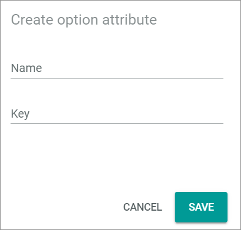

# Product Options

*Venduo POS > Management > Tab PRODUCT OPTIONS*

The *Options attributes* list shows all attributes that specify product options. For detailed information, see [Create a product option](../Integration/07_ManageOffers.md#create-a-product-option).

The following functions and fields are available in this list:

- *Name*   
    Name of the product option attribute.

- *Key*   
    Key of the product option attribute.

-  (Add)   
    Click this button to create a new product option.

## Create an option attribute

*Venduo POS > Management > Tab PRODUCT OPTIONS > Click Add*

The following functions and fields are available in this window:

- *Name*   
    Enter the name of the new product option attribute.

- *Key*   
    Enter the key of the product option attribute.

- [SAVE]   
    Click this button to save any changes.