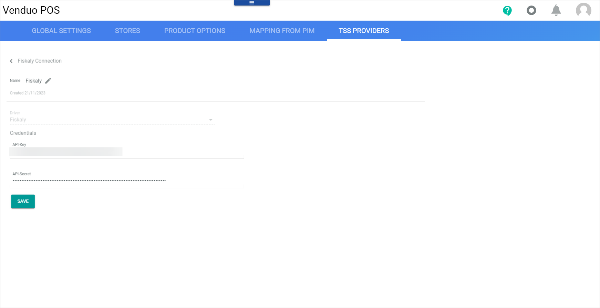

# TSS Providers

*POS > Management > Tab TSS PROVIDERS*

The list shows the connections that have been created to use the Fiskaly&trade; solution for TSS.

The following functions are available for the editing toolbar:

-  (Edit)  
    Click this button to edit the selected connection. This button is only displayed if a single checkbox in the list of connections is selected. Alternatively, you can directly click a row in the list to edit the corresponding connection. The *Edit connection* view is displayed, see [Edit connection](#edit-connection).

The following fields are available:

- *Name*   
    Name of the connection to Fiskaly&trade;.

- *Driver*   
    Name of the driver, currently only Fiskaly&trade; is supported.

## Edit connection

-  (Back)   
    Click this button to close the *Create connection* view and return to the list of connections. All changes are rejected.

- *Name*   
    Enter a connection name.

-  (Apply)  
    Click this button to apply the entered connection name. This button is only displayed if the connection name has not yet been confirmed.

-  (Edit)  
    Click this button to edit the connection name. This button is only displayed if the connection name has been confirmed.

- *Driver*  
    Click the drop-down list and select the desired driver. All installed drivers are displayed. 

    > [Info] Drivers are licensed and must be acquired via the app store. Currently only the Fiskaly&trade; driver is supported.

- *Created DD/MM/YYYY*  
    Creation date of the connection. This field is read-only.

**Credentials**

The fields displayed in the *Credentials* section vary depending on thSe selected driver. 

- *API key*   
    API key of the connection. You get this data from the Actindo support. <!--- Stimmt das?-->

- *API secret*   
    API secret of the connection. You get this data from the Actindo support. <!--- Stimmt das?-->

- [SAVE]  
    Click this button to save any changes made.

