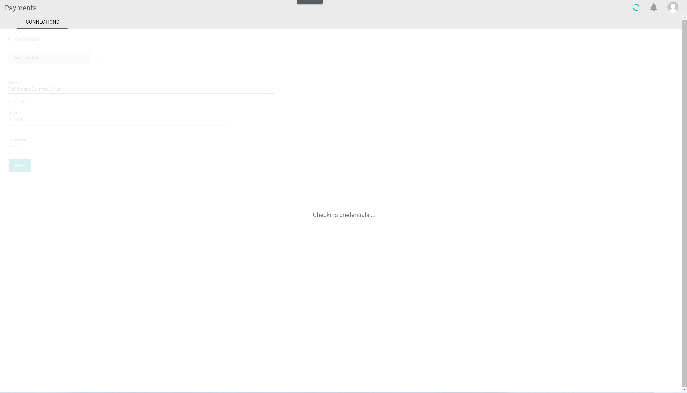
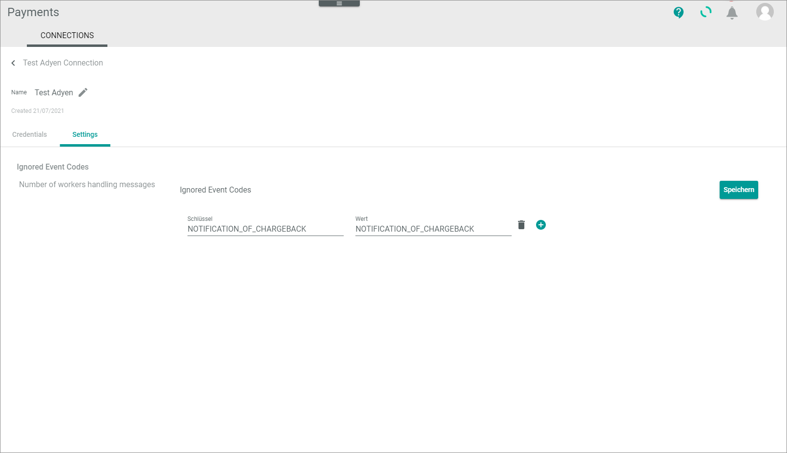

[!!Connections (Settings)](../UserInterface/08a_Connections.md)

# Manage connections to payment service providers (PSP)   

If you want to create a new connection to a payment service provider (PSP), you can buy, depending on the payment service provider, the needed connection in the app store or license it directly at the payment service provider. By default, Actindo supports the following drivers:   
- Adyen&trade; (available in the app store)
- Amazon pay&trade; (available in the app store)
- Stripe&trade; (available in the app store)
- Paypal&trade;
- A dummy driver to simulate payments for testing purposes in a sandbox   

The data structure of the connection then provides exactly the data that the PSP needs to exchange data with the Actindo *Payments* module.

In the following, the procedures to create, edit, or disable connections are described. 

## Create PSP connection

Create a connection to a certain payment provider. As soon you have created a connection, an initial synchronization will be triggered, which will transfer the entire data model of the connected payment service provider to Actindo. 

#### Prerequisites

- The relevant drivers are installed both on the main account and &ndash; if needed &ndash; the sandboxes.

#### Procedure    

*Payments > Settings > Tab CONNECTIONS*   

1.  Click the  (Add) button in the bottom right corner.   
    The *Connection* view is displayed.   
    

2.  Enter a name for the connection in the *Name* field.

3.  Click the *Driver* drop-down list and select the desired driver. 
   All already installed drivers are displayed in the list.   
   
     > [Info] If you want to install additional drivers, select the **more...** option and buy a driver in the app store. You have to purchase drivers from the main account. You need to install them separately in each sandbox or account where you want to use it.

     The *Credentials* section is displayed below the drop-down list.

    
     > [Info] Depending on the selected driver, the fields in the *Credentials* section differ. 

4. Enter the required data in the fields in the *Credentials* section. Use the information you received from the payment service provider to fill the credentials.   

5. Click the [SAVE] button.   
    The connection will be created. Depending on the driver, the *Checking credentials...* notice is displayed. After a few seconds, the *Loading data...* notice is displayed.

     

    The data are synchronized between Actindo and the payment service provider, if a synchronization is necessary. The view for creating connections is automatically closed when the connection has been created and synchronized. The *Edit connection* view of the newly created connection is displayed. The *Settings* tab is selected.
      
    <!---Stefan: stimmt das? Ich kann es nicht nachmachen, wenn es Verbindungen sind, die nicht direkt aktiv sind, gibt es dann buttons mit denen man aktivieren, synchronisieren kann?-->

## Edit PSP connection

Edit a connection to adjust any changed credentials, the connection name or further settings. 

#### Prerequisites

At least one connection has been created, see [Create a connection](#create-a-psp-connection).

#### Procedure

*Payments > Settings > Tab CONNECTIONS*

1. Select the checkbox of the driver to select the connection you want to edit.  
The editing toolbar is displayed above the list of connections.

2. Click the  (Edit) button.   
    The *"Driver name" connection* view is displayed.

    > [Info] Depending on the driver, the *Credentials* as well as the *Settings* tab are displayed in the view.

    

2. Edit the desired data of the connection in the corresponding fields in the *Credentials* tab.   

3. If necessary, click the *Settings* tab and edit the desired settings of the connection in the corresponding fields.

4. Click the [SAVE] button.   
    The *Checking credentials...* notice is displayed.
    
    The *"Driver name" connection* view is automatically closed when the changes have been saved. The *Connections* view is displayed again.

## Disable PSP connection

Once a connection has been and is in use, you cannot delete it because of potential dependencies in the existing database. Nevertheless, you can disable the connection if you no longer use it. You can disable several active connections at a time.

#### Prerequisites

- At least one connection is active, see [Create a connection](#create-a-psp-connection).

#### Procedure

*Payments > Settings > Tab CONNECTIONS*

1. Select the checkbox of the connection you want to disable in the list of connections.   
   The editing toolbar is displayed above the list of connections.

2. Click the [DISABLE] button in the editing toolbar.   
   The connection has been deactivated.

3. Click the  (Refresh) button to update the list of connections.   
    The status of the disabled connection in the *Status* column has switched to **Inactive**.

## Enable PSP connection

Once a connection has been created, you can disable it if you no longer need it. If you have done this by mistake, you can enable the connection again. You can enable several inactive connections at once.

#### Prerequisites

- At least one connection is *Inactive*.

#### Procedure

*Payments > Settings > Tab CONNECTIONS*

1. Select the checkbox of the connection you want to enable in the list of connections.   
    The editing toolbar is displayed above the list of connections.

2. Click the [ENABLE] button in the editing toolbar.   
    The connection has been activated.

3. Click the  (Refresh) button to update the list of connections.   
        The status of the enabled connection in the *Status* column has switched to **Active**.