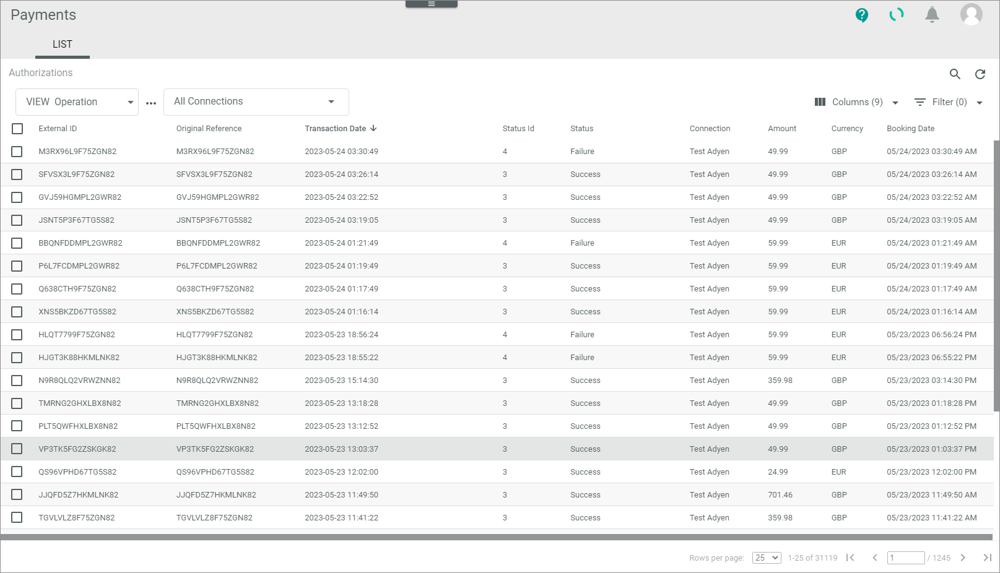
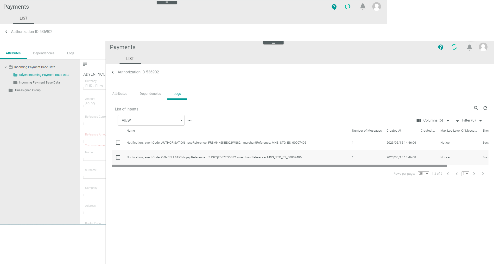

# Monitor authorizations

The processing of the authorization transactions works as follows: 
-   The payment service provider creates an authorization transaction, when a customer presses the *Pay now* button during the order process.   
- The payment provider sends then the authorization transaction to the *ActindoCore1 Platform*.    
- In addition, the shop system creates an ID for this transaction.  
- Actindo links both.   

For Actindo, the authorization transaction serves as a reference to a payment made by a customer.   
You can use this procedure to display all incoming authorization transactions of a payment service provider. You can check for communication errors between Actindo and the payment service provider that has been caused in a termination of a workflow, for example. In addition, if applicable, you can change the status of a transaction to start continuing further processing or to end it.    

If everything works fine with the posting of the payment, you do not need to monitor the *Authorizations* menu entry.   
It may happen that in rare cases something went wrong when the workflow cannot post a payment correctly. For example, this may happen, if something went wrong during pressing the *Pay now* button by the customer. In this case, the service payment provider may have sent two references to a payment to the *Payments* module. Now the workflow is not able to find the correct reference and ends with an error.   
In case of those errors you can capture, cancel, or void an authorization transaction manually.   
> [Info] You can only change the status of an authorization transaction, but not any data.

## Check an authorization transaction
An authorization transaction provides numerous payment-related details, which may vary depending on the payment service provider settings. To decide, whether you can manually capture, cancel, or void an authorization transaction, you need to check its details.

#### Prerequisites

- At least one connection has been created, see [Create a connection](../Integration/01_ManageConnections.md#create-a-connection).
- At least one authorization transaction has been created.
- It is recommended that you have added the *Status ID* field to your view so that you are able to sort or filter for specific statuses. 

#### Procedure

*Payments > Authorizations > Tab LIST*

1. Check the Authorization transaction status in the *Status* column. The status displays the current stage in the payment process. You can use the status ID prefixed below to filter the list. The following statuses are available: 
    - **1 - Preparing**  
        The transaction has been created, but is not yet transferred.
    - **2 - Unconfirmed**   
    ?
    - **3 - Success**  
        Actindo has got the response from the service payment provider, that the transfer was successfully.
    - **4 - Failure**   
        The payment service provider has received the request, but it cannot process it. If available for the connection, the status information field provides further information.
    - **5 - Error**   
       Errors have been occurred during transfer.
    - **6 - Void**   
       The transaction has been voided, see [Void an authorization transaction](01_ManageAuthorizations.md#void-an-authorization-transaction).
    
2. Click on the authorization transaction to see the details.   
    The sub-tabs of the transaction are opened.  
    *Payments > Authorizations > Tab LIST > Select Authorization transaction*  

    

3. Check the attributes and logs of the transaction. For detailed information, see the following:
   - [Authorizations &ndash; Attributes](../UserInterface/01_ListAuthorizations.md#authorizations-–-attributes)
   - [Authorizations &ndash; Logs](../UserInterface/01_ListAuthorizations.md#authorizations-–-logs)
4. Return to the LIST and decide how to proceed with the transaction.

## Capture authorization transaction

After you have checked an authorization transaction that could not be processed by the workflow, you can capture the transaction manually, so that the order process can be continued.

#### Prerequisites

- The status of an authorization transaction is **not** "Success". In this case, further processing has already been continued.<!---Stimmt das oder gibt es noch mehr?-->   
- It is recommended that you add the *Status ID* field to your view so that you are able to sort or filter for specific statuses. 

#### Procedure
*Payments > Authorizations > Tab LIST*

   

1. Check the authorization transaction you want to capture, see [Check the authorization transaction](./01_ManageAuthorization.md#check-an-authorization-transaction).
2. Select the authorization transaction you want to capture by clicking the checkbox on the left.   
    The editing toolbar is displayed.
3. Click the [Capture] button.    
   A confirmation message is displayed. The status of the authorization transaction has changed to *Success*.   
   You can now follow up this case under the menu entry *Payments and captures*. <!-----Stefan ist das richtig?---> 
   
  

## Cancel authorization transaction

After you have checked an authorization transaction that could not be processed by the workflow, you can cancel the transaction manually, so that the order is cancelled both at Actindo and at the payment service provider. Actindo will then automatically inform the payment service provider about the cancellation. The customer will get his or her money back.

#### Prerequisites
- The status of an authorization transaction is "Failure" or "Error". 
- The authorization transaction has not been captured before.

#### Procedure

*Payments > Authorizations > Tab LIST*

1. Identify the communication issue that led to the error. To do this, check the authorization transaction you want to cancel, see [Check the authorization transaction](01_ManageAuthorization.md#check-an-authorization-transaction).
2. Select the authorization transaction you want to cancel by clicking the checkbox on the left.   
    The editing toolbar is displayed.
3. Click the [Cancel] button.   <!---was passsiert dann-->   
   A confirmation message is displayed. The status of the authorization transaction has changed to *Success*.    
   You can now follow up this case under the menu entry *Refunds*. <!-----Stefan ist das richtig?--->

## Void authorization transaction

You can void an authorization transaction, if you want to disable the transaction for the Actindo database. For example, for whatever reason the same transaction has been posted twice. In this case, you can void one of these transactions and continue the order process with the other transaction.
> [Info] The payment service provider will not be informed about changing the status to "Void". It is only done to clear the database.

#### Prerequisites

The status of an authorization transaction is "Failure" or "Error".

#### Procedure

*Payments > Authorizations > Tab LIST*

1. Identify the communication issue that led to the error. To do this, check the authorization transaction you want to void, see [Check the authorization transaction](./01_ManageAuthorizations.md#check-an-authorization-transaction).
2. Select the authorization transaction to be voided by clicking the checkbox on the left.   
    The editing toolbar is displayed.
3. Click the [Void] button.   
   A confirmation message is displayed. The status of the authorization transaction has changed to "Void". It is no longer valid for the Actindo database.