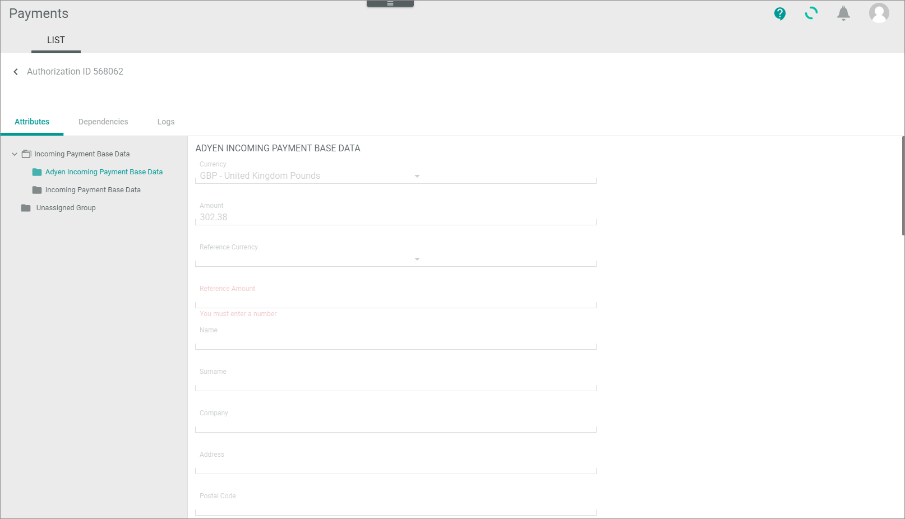

[!!LIST (Authorizations)](../UserInterface/01a_ListAuthorizations.md)

# Monitor authorizations

An authorization transaction is the permission that your company is allowed to capture money from the customer via a payment service provider. For Actindo, the authorization transaction serves as a reference to a payment to be made by a customer. The processing of the authorization transactions works as follows: 
-   The payment service provider creates an authorization transaction when a customer presses the button to pay an order during the order process.   
- The payment provider sends then the authorization transaction to the *Actindo Core1 Platform*.    
- In addition, the shop system creates an ID for this transaction.  
- Actindo links both.   

You can use this procedure to display all incoming authorization transactions of a payment service provider. You can check for communication errors between Actindo and the payment service provider that resulted in a workflow being stopped, for example. In addition, if applicable, you can change the status of a transaction to start continuing further processing or to end it. Note that you can only change the status of an authorization transaction, but not any data.  

If everything works fine with the posting of a payment, you do not need to monitor the *Authorizations* menu entry. In case of errors you can capture, cancel, or void an authorization transaction manually.   

## Check authorization transaction

An authorization transaction provides numerous payment-related details that may vary depending on the payment service provider settings. To decide whether you can manually capture, cancel, or void an authorization transaction, you need to check its details.   
In case of errors or failures, there may be a general issue that is caused by the payment service provider, by the shop, or by Actindo. In this case, contact the according business partner, so that the issue can be solved.

#### Prerequisites

- At least one connection has been created, see [Create PSP connection](../Integration/01_ManageConnection.md#create-psp-connection).
- At least one authorization transaction has been created.

 > [Info] It is recommended to add the following columns to your view to get the required information and to better filter and sort the entries: *Status ID* and *Status information* (if applicable).    

#### Procedure

*Payments > Authorizations > Tab LIST*

1. Check the authorization transaction status in the *Status* column. The status displays the current stage in the payment process. 

   > [Info] You can use the status ID prefixed below to filter the list. The following statuses are available:   

    - **1 - Preparing**  
        The transaction has been created but is not yet transferred.
    - **2 - Unconfirmed**   
        A refund is requested but not yet released by an Actindo user. This status is relevant for some functions only, for example, the cancellations and chargebacks.
    - **3 - Success**  
        Actindo as well as the payment service provider has processed the transaction successfully.
        You can now follow up this case under the menu entry *Payments and captures*. <!---Stefan ist das richtig?-->
    - **4 - Failure**   
        The payment service provider has received the request, but rejected it. If available for the connection, the "Status information" column provides further information.
    - **5 - Error**   
        Errors have been occurred during transfer.
    - **6 - Void**   
        The transaction has been voided, see [Void authorization transaction](#void-authorization-transaction).
    
2. Click the transaction to see the details.   
    The *"Authorization ID"* view is displayed. The *Attributes* tab is preselected by default.   
     
    

3. Check the list of attributes, for example, whether the required fields are filled. For detailed information on fields, see [Authorizations &ndash; Attributes](../UserInterface/01a_ListAuthorizations.md#authorization-–-attributes).

4. Click the *Logs* tab.   
    The *Logs* tab is displayed and shows the messages that have been created for this issue. 

   

5. Check the logs, for example, if there is a general communication issue.
    For detailed information on fields and functions, see [LIST (Logging)](../UserInterface/07a_ListLogging.md).

6. Return to the list of authorizations and decide how to proceed with the transaction.

## Capture authorization transaction

After you have checked an authorization transaction that could not be processed by the workflow, you can capture the transaction manually, so that the order process can be continued.

#### Prerequisites

The status of an authorization transaction is **not** "Success". In case of success, further processing has already been continued.<!---Stimmt das oder gibt es noch mehr?-->   

#### Procedure

*Payments > Authorizations > Tab LIST*

1. Check the authorization transactions you want to capture, see [Check authorization transaction]
(#check-authorization-transaction).

2. Select the authorization transactions you want to capture by clicking the checkbox on the left. If desired, you can select several transactions at once.   
    The editing toolbar is displayed.

3. Click the [CAPTURE] button.    
    A confirmation message is displayed. The status of the authorization transaction has changed to **Success**.   
    By using the *Original reference*, you can now follow up this case under the menu entry *Payments and captures*. <!---Stefan ist das richtig?--> 
   
  

## Cancel authorization transaction

After you have checked an authorization transaction that could not be processed by the workflow, you can cancel the transaction manually, so that the order is cancelled both at Actindo and at the payment service provider. Actindo will then automatically inform the payment service provider about the cancellation. The payment of the customer, blocked before by the payment service provider, is freed.

#### Prerequisites

- The status of an authorization transaction is **Failure** or **Error**. 
- The authorization transaction has not been captured before.

#### Procedure

*Payments > Authorizations > Tab LIST*

1. Identify the communication issue that led to the error. To do this, check the authorization transactions you want to cancel, see [Check authorization transaction](#check-authorization-transaction).

2. Select the authorization transactions you want to cancel by clicking the checkbox on the left. If desired, you can select several transactions at once.    
    The editing toolbar is displayed.

3. Click the [CANCEL] button.   
    A confirmation message is displayed. 
    The payment service provider gets the information about the cancellation of the authorization transaction and the payment of the customer is freed.  
    You can now follow up this case under the *Cancellations and Chargebacks* menu entry.
   
   

## Void authorization transaction

You can void an authorization transaction, if you want to invalidate the transaction for the Actindo database. For example, for whatever reason the same transaction has been posted twice. In this case, you can void one of these transactions and continue the order process with the other transaction.

> [Info] The payment service provider will not be informed about changing the status to **Void**. It is only done to clear the database from faulty entries.

#### Prerequisites

The status of an authorization transaction is **Failure** or **Error**.

#### Procedure

*Payments > Authorizations > Tab LIST*

1. Identify the issue that led to the error/failure. To do this, check the authorization transaction you want to void, see [Check the authorization transaction](#check-authorization-transaction).

2. Select the authorization transaction to be voided by clicking the checkbox on the left.   
    The editing toolbar is displayed.

3. Click the [VOID] button.   
    A confirmation message is displayed. The status of the authorization transaction has changed to **Void**. The transaction is no longer valid for the Actindo database.