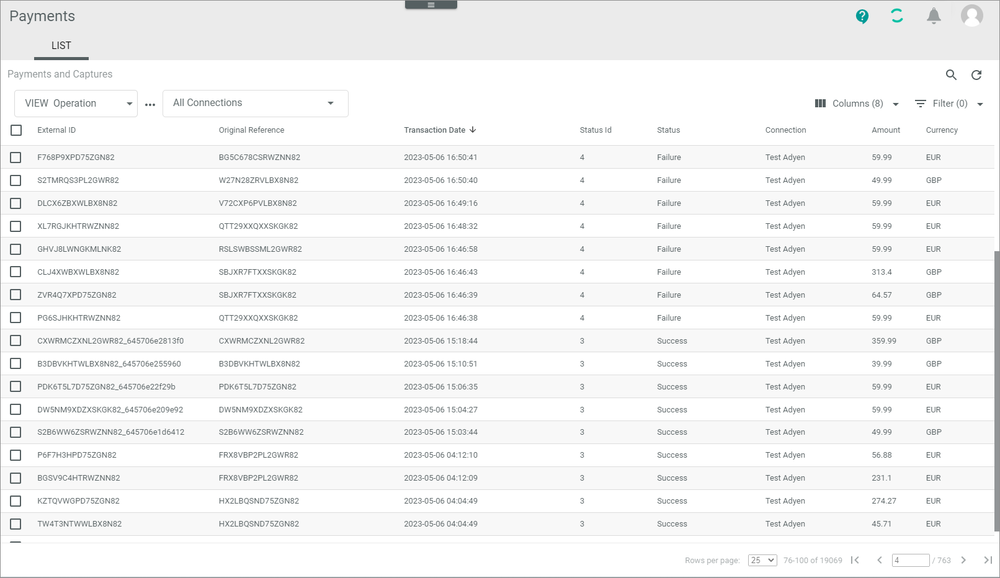

[!!LIST (Payments and captures)](../UserInterface/02a_ListPaymentsAndCaptures.md)

# Monitor payments and captures

A capture is a payment made. After delivering a product, Actindo captured the payment from the payment service provider. The most payment service providers create a new reference when a payment has been captured.

> [Info] This means that you cannot follow up a case with the ID of an authorization transaction. However, the most payment service providers support an original reference ID that you can use to search for a specific case in the whole payment process.  

You can use this procedure to display all incoming references to a payment and capture transaction from a payment service provider. You can check for communication and other errors between Actindo and the payment service provider resulted in a workflow being stopped, for example.   
If you cannot deliver the product and want to give the money back to the customer, you can manually change the status of a transaction to **Refund** to initiate a repayment. Additionally, you can set the status to **Void** to clear the database from faulty entries. Note that you can only change the status of a payment and capture transaction, but not any data.    

If everything works fine with the posting of a capture, you do not need to monitor the *Payments and captures* menu entry.   

## Check payment and capture transaction

A capture provides numerous payment-related details, which may vary depending on the payment service provider settings. To decide whether you can manually refund or void a payment and capture transaction, you need to check its details.   
In case of errors or failures, there may be a general issue that is caused by the payment service provider, by the shop, or by Actindo. In this case, contact the according business partner, so that the issue can be solved.

#### Prerequisites

- At least one connection has been created, see [Create PSP connection](../Integration/01_ManageConnection.md#create-psp-connection).
- At least one payment and capture transaction has been created.

> [Info] It is recommended to add the following columns to your view to get the required information and to better filter and sort the entries: Status ID, Status information (if applicable).    

#### Procedure

*Payments > Payments and captures > Tab LIST*  

  

1. Check the payment and capture transaction status in the *Status* column. The status displays the current stage in the payment process. You can use the status ID prefixed below to filter the list. The following statuses are available:   
    - **1 - Preparing**  
        The transaction has been created but is not yet transferred.
    - **2 - Unconfirmed**   
        A refund is reserved but not yet released by an Actindo user. This status is relevant for some functions only, for example, the cancellations and chargebacks.
    - **3 - Success**  
        Actindo as well as the payment service provider has processed the transaction successfully.
    - **4 - Failure**   
        The payment service provider has received the request but rejected it. If available for the connection, the *Status information* field provides further information.
    - **5 - Error**   
        Errors have been occurred during transfer.
    - **6 - Void**   
        The transaction has been voided, see [Void payment and capture transaction](#void-payment-and-capture-transaction).
    
2. Click a transaction to see the details.   
    The *"Capture ID"* view is displayed. The *Attributes* tab is preselected by default.   

    

3. Check the list of attributes, for example, whether the required fields are filled. For detailed information on fields, see [Capture &ndash; Attributes](../UserInterface/02a_ListPaymentsAndCaptures.md#capture-–-attributes).

4. Click the *Logs* tab.   
    The *Logs* tab is displayed and shows the messages that have been created for this issue. 

   

5. Check the logs, for example, if there is a general communication issue.
    For detailed information on fields and functions, see [LIST (Logging)](../UserInterface/07a_ListLogging.md).

6. Return to the list of payments and captures and decide how to proceed with the transaction.

## Refund payment and capture transaction

After you have checked a payment and capture transaction that could not be processed by the workflow, you can refund the payment and capture the transaction manually, so that the order process can be cancelled and the payment of the customer, blocked before by the payment service provider, is freed. This might be necessary if a product cannot be delivered.

#### Prerequisites

The status of a payment and capture transaction is not **Success**. In case of success, further processing has already been continued. 

#### Procedure

*Payments > Payments and Captures > Tab LIST*   

   

1. Check the payment and capture transaction you want to refund, see [Check payment and capture transaction](#check-payment-and-capture-transaction).

2. Select the payment and capture transaction you want to refund by clicking the checkbox on the left. If desired, you can select several transactions at once.     
    The editing toolbar is displayed.

3. Click the [REFUND] button.  
    A confirmation message is displayed. The status of the payment and capture transaction has changed to **Success**. 
    You can now follow up this case under the *Refunds* menu entry. 

## Void payment and capture transaction

You can void a payment and capture transaction if you want to invalidate the transaction for the Actindo database. 

> [Info] The payment service provider will not be informed about changing the status to **Void**. It is only done to clear the Actindo database from faulty entries.

#### Prerequisites

The status of a payment and capture transaction is **Failure** or **Error**. 

#### Procedure
*Payments > Payments and captures > Tab LIST*

  

 1. Identify the issue that led to the error/failure. To do this, check the payment and capture transaction you want to void, see [Check payment and capture transaction](#check-payment-and-capture-transaction).

2. Select the payment and capture transaction to be voided by clicking the checkbox on the left.   
    The editing toolbar is displayed.

3. Click the [VOID] button.    
    A confirmation message is displayed. The status of the payment and capture transaction has changed to **Void**. The transaction is no longer valid for the Actindo database.