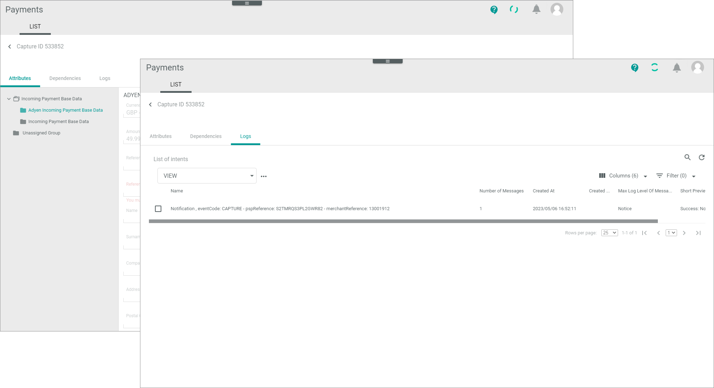

[!!LIST (Payments and captures](../UserInterface/02a_ListPaymentsAndCaptures.md))

# Monitor payments and captures

A capture is a payment made. The most payment service providers create a new reference, when a payment has been captured.
> [Info] This means that you cannot follow up a case with the reference ID of an authorization transaction. However, the most payment service providers support an original reference ID that you can use to search for a specific case in the whole payment process.   

You can use this procedure to display all incoming references to a payment and capture transaction from a payment service provider. You can check for communication errors between Actindo and the payment service provider that has been caused in a termination of a workflow, for example.   
If you cannot deliver the product and want to give the money back to the customer, you can manually change the status of a transaction to "Refund" to initiate a repayment. Additionally, you can set the status to "Void" to clear the database from faulty entries.      

If everything works fine with the posting of a capture, you do not need to monitor the *Payments and Captures* menu entry.   
> [Info] You can only change the status of a payment and capture transaction, but not any data.

## Check payment and capture transaction

A capture provides numerous payment-related details, which may vary depending on the payment service provider settings. To decide, whether you can manually refund or void a payment and capture transaction, you need to check its details.

#### Prerequisites

- At least one connection has been created, see [Create a connection](../Integration/01_ManageConnections.md#create-a-connection).
- At least one payment and capture transaction has been created.
- It is recommended that you add the *Status ID* column to your view so that you are able to sort or filter for specific statuses. 

#### Procedure

*Payments > Payments and Captures > Tab LIST*  

  

1. Check the payment and capture transaction status in the *Status* column. The status displays the current stage in the payment process. You can use the status ID prefixed below to filter the list. The following statuses are available:   
    - **1 - Preparing**  
        The transaction has been created, but is not yet transferred.
    - **2 - Unconfirmed**   
        A refund is reserved but not yet released by an Actindo user. This status is relevant for some functions only, for example, the cancellations and chargebacks.
    - **3 - Success**  
        Actindo has got the response from the service payment provider, that the transfer was successfull.
    - **4 - Failure**   
        The payment service provider has received the request, but it cannot process it. If available for the connection, the *Status information* field provides further information.
    - **5 - Error**   
       Errors have been occurred during transfer.
    - **6 - Void**   
       The transaction has been voided, see [Void payment and capture transaction](#void-payment-and-payment-and-capture-transaction).
    
2. Click on a transaction to see the details.   
    The sub-tabs of the transaction are opened.   

    *Payments > Payments and Captures > Tab LIST > Select a payment and capture transaction*   

       

3. Check the attributes and logs of the transaction. For detailed information, see the following:
     - [LIST &ndash; Attributes](../UserInterface/03_ListPaymentsAndCaptures.md#payments-and-captures-–-attributes)
     - [LIST &ndash; Logs](../UserInterface/03_ListPaymentsAndCaptures.md#payments-and-captures-–-logs)
4. Return to the LIST and decide how to proceed with the transaction.

## Refund payment and capture transaction

After you have checked a payment and capture transaction that could not be processed by the workflow, you can refund the payment and capture transaction manually, so that the order process can be cancelled.<!---ist das richtig-->

#### Prerequisites

The status of a payment and capture transaction is **not** success. In this case, further processing has already been continued. <!---ist das richtig-->

#### Procedure

*Payments > Payments and Captures > Tab LIST*   

   

1. Check the payment and capture transaction you want to refund, see [Check payment and capture transaction](#check-payment-and-capture-transaction).
2. Select the payment and capture transaction you want to refund by clicking the checkbox on the left.   
    The editing toolbar is displayed.
3. Click the [Refund] button. <!---was passsiert dann-->   
   A confirmation message is displayed. The status of the payment and capture transaction has changed to *Success*. <!---Stefan, oder "Unconfirmed"?-->   
   You can now follow up this case under the menu entry *Refunds*. <!-----Stefan ist das richtig?--> 

## Void payment and capture transaction

You can void a payment and capture transaction, if you want to disable the transaction for the Actindo database. 
> [Info] The payment service provider will not be informed about changing the status to "Void". It is only done to clear the Actindo database.

#### Prerequisites

The status of a payment and capture transaction is **not** "Success". In this case, further processing has already been continued. <!---ist das richtig-->

#### Procedure
*Payments > Payments and Captures > Tab LIST*

   

 1. Identify the communication issue that led to the error. To do this, check the payment and capture transaction you want to void, see [Check payment and capture transaction](#check-payment-and-capture-transaction).
2. Select the payment and capture transaction to be voided by clicking the checkbox on the left.   
    The editing toolbar is displayed.
3. Click the [Void] button.    
   A confirmation message is displayed. The status of the payment and capture transaction has changed to "Void". It is no longer valid for the Actindo database.