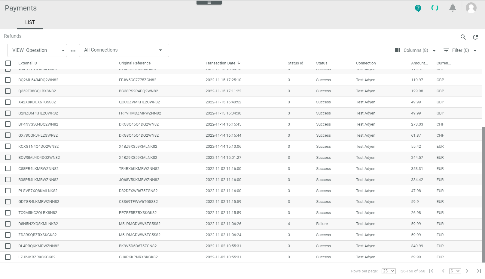
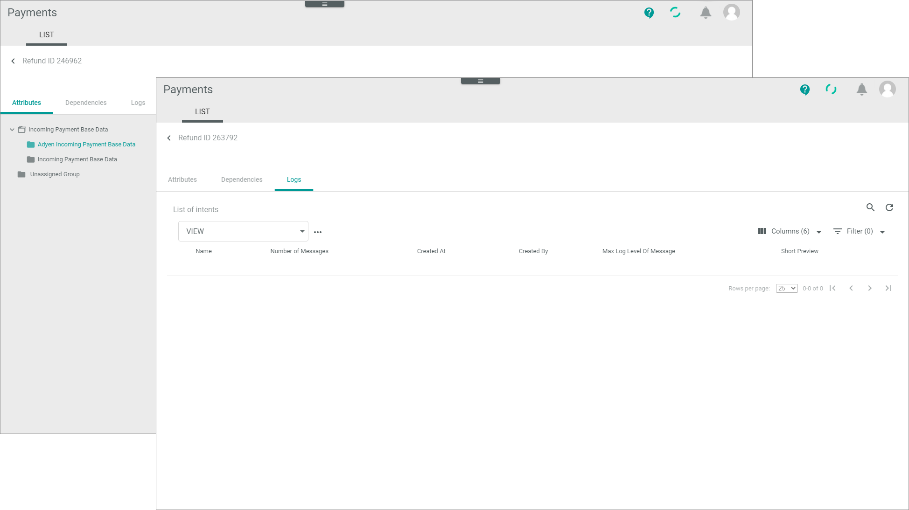

[!!LIST (Refunds)](../UserInterface/03_Refunds.md)

# Monitor refunds

A refund is a repayment of a capture. On the one hand, it is initialized by the merchant, for example, if a product is not available and cannot be delivered. On the other hand, it is initialized if a payment and capture transaction has been manually refunded by the Actindo user.
> [Info] This means that you cannot follow up a case with the ID of an authorization or a payments and captures transaction. However, the most payment service providers support an original reference ID that you can use to search for a specific case in the whole payment process.

You can use this procedure to display all incoming references to a refund from a payment service provider. You can check for communication and other errors between Actindo and the payment service provider resulted in a workflow being stopped, for example. In addition, if applicable, you can manually change the status of a transaction to **Void** to clear the database.    
   
If everything works fine with the posting of a refund, you do not need to monitor the *Refunds* menu entry. You can follow up the successfully processed refunds with the *Confirmation* menu entry.

## Check refund transaction

A refund transaction provides numerous payment-related details, which may vary depending on the payment service provider settings. To decide whether you can manually void a refund transaction, you need to check its details.   
> [Info] You can only change the status of a refund transaction, but not any data.

#### Prerequisites

- At least one connection has been created, see [Create a connection](../Integration/01_ManageConnection.md#create-a-psp-connection).
- At least one refund has been created.
- It is recommended that you add the *Status ID* field to your view so that you are able to sort or filter for specific statuses. 

#### Procedure   

*Payments > Refunds > Tab LIST* 

1. Check the refund transaction status in the *Status* column. The status displays the current stage in the payment process. You can use the status ID prefixed below to filter the list. The following statuses are available:   
    - **1 - Preparing**  
        The transaction has been created, but is not yet transferred.
    - **2 - Unconfirmed**   
        A refund is reserved but not yet released by an Actindo user. This status is relevant for some functions only, for example, the cancellations and chargebacks.
    - **3 - Success**  
        Actindo has got the response from the service payment provider, that the transfer was successfully.   
        You can now follow up this case under the menu entry *Confirmations*. <!-----Stefan ist das richtig?---> 
    - **4 - Failure**   
        The payment service provider has received the request, but it cannot process it. If available for the connection, the status information field provides further information.
    - **5 - Error**   
       Errors have been occurred during transfer.
    - **6 - Void**   
       The transaction has been voided, see [Void refund transaction](#void-refund-transaction)

    
2. Click a transaction to see the details.   
    The *Refund "Refund ID"* view is displayed. The *Attributes* tab is preselected by default.    

     

3. Check the attributes and logs of the transaction. For detailed information, see the following:
     - [LIST &ndash; Attributes](../UserInterface/04_ListRefunds.md#refunds-–-attributes)
     - [LIST &ndash; Logs](../UserInterface/04_ListRefunds.md#refunds-–-logs)
4. Return to the list and decide how to proceed with the transaction.

## Void refund transaction

You can void a refund transaction, if you want to invalidate the transaction for the Actindo database. 
> [Info] The payment service provider will not be informed about changing the status to **Void**. It is only done to clear the database from faulty entries.

#### Prerequisites

The status of a refund transaction is not **Success**. In case of success, the refund process has already been started. <!---ist das richtig-->

#### Procedure
*Payments > Refunds > Tab LIST*

 1. Identify the issue that led to the error/failure. To do this, check the refund transaction you want to void, see [Check refund transaction](#check-refund-transaction).
2. Select the refund transaction to be voided by clicking the checkbox on the left.   
The editing toolbar is displayed.
3. Click the [VOID] button.   
   A confirmation message is displayed. The status of the refund transaction has changed to **Void**. The transaction is no longer valid for the Actindo database.