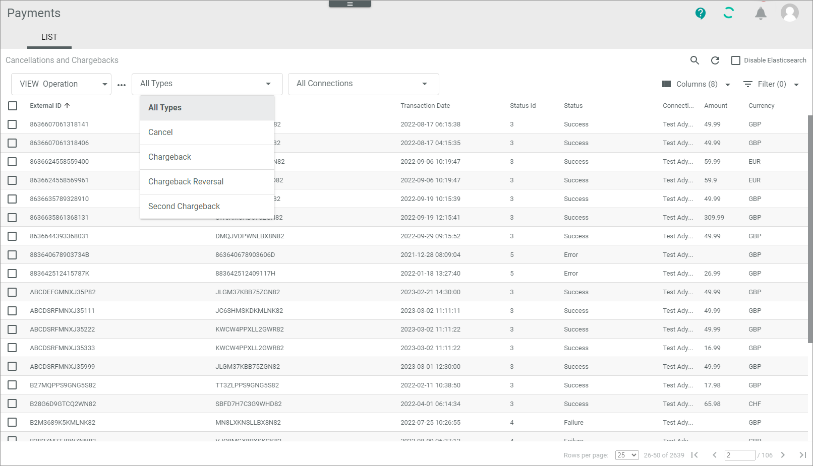
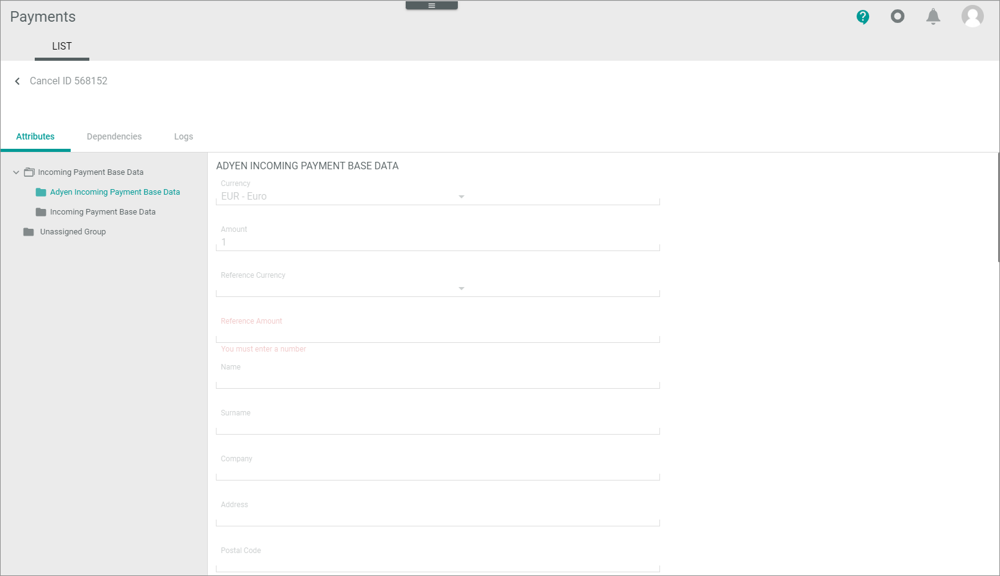
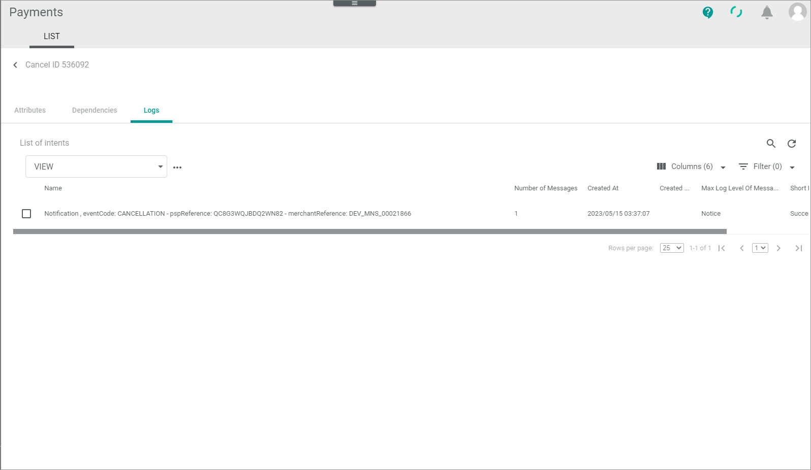

[!!LIST (Cancellations and chargebacks)](../UserInterface/05a_ListCancellationsChargebacks.md)

# Monitor cancellations and chargebacks

In the context of a payment transaction, a chargeback is a retroactive reclaim of a capture. It is initialized by the customer, for example, if he or she withdraws the payment. A cancellation is a revocation of the reservation of a product that has not yet been delivered, for example. It is initialized by the customer or the merchant.    

> [Info] The most payment service providers create a new reference when a payment has been cancelled or charged back by the customer. However, the most payment service providers support an original reference ID that you can use to search for a specific case in the whole payment process.  

You can use this procedure to display all incoming references to cancellations and chargebacks from a payment service provider. You can check for communication and other errors between Actindo and the payment service provider resulted in a workflow being stopped, for example. In addition, if applicable, you can manually change the status of a transaction to **Void** to clear the database.    
   
If everything works fine with the posting of a cancellation and chargeback, you do not need to monitor the *Cancellations and chargebacks* menu entry.  

## Check cancellation and chargeback transaction

A cancellation and chargeback transaction provides numerous payment-related details, which may vary depending on the payment service provider settings. To decide whether you can manually void a cancellation and cancellation and chargeback transaction, you need to check its details.  
> [Info] You can only change the status of a chargeback transaction, but not any data.

#### Prerequisites

- At least one connection has been created, see [Create PSP connection](../Integration/01_ManageConnection.md#create-psp-connection).
- At least one customer has created a chargeback or a cancellation.
- It is recommended that you add the *Status ID* field to your view so that you are able to sort or filter for specific statuses. 

#### Procedure

*Payments > Cancellations and chargebacks > Tab LIST*   

1. Select the desired view, if applicable.   

2. If desired, select the cancellation and chargeback type you want to check. The following types are available:   
    - **Cancel**   
      Depending on the payment service provider, an appropriately permitted person or the customer has cancelled the authorization. 
    - **Chargeback**   
      The customer has withdrawn a payment.
    - **Chargeback reversal**   
      The customer has terminated his or her withdrawing of the payment.
    - **Second chargeback**   
      Again, the customer has withdrawn the payment.

3. Check the cancellation and chargeback transaction status in the *Status* column. The status displays the current stage in the payment process. You can use the status ID prefixed below to filter the list. The following statuses are available:   
    - **1 - Preparing**  
        The transaction has been created, but is not yet transferred.
    - **2 - Unconfirmed**   
        A refund is reserved but not yet released by an Actindo user. 
    - **3 - Success**  
        Actindo has got the response from the service payment provider, that the transfer was successfully.
    - **4 - Failure**   
        The payment service provider has received the request, but it cannot process it. If available for the connection, the status information field provides further information.
    - **5 - Error**   
       Errors have been occurred during transfer.
    - **6 - Void**   
       The transaction has been voided, see [Void cancellation and chargeback transaction](#void-cancellation-and-chargeback-transaction).
    
3. Click a transaction to see the details.   
    The *Cancellation and chargeback "Cancel ID"* view is displayed. The *Attributes* tab is preselected by default.    

   

3. Check the list of attributes, for example, if the required fields are filled. For detailed information on fields, see [Cancel &ndash; Attributes](../UserInterface/05a_ListCancellationsChargebacks.md#cancel-–-attributes).

4. Click the *Logs* tab.   
The *Logs* tab is displayed and shows the messages that have been created for this issue. 

   

5. Check the logs, for example, if there is a general communication issue.
For detailed information on fields and functions, see [LIST (Logging)](../UserInterface/07a_ListLogging.md).

6. Return to the list and decide how to proceed with the transaction.

## Void cancellation and chargeback transaction

You can void a cancellation and chargeback transaction, if you want to invalidate the transaction for the Actindo database. 
> [Info] The payment service provider will not be informed about changing the status to **Void**. It is only done to clear the database from faulty entries.

#### Prerequisites

The status of a cancellation and chargeback transaction is not **Success**. In case of success, the cancellation and chargeback has already been further processed and is available under the *Confirmation* menu entry. <!---Stefan, ist das richtig oder ist es unter Refund? --> 

#### Procedure

*Payments > Cancellations and chargebacks > Tab LIST*   

!

 1. Identify the issue that led to the error/failure. To do this, check the cancellation and chargeback transaction to be voided, see [Check cancellation and chargeback transaction](#check-cancellation-and-chargeback-transaction).
2. Select the cancellation and chargeback transaction to be voided by clicking the checkbox on the left.   
The editing toolbar is displayed.
3. Click the [VOID] button.    
   A confirmation message is displayed. The status of the cancellation and chargeback transaction has changed to **Void**. The transaction is no longer valid for the Actindo database.
