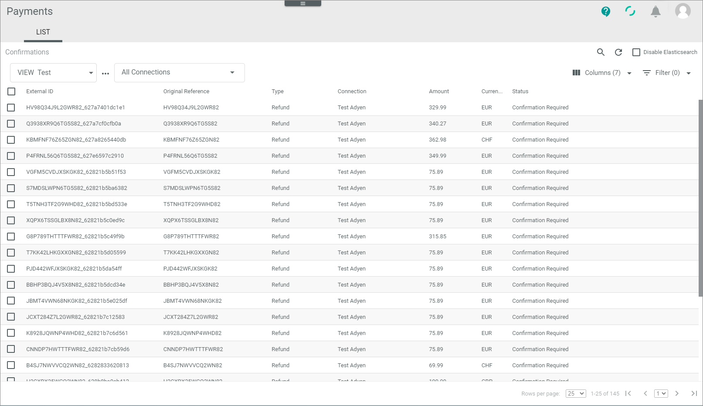
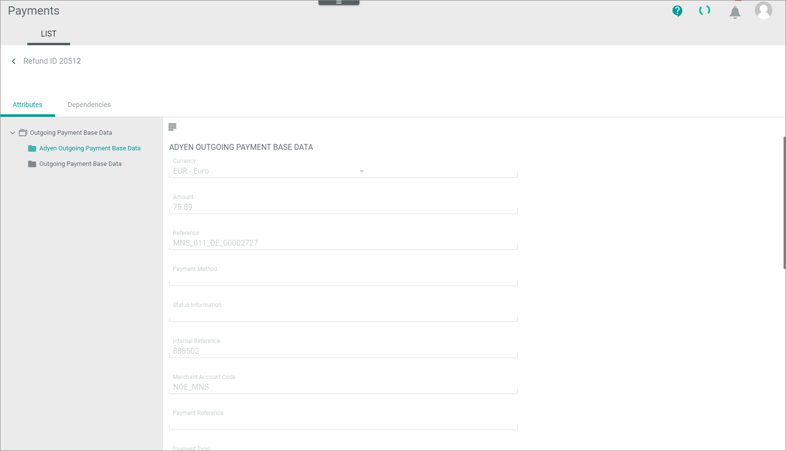

[!!LIST (Confirmations)](../UserInterface/06a_ListConfirmations.md)

# Manage confirmations

The *Confirmation* menu entry provides you with a view on all references to refunds that have been created. Before your company sends back the money to the customer, you have to check the refunds with this menu entry. This service is supported by the most payment service providers. As a person with appropriate permissions, you have here the possibility to check the refunds manually before money is returned.  

You can use this procedure to accept a refund so that the service payment provider gets the request to send back the money to the customer.    
You can also reject a refund, if it is not justified, for example, because the customer has returned a product with visible traces of use. In case of faulty transactions you can void them to clear the database. Note that you can only change the status of a confirmation transaction, but not any data.

Special permissions for this menu entry might have been applied in the *Settings* module. You might not be able to access this menu entry because you have no permissions to do it. Furthermore, you may have access, but you are not permitted to execute refunds above a certain amount (for example, more than €50). 

## Check confirmation transaction  

A confirmation transaction provides numerous payment-related details on a refund, which may vary depending on the payment service provider settings. To decide whether you can execute, reject or void a transaction, you can check its details.  

#### Prerequisites 

- At least one connection has been created, see [Create PSP connection](../Integration/01_ManageConnection.md#create-psp-connection).
- At least one refund has been created.
- The view displays in minimum the *Amount* and the *Status* column. If necessary, it also shows the *Currency* column. 

#### Procedure

*Payments > Confirmation > Tab LIST*  

1. If desired, click the  (Search) button to display the search bar and search for the original reference ID of the refund.

2. Check the confirmation transaction status in the *Status* column. The status displays the current stage in the confirmation process. You can use the status ID prefixed below to filter the list. The following status is available: 
    - **2 - Confirmation required**   
       The transaction is not yet executed rsp. the repayment is not yet confirmed by an Actindo user.   
    
3. Click a transaction to see the details.   
    The *"Confirmation ID"* view is displayed. The *Attributes* tab is preselected by default.   

    

4. If required, check the details of the refund. For more information, see [Confirmations &ndash; Attributes](../UserInterface/06a_ListConfirmations.md#confirmation-–-attributes).   

5. Return to the list of confirmations and decide how to proceed the refund.

## Execute confirmation transaction

After you have checked a confirmation transaction and the reclaim is justified, you can execute it. The payment service provider can then arrange the repayment of the money.  

#### Prerequisites

- At least one refund has been created.
- At least the *Amount* and the *Status* column is displayed in the view.
- The status of a confirmation transaction is **Confirmation required**. 

#### Procedure

*Payments > Confirmation > Tab LIST*

1. If desired, click the  (Search) button to display the search bar and search for the original reference ID of the refund.

2. Check the confirmation transaction you want to execute, see [Check confirmation transaction](#check-confirmation-transaction).

3. Select the confirmation transaction you want to execute by clicking the checkbox on the left. If desired, you can select several transactions at once.    
    The editing toolbar is displayed.

4. Click the [EXECUTE] button.
    The entry is removed from the list. The workflow now initiates a repayment of the money.

## Reject confirmation transaction

After you have checked a confirmation transaction and the reclaim is not justified, you can reject it.   

#### Prerequisites

- At least one refund has been created.
- At least the *Amount* and the *Status* column is displayed in the view.
- The status of a confirmation transaction is **Confirmation required**. 

#### Procedure

*Payments > Confirmation > Tab LIST*

1. If desired, click the  (Search) button to display the search bar and search for the original reference ID of the refund.

2. Check the confirmation transaction you want to reject, see [Check confirmation transaction](#check-confirmation-transaction).

3. Select the confirmation transaction you want to reject by clicking the checkbox on the left. If desired, you can select several transactions at once.    
    The editing toolbar is displayed.

4. Click the [REJECT] button. 
    A confirmation message is displayed.    
    The status of the confirmation transaction will be internally changed to **Void**, but it will not be displayed. The workflow informs the payment service provider about the rejection of the refund.

## Void confirmation transaction  

You can void a confirmation transaction that is no longer valid for the payment process and invalidate it for the Actindo database. 
> [Info] The payment service provider will not be informed about changing the status to **Void**. It is only done to clear the database from faulty entries.  

#### Prerequisites

- The confirmation transaction is no longer valid.

#### Procedure

*Payments > Confirmation > Tab LIST*

1. Identify the issue that led to the error/failure. To do this, check the confirmation transaction to be voided, see [Check confirmation transaction](#check-confirmation-transaction).

2. Select the confirmation transaction to be voided by clicking the checkbox on the left.   
The editing toolbar is displayed.   

3. Click the [VOID] button.  
A confirmation message is displayed.  
The confirmation transaction has been removed from the list. It is no longer valid for the Actindo database.