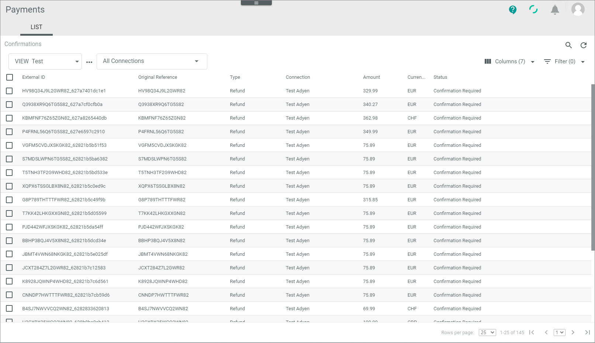

# Manage confirmations

The *Confirmations* menu entry provides you with a view on all references to refunds that has been created. Before your company sends back the money to the customer, you can check the refunds with this menu entry. This service is supported by the most payment service providers.
> [Info] If a workflow decides that you have to sent back money to the customer, you have here the possibility to check the refunds, before money is returned.   

You can use this procedure to accept a refund so that the service payment provider gets the request to send back the money to the customer. If a refund is not justified, for example, because the goods have already been delivered, you can also reject the refund. In case of faulty tickets you can void them to clear the database.      
In the settings might have been applied special permissions.
> [Info] You might not be able to access this menu entry, because you have no permissions to do it. Furthermore, you may have access, but you are not permitted to execute refunds above a certain amount (for example, more than 50€). 

## Check confirmation ticket  

*Payments > Confirmations > Tab LIST*  

A confirmation ticket provides numerous payment-related details on a refund, which may vary depending on the payment service provider settings. To decide whether you can execute, reject or void a ticket, you can check its details.  
> [Info] You can only change the status of a confirmation ticket, but not any data.

#### Prerequisites
- At least one connection has been created, see [Create a connection](../Integration/01_ManageConnections.md#create-a-connection).
- At least one refund has been created.
- The view displays in minimum the *Amount* and the *Status* column. If it is necessary, it also shows the *Currency* column. For more information, see [LIST &ndash; Confirmations](../UserInterface/06_ListConfirmations.md#create-view).
- You have the original reference ID for this transaction.

#### Procedure
1. Click the [Search](../../Assets/Icons/Search.png "[Search]") (Search) button to display the search bar and search for the original reference ID of the refund.
2. Check the confirmation ticket status in the *Status* column. The status displays the current stage in the confirmation process. You can use the status ID prefixed below to filter the list. The following statuses are available: 
    - **2 - Confirmation required**   
    -    
3. Click on a transaction to see the details.   
    The sub-tabs of the transaction are opened.   

    
4. If required, check the details of the refund. For more information, see the following:
     - [LIST &ndash; Attributes](../UserInterface/06_ListConfirmations.md#confirmations-–-attributes)

## Execute confirmation ticket 
After you have checked a confirmation ticket and the reclaim is justified, you can execute it. The payment service provider can than arrange the repayment of the money.
#### Prerequisites
- At least one connection has been created, see [Create a connection](../Integration/01_ManageConnections.md#create-a-connection).
- At least one refund has been created.
- At least the *Amount* and the *Status* column is displayed in the view.
- The status of a confirmation ticket is "Confirmation required". 

#### Procedure
*Payments > Confirmations > Tab LIST*

1. Click the [Search](../../Assets/Icons/Search.png "[Search]") (Search) button to display the search bar and search for the original reference ID of the refund.
2. Check the confirmation ticket you want to execute, see [Check the confirmation ticket](05_ManageConfirmations.md#check-confirmation-ticket).
2. Select the confirmation ticket you want to excute by clicking the checkbox on the left.   
    The editing toolbar is displayed.
3. Click the [Execute] button. <!---was passsiert dann-->
   The status of the authorization ticket has changed to *Executed??*.

## Reject confirmation ticket 
After you have checked a confirmation ticket and the reclaim is **not** justified, you can reject it. 
#### Prerequisites
- At least one connection has been created, see [Create a connection](../Integration/01_ManageConnections.md#create-a-connection).
- At least one refund has been created.
- At least the *Amount* and the *Status* column is displayed in the view.
- - The status of a confirmation ticket is "Confirmation required". 

#### Procedure

*Payments > Confirmations > Tab LIST*

1. Click the [Search](../../Assets/Icons/Search.png "[Search]") (Search) button to display the search bar and search for the original reference ID of the refund.
2. Check the confirmation ticket you want to reject, see [Check the confirmation ticket](05_ManageConfirmations.md#check-confirmation-ticket).
2. Select the confirmation ticket you want to reject by clicking the checkbox on the left.   
    The editing toolbar is displayed.
3. Click the [Execute] button. <!---was passsiert dann-->
   The status of the confirmation ticket has changed to *Rejected??*.

## Void confirmation ticket
You can void a refund ticket, if you want to disable the ticket for the Actindo database. 
> [Info] The payment service provider will not be informed about changing the status to "void". It is only done to clear the database.
#### Prerequisites
- The status of a confirmation ticket is **not** "Confirmation required". 

#### Procedure

*Payments > Confirmations > Tab LIST*

1. Identify the communication issue that led to the error. To do this, check the confirmation ticket to be voided, see [Check the cancellation and chargeback ticket](04_ManageCancellationsChargebacks.md#check-cancellation-and-chargeback-ticket).
2. Select the Confirmation ticket to be voided by clicking the checkbox on the left.   
    The editing toolbar is displayed.
3. Click the [Void] button.  <!---was passsiert dann-->   
   The status of the confirmation ticket has changed to "Void". It is not longer valid for the Actindo database.