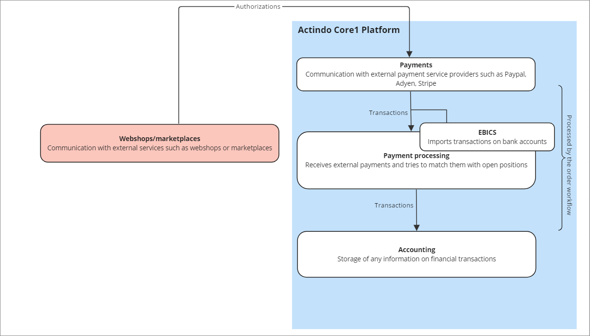

# Key Features
Organize and monitor your incoming payments and refunds:   

- [Automated import](./02_Features.md#automated-import)      
- [Connecting with payment service providers](./02_Features.md#connection-of-payment-service-providers)      
- [Importing bank statements and automatic posting](./02_Features.md#import-of-bank-statements-and-automatic-posting)   
- [Payment processing and accounting linked](./02_Features.md#payment-processing-and-accounting-linked)   
- [Managing all payments centrally](./02_Features.md#managing-all-payments-centrally)  
- [Handling of sensitive data](./02_Features.md#handling-of-sensitive-data)

<!---Hallo Stefan, die folgenden Infos sind hauptsächlich von der Website. Ich bin mir da nicht sicher, ob das alles so stimmt-->

## Automated import
With the *Payments* module of Actindo, pre-authorized payments are captured automatically at the moment orders are delivered. If products are announced, but not yet launched, customers can reserve a product and pay later when the shipment has started.
In case of returns or credit notes, refund requests are automatically sent out to the original means of payment. By using the 4-eyes principle, you can optionally double-check the refunds, for example, with specific user permissions depending on the invoice amount.  
The single steps of the payments process are usually integrated in an order workflow. The workflow controls that no products are shipped without a payment commitment from the customer.

## Connecting with payment service providers
Youu can flexibly connect various payment service providers such as Adyen&trade;, Paypal&trade; to the *Actindo Core1 Platform*. Depending on the payment service provider you decide for, credit cards, bank transactions, and other standard payment methods are supported implicitly.

## Importing bank statements and automatic posting
Bank statements and reports from payment service providers can be automatically processed and posted to the *Payment Processing* module and therefore by passing the *Payment Processing* module to the Actindo *Accounting* module or a third-party Accounting. In case of prepayments, you can hold the shipment of orders until the invoice amount is received. It is then and automatically released for shipment after payment has been made.

## Payment processing and accounting linked 
 The Actindo *Payment* module connects the business accounts at your various payment service providers and the Actindo *Payment Processing* module. In being the smart connection between those two modules, the Actindo *Payment* module helps you to process orders faster and more efficiently. Thanks to automated payment checks, incoming payments are registered directly, and orders could therefore be processed immediately. Refunds can be made just as quickly and automatically. By linking payment and accounting, you do not only minimize the workload for your employees, but also offer your customers a smooth and fast service.

 **Payments interaction with other modules** 

## Managing all payments centrally 
The payment options for customers are diverse, and so are the payment service providers that exist on the market today. In order to be able to offer your customers the widest possible range of payment methods - from invoice to credit card to direct debit - cooperation with various providers is required and provided by Actindo. This enables the management of all payments and refunds centrally via the *Actindo Core1 Platform*.  
In order to have consistent databases and if this is supported by the payment service provider, the *Payments* module can reconcile each day whether all payments have been successfully transferred from the payment service provider to the *Payments* module. In addition, the *Payments module* supports both asynchronous and synchronous processing.

## Handling of sensitive data
Although you can view and monitor all incoming payments and refunds, you do not have access to any sensitive customer data. In the *Payments* module, all incoming payments and refunds are referenced to the number of the payment service provider transactions.   
Sensible data such as customer names, bank or credit card details or other data that are protected by a data protection act such as GDPR, are not visible in the *Payments* module. 
The sensitive data remain on the payment server provider side only. In addition, an Actindo user will not be able to redirect a payment to his or her own bank account. The *Payments* transactions are a reference to the communication between the Actindo system and the payment service provider's system only. 

