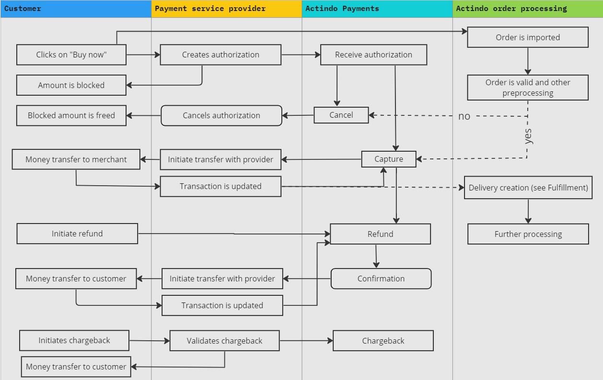

# Processes overview

- [Payments documentation](#payments-documentation)  
- [Payments in the order process](#payments-in-the-order-process)

## Payments documentation
The following scheme shows the processes and chapters of the *Payments* module documentation and their link to other modules:

## Payments in the order process

The whole payments steps are part of the order workflow and, except the confirmation menu entry, you can only monitor the steps for errors occurred during processing the order workflow or for communication errors occurred during transferring the data between the payment service provider and Actindo. As these processes are invisible, the following scheme shows the single payments steps in the order workflow.

