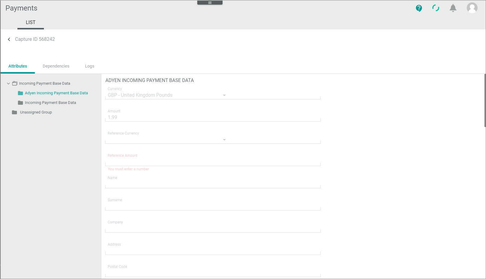
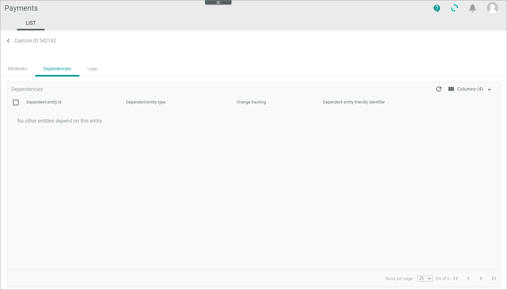
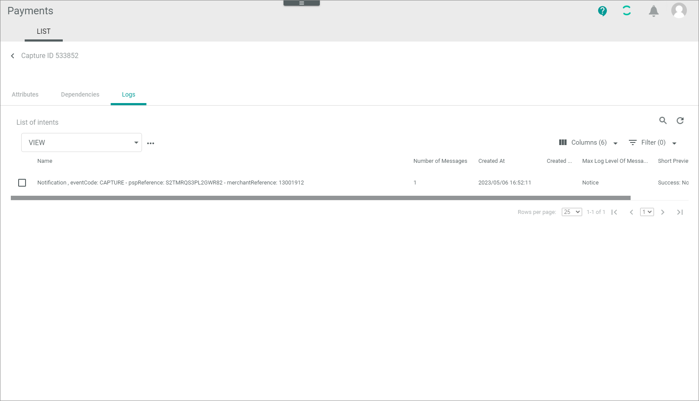
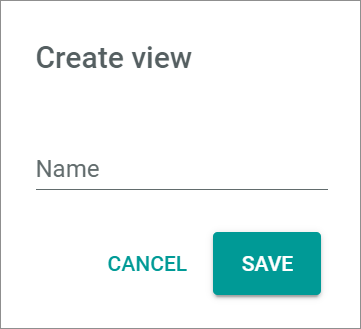

[!!Monitor payments and captures](../Operation/02_ManagePaymentsAndCaptures.md)

# LIST (Payments and captures)

*Payments > Payments and captures > Tab LIST*

]")

**Payments and captures**

- *VIEW*  
    Click the drop-down list to select the view. All created views are displayed in the drop-down list. Click the  (Points) button to the right of the *VIEW* drop-down list to display the context menu and create a view.   

    -  (Points)      
        Click this button to the right of the *VIEW* drop-down list to display the context menu. The following menu entries are available:

        -  create  
            Click this entry to create a view. The *Create view* window is displayed, see [Create view](#create-view).

        -  rename  
            Click this entry to rename the selected view. The *Rename view* window is displayed, see [Rename view](#rename-view). This menu entry is only displayed if a view has been selected.

      <!---- [Reset](../../Assets/Icons/Reset.png "[Reset]") reset  
            Click this entry to reset all unsaved changes to the settings of the selected view. This menu entry is only displayed if a view has been selected and any changes have been made to the view settings.-->

        -  publish  
            Click this entry to publish the view. This menu entry is only displayed if you have selected an unpublished view. As long as you have not published a view, your views are visible for you only.

        -  unpublish  
            Click this entry to unpublish the view so that it is visible only to you again. This menu entry is only displayed if you have selected and published a view.

        -  save  
            Click this entry to save the current view settings in the selected view. This menu entry is only displayed if you have selected a view.

            > [Info] When the settings of a view have been changed, an asterisk is displayed next to the view name. The asterisk is hidden as soon as the changes have been saved.

        -  delete  
            Click this entry to delete the selected view. A confirmation window to confirm the deletion is displayed. This menu entry is only displayed if you have selected a view.   
 
- *Connections*   
    Click the drop-down list to select a connection. The following options are available:
    - **All connections**  
        Select this option to display payment and capture transactions for all configured connections. 
    - **Connection name**  
        Select this option to display payment and capture transactions for the selected connection. When a specific connection has been selected, the **All connections** option is no longer displayed. Click the selected connection again to deselect it.  

-  (Search)   
    Click this button to display the search bar and search for authorization transactions.   

-  (Refresh)   
    Click this button to update the list of authorization transactions.   

-  Columns (x)   
    Click this button to display the columns bar and to customize the displayed columns and the order of columns in the list. The *x* indicates the number of columns that are currently displayed in the list.   
    
-  Filter (x)   
    Click this button to display the filter bar and customize the active filters. The *x* indicates the number of filters that are currently active.  

- [x]     
    Select the checkbox to the left of one list entry to display the editing toolbar for this single entry.   
    If you click the checkbox in the header, all entries in the list are selected. The editing toolbar shows then all actions you can perform on several entries.   

- [REFUND]   
   Click this button to refund the payment manually, so that the order process can be continued. If desired, you can select several transactions at once. For detailed information, see [Refund payment and capture](../Operation/02_ManagePaymentsAndCaptures.md#refund-payment-and-capture-transaction).   

- [VOID]   
  Click this button to invalidate the transaction for the Actindo database. For detailed information, see [Void payment and capture transaction](../Operation/02_ManagePaymentsAndCaptures.md#void-payment-and-capture-transaction).

The list displays all capture transactions. Depending on the payment service provider, the displayed columns vary. All fields are read-only. The following standard columns are available.

- *External ID*   
   ID given by the payment service provider.

- *Original reference*   
   Reference to the authorization transaction. You can use this reference to follow up one payment over the whole process.

- *Transaction date*   
   Date on which the transaction has been created by the payment service provider.

- *Status*   
   Description of the transaction status.   

- *Status ID*   
   Identifier for the status. The following statuses are available, each prefixed by the ID in the list below. You can use the *Status ID* to filter and sort the list. 
-   - **1 - Preparing**  
        The transaction has been created, but is not yet transferred.
    - **2 - Unconfirmed**   
        A refund is reserved but not yet released by an Actindo user. 
    - **3 - Success**  
        Actindo as well as the payment service provider has processed the transaction successfully.
    - **4 - Failure**   
        The payment service provider has received the request, but rejected it. If available for the connection, the status information field may provide further information.
    - **5 - Error**   
       Errors have been occurred during transfer.
    - **6 - Void**   
       The transaction has been voided, see [Void payment and capture transaction](../Operation/02_ManagePaymentsAndCaptures.md#void-payment-and-capture-transaction).

- *Connection*   
   Name of the Connection. Note that this is the customer-specific name that has been given the connection. For detailed information, see [Manage connections to payment service providers (PSP)](../Integration/01_ManageConnection.md).

- *Created by*   
   User name of the person or API who has created the transaction. Can be a real user or an API user.

- *Modified by*   
   User name of the person or API who has changed the transaction. Can be a real user or an API user.

- *ID*   
   Unique transaction identification. The ID is automatically assigned by the system.
     
- *Type*   
   Kind of the displayed transaction, in this case a payment and capture transaction.  

- *Connection ID*   
   Connection identification number. The ID number is automatically assigned by the system.    

- *Created at*   
   Date and time when the payment service provider has created the transaction. 

- *Modified at*   
   Date and time when the payment service provider has modified the transaction.  

- *Currency*   
   Currency in which the payment will be posted.  

- *Amount*   
   Invoice amount of the payment in the currency in which the payment will be posted.   

- *Reference currency*   
  Currency of the original payment. Makes it possible that the accounting can post the payment to the correct currency account so that a refund later do not lead to currency differences.

- *Reference amount*   
   Amount of the original payment. 

- *Name*   
   First name of the person who has made the payment.   

- *Surname*   
   Last name of the person who has made the payment.   

- *Company*   
   Name of the company on whose behalf the payment was made.   

- *Address*   
   Street and house number of the address.   

-  *Postal code*   
   Zip code of the address.    

- *City*   
   City of the address.    

- *State*   
   State of the address.    

- *Country*   
   Country of the address.   

- *Charges amount*   
   Amount of the fee.    

- *Charges currency*   
   Currency of the fee.      

- *Charges other*   
   Other fees.     

- *Reference*   
  Mostly, depending on the payment service provider, the order number.

- *Intented use*   
   In general, depending on the payment service provider, a further description of the transaction.

- *Charges intended use*   
   Description of the fee, for example transaction fee.

- *Booking date*   
   Date on which the payment was posted.   

- *Due date*  
   If applicable, date on which the payment is to be collected.

- *Payment method*   
   The way of payment that the customer has chosen, for example, credit card, PayPal&trade;, direct debit.   

- *Status information*   
   If applicable, specific information on the status of the transaction.  

- *Internal reference*   
   Actindo-specific reference back to the billing document.

- *Original currency*   
   Currency in which the product(s) were paid.   

- *Original currency amount*   
   Invoice amount in the original currency.   

## Capture

*Payments > Payments and captures > Tab LIST > Select a payment and capture transaction*

**Capture "Capture ID"**

-  (Back)   
    Click this button to close the *Capture ID* view and return to the list of payment and capture transactions. 

## Capture &ndash; Attributes

*Payments > Payments and captures > Tab LIST > Select a payment and capture transaction > Tab Attributes*   

In the left margin column, all available attribute groups are displayed. Click a group to display the attributes that are assigned to this group on the right side of the *Attributes* tab. If the authorization transaction contains attributes that are not assigned, the *Unassigned group* attribute group is automatically displayed in the left margin column.

-  (Folders)  
    Attribute group that contains attribute sub-groups. Click the attribute group or the arrow left to the attribute group to expand the group and to display the attribute sub-groups. The following sub-groups are available:
    - *[Payment service provider] Incoming Payment Base Data*   
      This folder contains attributes that are specific for the payment service provider.   

    - *Incoming Payment Base Data*   
      This folder contains general attributes that Actindo needs to query payments data. These data support standard functions of Actindo.   

    - *Unassigned Group*   
      This folder contains attributes that are not assigned the other groups.   

-  (Folder)   
    Attribute group. Click the attribute group to display all attributes that are assigned to the selected attribute group on the right side of the *Attributes* tab.

The right side of the *Attributes* tab displays all attributes that are assigned to the selected group in the left margin column. Depending on the selected attribute group, the displayed fields may vary. The attributes are imported by the payment service provider driver. All fields are read-only.   

<!----  (Collapse/Expand)    
    Click this button to collapse or expand the left margin column with the attribute groups. When the left margin is expanded and you click this button, the column is collapsed. When the column is collapsed and you click this button, the column is expanded. This is available for the *Unassigned Group* folder only.-> nicht im Screen-->

## Capture &ndash; Dependencies

*Payments > Payments and captures > Tab LIST > Select a payment and capture transaction > Tab DEPENDENCIES* 

   

Since a payment and capture transaction has no dependencies to other entities in Actindo by default, this sub-tab is not relevant.

## Capture &ndash; Logs

*Payments > Payments and captures > Tab LIST > Select a payment and capture transaction > Tab Logs* 

   

This tab displays messages and intents that have been created during transferring the selected payment and capture transaction from the payment service provider. The logging contains all requests and responses from both, the payment service provider and the *Payments* module.   
In contrast to the messages that are provided with the *Logging* menu entry, you see here the logging for the specific payment and capture transaction only. See [LIST (Logging)](./07a_ListLogging.md) for detailed information on fields and functions.   

## Create view

*Payments > Payments and captures > Tab LIST > Button Points > Menu entry create*

- *Name*   
    Enter a name for the view.

- [CANCEL]   
    Click this button to cancel creating a view. The *Create view* window is closed.

- [SAVE]   
    Click this button to save the new view and display it in the *VIEW* drop-down list. The *Create view* window is closed.

## Rename view

*Payments > Payments and captures > Tab LIST > Button Points > Menu entry "rename"*

- *Name*   
    Click this field to edit the view name.

- [CANCEL]   
    Click this button to cancel renaming the view. The *Rename view* window is closed.

- [SAVE]   
    Click this button to save the changes and display the new name in the *VIEW* drop-down list. The *Rename view* window is closed.

