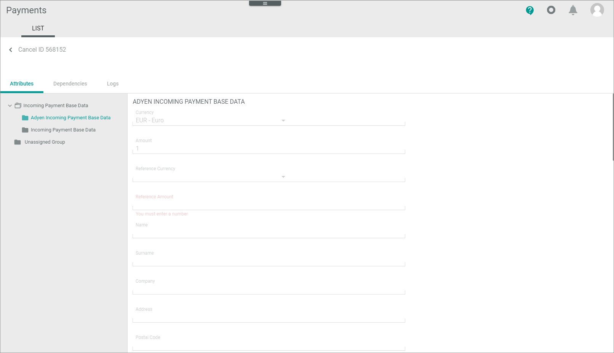

# LIST (Cancellations and Chargebacks)

]")

## Cancellations and Chargebacks &ndash; Attributes
]")

## Cancellations and Chargebacks &ndash; Dependencies

## Cancellations and Chargebacks &ndash; Logs

]")