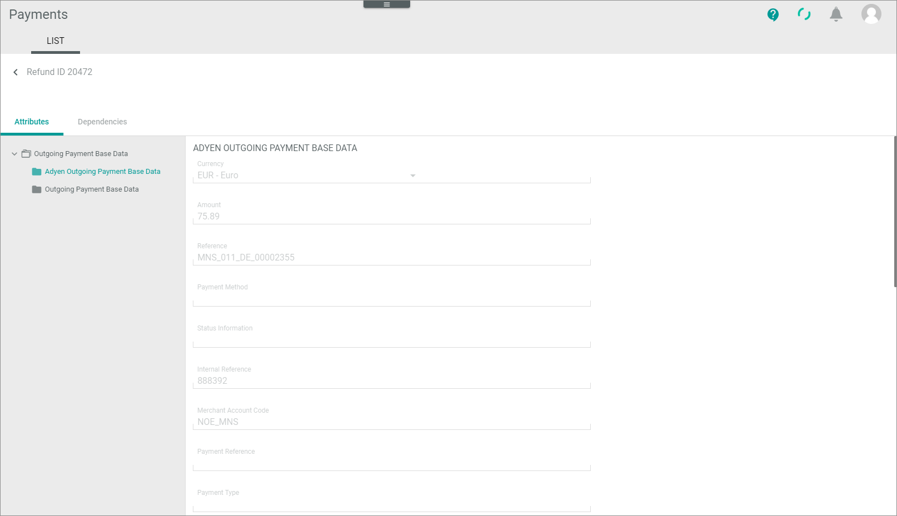
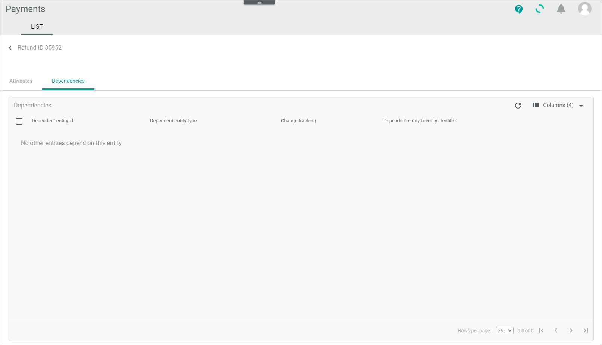

[!!Manage confirmations](../Operation/05_ManageConfirmations.md)

# LIST (Confirmations)

*Payments > Authorizations > Tab LIST*

]")

**Confirmations**

- *VIEW*  
    Click the drop-down list to select the view. All created views are displayed in the drop-down list. Click the  (Points) button to the right of the *VIEW* drop-down list to display the context menu and create a view.   

    -  (Points)      
        Click this button to the right of the *View* drop-down list to display the context menu. The following menu entries are available:

        -  create  
            Click this entry to create a view. The *Create view* window is displayed, see [Create view](#create-view).

        -  rename  
            Click this entry to rename the selected view. The *Rename view* window is displayed, see [Rename view](#rename-view). This menu entry is only displayed if you have selected a view.

        <!--- Eintrag gibt es nicht mehr [Reset](../../Assets/Icons/Reset.png "[Reset]") reset  
            Click this entry to reset all unsaved changes to the settings of the selected view. This menu entry is only displayed if a view has been selected and any changes have been made to the view settings.-->

        -  publish  
            Click this entry to publish the view. This menu entry is only displayed if you have selected an unpublished view. As long as you have not published a view, your views are visible for you only.

        -  unpublish  
            Click this entry to unpublish the view so that it is visible only to you again. This menu entry is only displayed if you have selected and published a view.

        -  save  
            Click this entry to save the current view settings in the selected view. This menu entry is only displayed if you have selected a view.

            > [Info] When the settings of a view have been changed, an asterisk is displayed next to the view name. The asterisk is hidden as soon as the changes have been saved.

        -  delete  
            Click this entry to delete the selected view. A confirmation window to confirm the deletion is displayed. This menu entry is only displayed if you have selected a view.
 

- *Connections*   
    Click the drop-down list to select a connection. The following options are available:
    - **All connections**  
        Select this option to display authorization transactions for all configured connections. 
    - **Connection name**  
        Select this option to display authorization transactions for the selected connection. When a specific connection has been selected, the **All connections** option is no longer displayed. Click the selected connection again to deselect it.  
- [x]     
    Select the checkbox to the left of one list entry to display the editing toolbar for this single entry.   
    If you click the checkbox in the header, all entries in the list are selected. The editing toolbar shows all actions you can perform on several entries.
-  (Search)   
    Click this button to display the search bar and search for entries.

-  (Refresh)   
    Click this button to update the entries.

-  Columns (x)   
    Click this button to display the columns bar and to customize the displayed columns and the order of columns in the list. The *x* indicates the number of columns that are currently displayed in the list.   
    > [Info] It is recommended to add the following columns to your view to get the required information snd to better filter and sort the entries: Status ID, Status information (if applicable). 
-  Filter (x)   
    Click this button to display the filter bar and customize the active filters. The *x* indicates the number of filters that are currently active.

The list displays all confirmation transactions. Depending on the payment service provider, the displayed columns vary. All fields are read-only. The following standard columns are available.   
- - *ID*   
   Unique identifier of the transaction.   
- *Status ID*   
   Identifier for the status. The following status ID is available, each prefixed by the ID in the list below:
     - **2 - Confirmation required**   
        A refund is reserved but not yet released by an Actindo user.      
- *Status*
   Status text of the confirmation transaction.
- *Connection ID*   
   Name of the connection.    
- *Created At*   
   Date and time, on which the payment service provider has created the authorization transaction. <!---Stimmt das? Oder das Payment?-->
- *Modified At*   
   Date and time, on which the payment service provider has modified authorization transaction.
- *Currency*   
   Currency in which the payment will be posted.   
- *Amount*   
   Invoice amount of the payment in the currency in which the payment will be posted.   
- *Reference*  
   <!---???-->
- *Name*   
   Full name <!---oder nur Vorname?--> of the person who has made the payment.
- *Surname*   
   Surname of the person who has made the payment.
- *Company*   
   Name of the company on whose behalf the payment was made. 
- *Address*   
   Street and house number of the address.<!---Straße und Hausnummer? oder konkatenierte Adresse? -->
- *Postal Code*   
   Zip code of the address.
- *City*   
   City of the address. 
- *State*   
   If applicable, state of the address.<!----state oder country--->
- *Country*   
   If applicable, country of the address.   
- *Payment Method*   
- *Status Information*
- *Internal Reference*   
- *Due Date*   
   Date on which the repayment must be made at the latest.<!---Stimmt das?-->   

## Confirmations &ndash; Attributes

In the left margin column, all available attribute groups are displayed. Click a group to display the attributes that are assigned to this group on the right side of the *Attributes* tab. 

-  (Folders)  
    Attribute group that contains attribute sub-groups. Click the attribute group or the arrow left to the attribute group to expand the group and display the attribute sub-groups. The following sub-groups are available:
    - *[Payment service provider] Outgoing Payment Base Data*   
      This folder contains attributes that are specific for the payment service provider.
    - *Outgoing Payment Base Data*   
      This folder contains general fields that Actindo needs to query payments data. These data support standard functions of Actindo. See the description of the fields above.
    - *Unassigned Group*   
      This folder contains attributes that are not assigned the other groups.

-  (Folder)  
    Attribute group. Click the attribute group to display all attributes that are assigned to the selected attribute group on the right side of the *Attributes* tab.

The right side of the *Attributes* tab displays all attributes that are assigned to the selected group in the left margin column. Depending on the selected attribute group, the displayed fields may vary. The attributes are imported by the payment service provider driver. All fields are read-only.   

-  (Collapse/Expand)    
    Click this button to collapse or expand the left margin column with the attribute groups. When the left margin is expanded and you click this button, the column is collapsed. When the column is collapsed and you click this button, the column is expanded. This is available for the *Unassigned Group* folder only.

## Confirmations &ndash; Dependencies

Since a confirmation ticket has no dependencies to other entities in Actindo by default, this sub-tab is not relevant.

<!---Marina, hier gibt es keine Logs-->

## Create view
*Payments > Confirmations > Tab LIST > Button Points > Menu entry create*

- *Name*   
    Enter a name for the view.

- [CANCEL]   
    Click this button to cancel creating a view. The *Create view* window is closed.

- [SAVE]   
    Click this button to save the new view and display it in the *VIEW* drop-down list. The *Create view* window is closed.

## Rename view

*Payments > Confirmations > Tab LIST > Button Points > Menu entry rename*

- *Name*   
    Click this field to edit the view name.

- [CANCEL]   
    Click this button to cancel renaming the view. The *Rename view* window is closed.

- [SAVE]   
    Click this button to save the changes and display it in the *VIEW* drop-down list. The *Rename view* window is closed.

