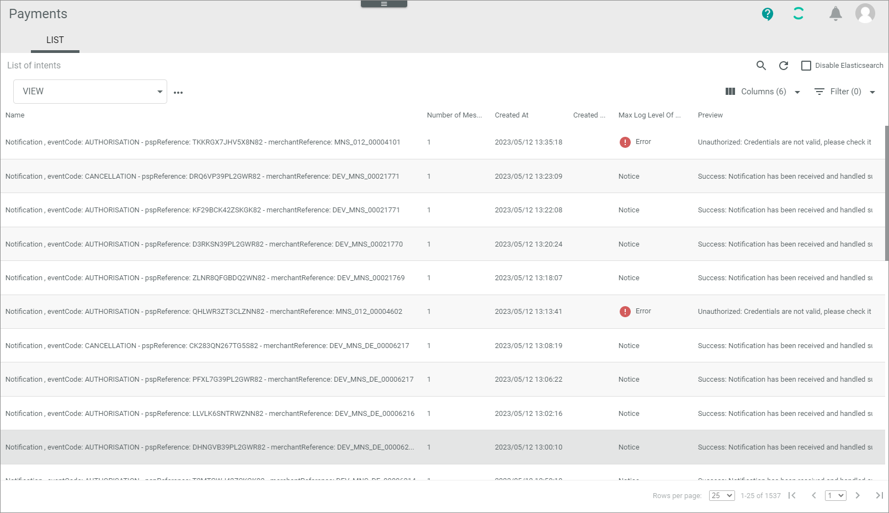
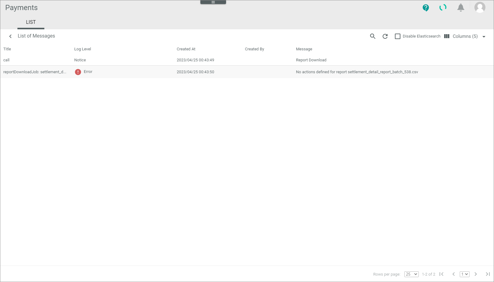
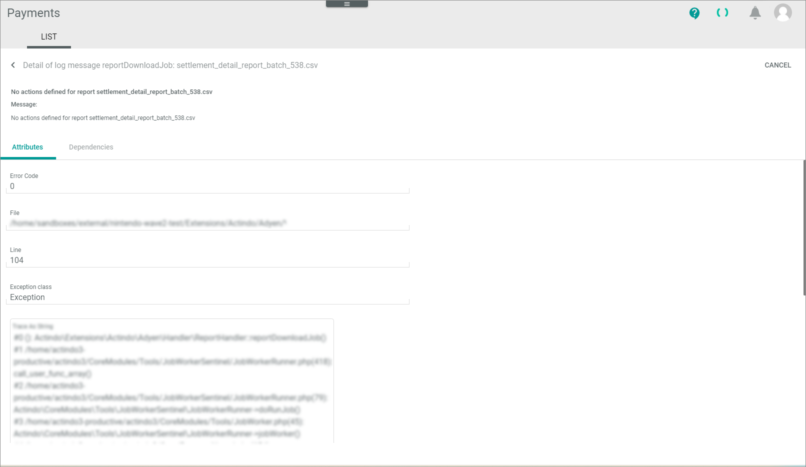
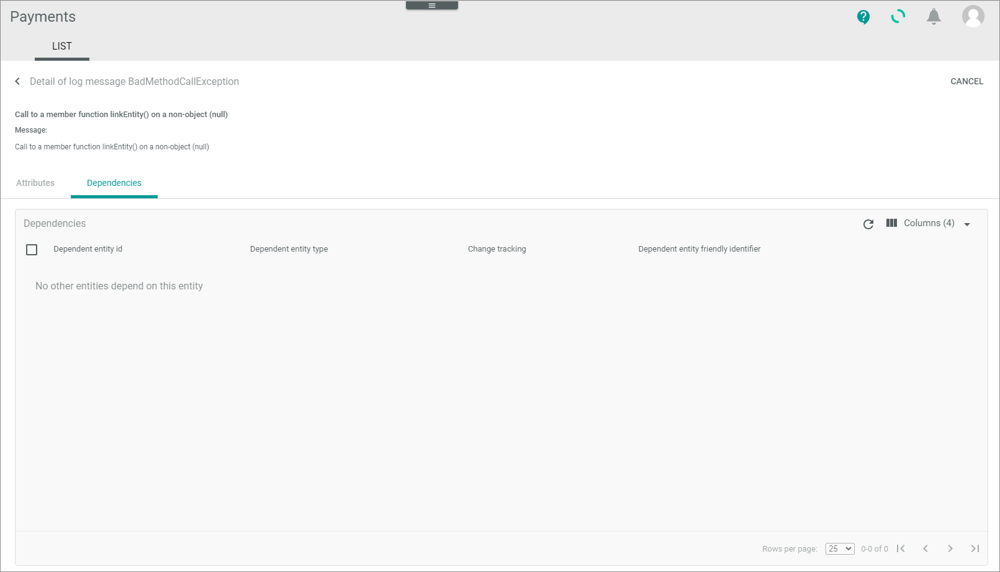

# LIST (Logging)

*Payments > Logging > Tab LIST*

**List of intents**

-  (Search)   
    Click this button to display the search bar and search for an intent.

-  (Refresh)   
    Click this button to update the list of intents.

- *VIEW*  
    Click the drop-down list to select the view. All created views are displayed in the drop-down list. Click the  (Points) button to the right of the *VIEW* drop-down list to display the context menu and create a view.   

    -  (Points)      
        Click this button to the right of the *View* drop-down list to display the context menu. The following menu entries are available:

        -  create  
            Click this entry to create a view. The *Create view* window is displayed, see [Create view](#create-view).

        -  rename  
            Click this entry to rename the selected view. The *Rename view* window is displayed, see [Rename view](#rename-view). This menu entry is only displayed if a view has been selected.

        -  reset  
            Click this entry to reset all unsaved changes to the settings of the selected view. This menu entry is only displayed if a view has been selected and any changes have been made to the view settings.

        -  publish  
            Click this entry to publish the view. This menu entry is only displayed if a view has been selected and unpublished.

        -  unpublish  
            Click this entry to unpublish the view. This menu entry is only displayed if a view has been selected and published.

        -  save  
            Click this entry to save the current view settings in the selected view. This menu entry is only displayed if a view has been selected.

            > [Info] When the settings of a view have been changed, an asterisk is displayed next to the view name. The asterisk is hidden as soon as the changes have been saved.

        -  delete  
            Click this entry to delete the selected view. A confirmation window to confirm the deletion is displayed. This menu entry is only displayed if a view has been selected.

-  Columns (x)   
    Click this button to display the columns bar and customize the displayed columns and the order of columns in the list. The *x* indicates the number of columns that are currently displayed in the list.

-  Filter (x)
    Click this button to display the filter bar and customize the active filters. The *x* indicates the number of filters that are currently active.-->

 The list displays all intents. Depending on the settings, the displayed columns may vary. All fields are read-only.

- *Name*  
    Description of the intent.

- *Number of messages*  
    Number of messages contained in the intent.

- *Created at*  
    Date and time of the creation.

- *Created by*  
    Name and username of the user that initiated the action leading to the intent. If the intent was created automatically by the system, this field is empty. 

- *Max log level of message*  
    Maximum log level type of the message(s) contained in the intent. The following levels are available:   
     - **Debug**   
     - **Info**
     - **Notice**
     - **Warning**
     - **Error**
     - **Critical**
     - **Alert**
     - **Emergency**  
        
- *ID*  
    Intent identification number. The ID number is automatically assigned by the system.

- *Short preview*  
    First 30 characters of the log message.

- *Preview*  
    Complete log message.

## List of messages

*Payments > Logging > Tab LIST > Select an intent*

**List of messages**

-  (Back)   
    Click this button to close the *List of messages* view and return to the list of intents. All changes are rejected.

The list displays all log messages of the selected intent. Depending on the settings, the displayed columns may vary. All fields are read-only.

- *Title*  
    Title of the log message.

- *Log level*  
    Log level type. The following levels are available:   
     - **Debug**
     - **Info**
     - **Notice**
     - **Warning** 
     - **Error**
     - **Critical**
     - **Alert**
     - **Emergency**
  
 
- *Created at*  
    Date and time of the creation.

- *Created by*  
    Name and username of the user who has initiated the action leading to the log message. If the log message was created automatically by the system, this field is empty. 

- *Message*  
    Detailed log message to the intent.

- *ID*  
    Log message identification number. The ID number is automatically assigned by the system.

### Detail of log message

*Payments > Logging > Tab LIST > Select an intent > Select a log message*   

-  (Back)   
    Click this button to close the *Detail of log message "Log message title"* view and return to the list of messages.    
- [CANCEL]  
    Click this button to close the *Detail of log message "Log message title"* view.

- *Message*    
    Description of the log message.

### Detail of log message &ndash; Attributes

*Payments > Logging > Tab CONNECTIONS > Select an intent > Select a log message > Tab Attributes*

The *Attributes* tab displays further details of the selected log message. Depending on the attribute set of the log message, the displayed fields vary. All fields are read-only.

In general, the most common attribute sets are the standard error log message attribute set as well as the API communication attribute set. The fields of these sets are described in the following. Furthermore, it is possible to create a custom log message attribute set with different fields.

**Standard error log message attribute set**

- *Error code*  
    Number of the error code.

- *File*  
    Path of the file where the error has occurred.

- *Line*  
    Line in the file where the error has occurred.

- *Exception class*   
    Class name of the error. The error class describes the type of error that has occurred.

- *Trace as string*   
    Stack trace until the error has occurred. The stack trace lists the code until the error has occurred and is used to track the error.

- *Exception*   
    Detailed description of the error.

**API communication attribute set**

- *Code*   
    Http response status code. For detailed information about the http status codes, see [http status codes](https://www.rfc-editor.org/rfc/rfc9110#section-15) website.

- *Endpoint and method*   
    Http method of the API request and url endpoint to which the request was sent.

- *Request*   
    Http header and body of the request.

- *Response*   
    Http header and body of the response.

- *Exception*   
    Description of the error. An exception is only displayed if an error has occurred and a http status code of the **4xx** class, for instance a **404** code has been returned.

### Detail of log message &ndash; Dependencies   

*Payments > Logging > Tab CONNECTIONS > Select an intent > Select a log message > Tab Dependencies*   

The *Payments* module only handles the communication between the payment service provider and Actindo. For this reason there are in the standard no dependencies to other Actindo entities that could be displayed here.

## Create view

*Payments > Logging > Tab LIST > Button Points > Menu entry create*

- *Name*   
    Enter a name for the view.

- [CANCEL]   
    Click this button to cancel creating a view. The *Create view* window is closed.

- [SAVE]   
    Click this button to save the new view and display it in the *VIEW* drop-down list. The *Create view* window is closed.

## Rename view

*Payments > Logging > Tab CONNECTIONS > Button Points > Menu entry rename*

- *Name*   
    Click this field to edit the view name.

- [CANCEL]   
    Click this button to cancel renaming the view. The  *Rename view* window is closed.

- [SAVE]   
    Click this button to save the changes and display it in the *VIEW* drop-down list. The *Rename view* window is closed.