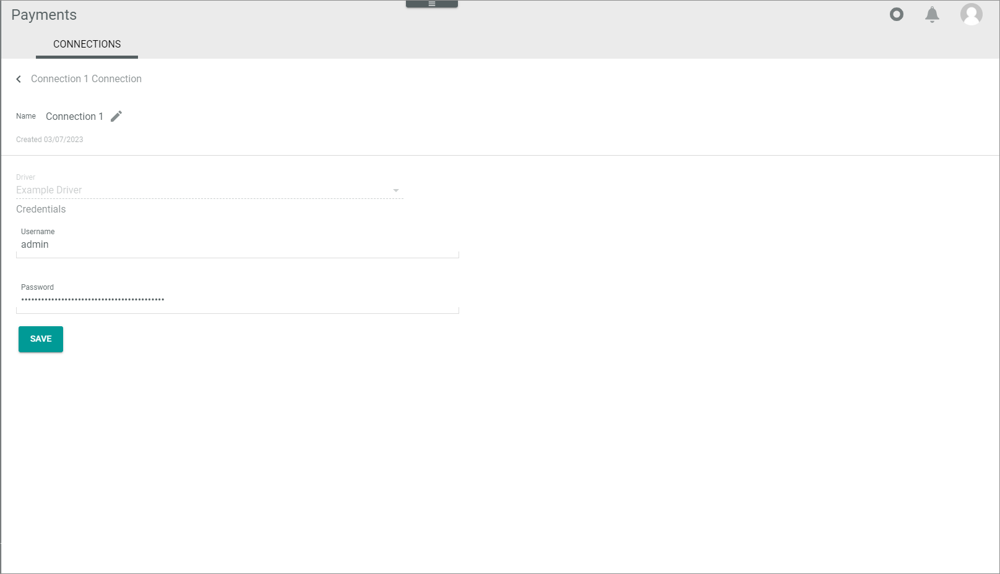
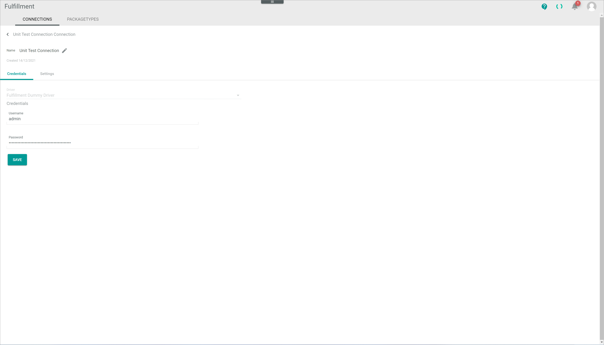
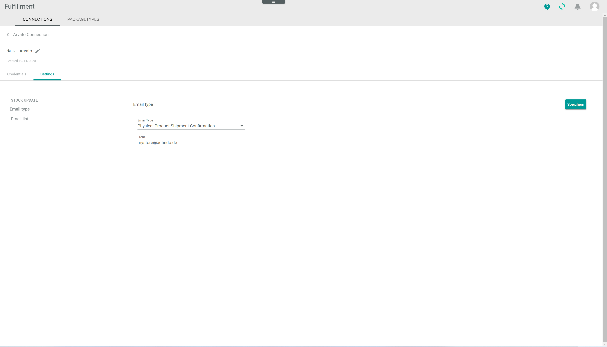

# CONNECTIONS (Settings)

[!!Establish connections](../Integration/01_EstablishConnection.md)

*Payments > Settings > Tab CONNECTIONS*

**Connections**

-  (Refresh)   
    Click this button to update the list of connections.

- *VIEW*  
    Click the drop-down list to select the view. All created views are displayed in the drop-down list. Click the  (Points) button to the right of the *VIEW* drop-down list to display the context menu and create a view.   

    -  (Points)      
        Click this button to the right of the *View* drop-down list to display the context menu. The following menu entries are available:

        -  create  
            Click this entry to create a view. The *Create view* window is displayed, see [Create view](#create-view).

        -  rename  
            Click this entry to rename the selected view. The *Rename view* window is displayed, see [Rename view](#rename-view). This menu entry is only displayed if a view has been selected.

        -  reset  
            Click this entry to reset all unsaved changes to the settings of the selected view. This menu entry is only displayed if a view has been selected and any changes have been made to the view settings.

        -  publish  
            Click this entry to publish the view. This menu entry is only displayed if a view has been selected and unpublished.

        -  unpublish  
            Click this entry to unpublish the view. This menu entry is only displayed if a view has been selected and published.

        -  save  
            Click this entry to save the current view settings in the selected view. This menu entry is only displayed if a view has been selected.

            > [Info] When the settings of a view have been changed, an asterisk is displayed next to the view name. The asterisk is hidden as soon as the changes have been saved.

        -  delete  
            Click this entry to delete the selected view. A confirmation window to confirm the deletion is displayed. This menu entry is only displayed if a view has been selected.

-  Columns (x)   
    Click this button to display the columns bar and customize the displayed columns and the order of columns in the list. The *x* indicates the number of columns that are currently displayed in the list.

- [x]     
    Select the checkbox to display the editing toolbar. If you click the checkbox in the header, all connections in the list are selected.

- [DISABLE]  
    Click this button to disable the selected connection(s). This button is only displayed if the checkbox of at least one active connection is selected. For detailed information see [Disable a connection](../Integration/01_ManageConnections.md#disable-a-connection).

- [ENABLE]  
    Click this button to enable the selected connection(s). This button is only displayed if the checkbox of at least one inactive connection is selected. For detailed information see [Enable a connection](../Integration/01_ManageConnections.md#enable-a-connection).

-  (Edit)  
    Click this button to edit the selected connection. This button is only displayed if a single checkbox in the list of connections is selected. Alternatively, you can click directly a row in the list to edit the corresponding connection. The *Edit connection* view is displayed, see [Edit connection](#edit-connection).

The list displays all available connections. Depending on the settings, the displayed columns may vary. All fields are read-only.

- *Name*  
    Connection name.

- *Status*  
    Connection status. The following statuses are available:
    -  **Active**  
        The connection is enabled and data is being synchronized via the connection.
    -  **Inactive**   
        The connection is disabled and no data is being synchronized via the connection.

- *Driver*  
    Driver name.

- *ID*  
    Connection identification number. The ID number is automatically assigned by the system.

-  (Add)  
    Click this button to add a connection. The *Create connection* view is displayed, see [Create connection](#create-connection).
  

## Create connection

*Payments > Settings > Tab CONNECTIONS > Button Add*

-  (Back)   
    Click this button to close the *Create connection* view and return to the list of connections. All changes are rejected.

- *Name*   
    Enter a connection name.

-  (Apply)  
    Click this button to apply the entered connection name. This button is only displayed if the connection name has not yet been confirmed.

-  (Edit)  
    Click this button to edit the connection name. This button is only displayed if the connection name has been confirmed.

- *Driver*  
    Click the drop-down list and select the desired driver. All installed drivers are displayed. 

    > [Info] Drivers are licensed and must be acquired via the app store or the corresponding service payment partner. The applicable driver credentials to establish the connection are obtained when acquiring the corresponding license. For detailed information, see [Create a connection](../Integration/01_EstablishConnection.md#create-a-psp-connection.)

**Credentials**

The fields displayed in the *Credentials* section vary depending on the selected driver. 

- [SAVE]  
    Click this button to save the connection.

## Edit connection

*Fulfillment > Settings > Tab CONNECTIONS > Select a connection*

-  (Back)   
    Click this button to close the *Edit connection* view and return to the list of connections. All changes are rejected.

- *Name*   
    Connection name. Click the button  (Edit) to the right of the name to edit it.

-  (Edit)  
    Click this button to edit the connection name. 

-  (Apply)  
    Click this button to apply the changes to the connection name. This button is only displayed if you are editing the connection name.

- *Created DD/MM/YYYY*  
    Creation date of the connection. This field is read-only.

## Edit connection &ndash; Credentials

*Fulfillment > Settings > Tab CONNECTIONS > Select a connection > Tab Credentials*

- *Driver*  
    Selected driver name. This drop-down list is read-only.

**Credentials** 

The fields displayed in the *Credentials* section vary depending on the selected driver.

- [SAVE]  
  Click this button to save any changes made.

## Edit connection &ndash; Settings

*Fulfillment > Settings > Tab CONNECTIONS > Select a connection > Tab Settings*

This tab is only displayed for drivers with further settings. The settings can only be configured after the connection has been established. The fields displayed vary depending on the driver installed.

- [SAVE]  
    Click this button to save any changes made.

    > [Info] If no settings are available for the selected connection, the notice *There are no settings available* is displayed.

## Create view

*Fulfillment > Settings > Tab CONNECTIONS > Button Points > Menu entry create*

For a detailed description of this window and the corresponding functions, see [Create view](./01a_List.md#create-view).

## Rename view

*Fulfillment > Settings > Tab CONNECTIONS > Button Points > Menu entry rename*

For a detailed description of this window and the corresponding functions, see [Rename view](./01a_List.md#rename-view).