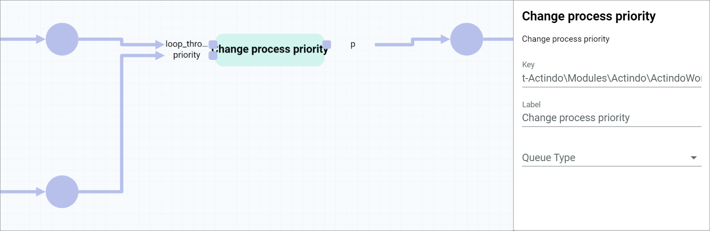
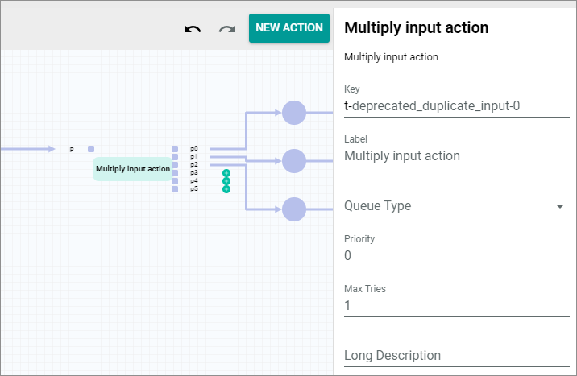
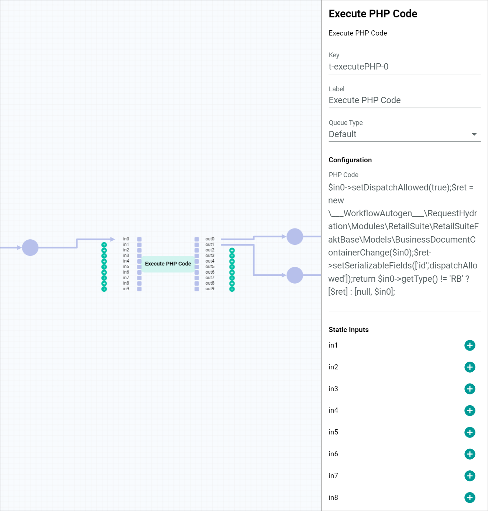
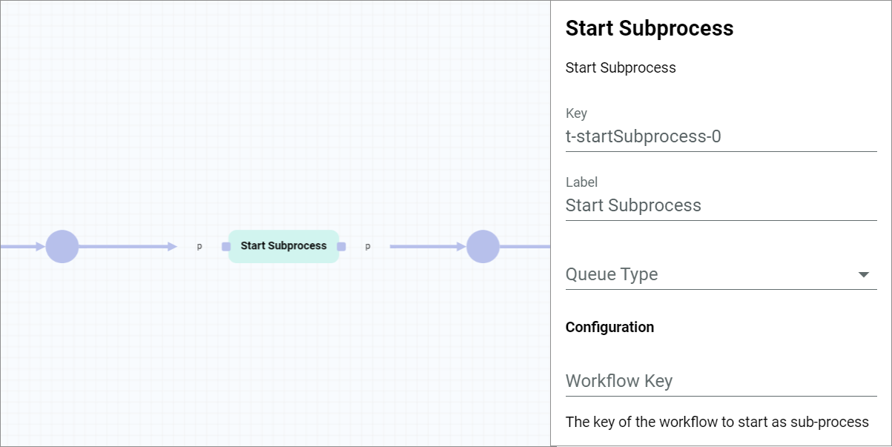
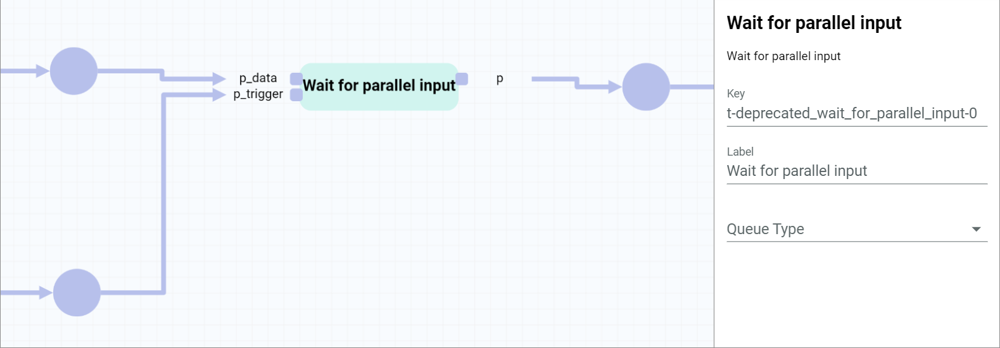

# Workflow actions

## Change process priority

The *Change process priority* core action is used to change the preconfigured priority of the process while the process is already running.   
The data runs via the *loop_through* input port into the workflow action and is output via the *p* output port. However, the data is only output when data has also been incoming via the *priority* input port. The input value of the *priority* input port must be an integer. This integer will be used as the new priority.

[comment]: <> (ticket ICBPM-199 in arbeit: static inputs sollen im priority input port möglich sein, ändern sobald möglich)

### Settings   

- *Description*   
  Change process priority

- *Key*   
  t-Actindo\Modules\Actindo\ActindoWorkFlow\Components\Actions\ChangeProcessPriorityAction-0

- *Label*   
  Enter a descriptive name for the action. The specified name is also displayed in the process graph and the workflow editor.

- *Queue type*  
  Click the drop-down list to select the applicable queue type. If no queue type is selected, the *Default* queue type is applied by default.

- *Max tries*   
  Enter how often an action should be executed before an error is issued.

## Multiply input action

The *Multiply input action* core action is used to output the data coming in via one input port to two output ports. This core action is often used when the same data is needed for two different purposes. To merge the duplicated data again, the *Wait for parallel input* core action can be used, see [Wait for parallel input](#wait-for-parallel-input) .   
The data runs via the *p* input port into the workflow action and is output via both the *p0* and the *p1* output ports.

[comment]: <> (ticket ICBPM-200 in arbeit: mehr als zwei output port sollen hinzukommen)

### Settings   

- *Description*   
  Multiply input action

- *Key*   
  t-deprecated_duplicate_input-0

- *Label*   
  Enter a descriptive name for the action. The specified name is also displayed in the process graph and the workflow editor.

- *Queue type*  
  Click the drop-down list to select the applicable queue type. If no queue type is selected, the *Default* queue type is applied by default.

- *Max tries*   
  Enter how often an action should be executed before an error is issued.

## Execute PHP code

The *Execute PHP code* core action is used to execute a custom PHP code defined in the configuration.
As the complete functionality of the PHP code is accessible, this core action enables complete variability in programming. Therefore, it is often used when more complex actions which require more logic need be executed within a workflow step.   
Depending on which ports are connected to the places and which ports are defined in the PHP code, the data runs via the *in0* to *in9* input ports into the workflow action and is output via the *out0* to *out9* output ports.   
It is also possible to include a static input via the unconnected input ports. These inputs must be defined in the *Static inputs* section in the settings side bar, see [Transitions](../Overview/04_WorkflowProcessElements#transitions).

> [Info] It is recommended to give the action a name that describes what the PHP code does.

### Settings   

- *Description*   
  Execute PHP Code

- *Key*   
  t-executePHP-1

- *Label*   
  Enter a descriptive name for the action. The specified name is also displayed in the process graph and the workflow editor.

- *Queue type*  
  Click the drop-down list to select the applicable queue type. If no queue type is selected, the *Default* queue type is applied by default.

- *Max tries*   
  Enter how often an action should be executed before an error is issued.

**Configuration**

- *PHP Code*   
  Click this field to display the code editor and enter the desired PHP code. There are no restrictions in the PHP code. Remember to include the input ports whose data should be read using **$in0** for the *in0* input port, **$in1** for the *in1* input port, etc. as well as to specify the output via the output ports using the *return [output1, output2];* return array. The first value within the array is output via the *out0* output port, the second value via the *out1* output port, etc.  

  

**Static inputs**

If necessary, you can define a static input for the following ports:
- *in0*
- *in1*
- *in2*
- *in3*
- *in4*
- *in5*
- *in6*
- *in7*
- *in8*
- *in9*

## Split by criterion

The core action *Split by criterion* is used to compare the input value with a defined criterion and output it via a different branch depending on whether the input value matches or not.
The data runs via the *in* input port into the workflow action and is output either via the *match* output port if the input value matches the criterion to be compared with, or via the *noMatch* output port if the input value does not match the criterion to be compared with.   
The criterion to be compared with is defined in the configuration.

> [Info] It is recommended to give the action a name that describes with which criterion the input value is compared.

### Settings   

- *Description*   
  Split by criterion

- *Key*   
  t-splitByCriterion-0

- *Label*   
  Enter a descriptive name for the action. The specified name is also displayed in the process graph and the workflow editor.

- *Queue type*  
  Click the drop-down list to select the applicable queue type. If no queue type is selected, the *Default* queue type is applied by default.

- *Max tries*   
  Enter how often an action should be executed before an error is issued.

**Configuration**

- *Path*   
  Enter the path to the property of the input object to be compared with. If the input data is of a primitive type, for instance *string* or *number*, you can also leave the path blank to compare the input data directly.

  > [Info] The properties of an entity you can refer to are described in the relevant API documentation.

- *Operator*   
  Enter the applicable operator for the comparison. The following operators are available:
  - **=**  
    It is a match if the input value equals the defined value.
  - **!=**    
    It is a match if the input value does not equal the defined value.
  - **in**    
    It is a match if the input value is included within the defined values. For this operator, it is possible to enter an array in the *Value* field.
  - **notIn**   
    It is a match if the input value is not included within the defined values. For this operator, it is possible to enter an array in the *Value* field.
  - **regexp**   
    It is a match if the input value equals the regular expression entered in the *Value* field.    
    For detailed information about regular expressions, see https://regex101.com/.

- *Value*   
  Enter the value to be compared with the input value. The value must be valid JSON and is type strict, for example a string must be specified as a string (**\"example\"**), an integer as an integer (**123**), and so on.

[comment]: <> (Ticket ICBPM-197 in Arbeit: Weitere operatoren geplant: <=, <, >=, >)

## Start subprocess

The *Start subprocess* core action is used to start a different subprocess within the currently running process.       
The data runs via the *p* input port into the workflow action and is output via the *p* output port. However, the action does not wait until the subprocess has been finished, but outputs the data after having started the subprocess. The input data is also the data put in the start place of the subprocess.   
The subprocess to be started is defined in the configuration.

### Settings   

- *Description*   
  Start Subprocess

- *Key*   
  t-startSubprocess-0

- *Label*   
  Enter a descriptive name for the action. The specified name is also displayed in the process graph and the workflow editor.

- *Queue type*  
  Click the drop-down list to select the applicable queue type. If no queue type is selected, the *Default* queue type is applied by default.

- *Max tries*   
  Enter how often an action should be executed before an error is issued.

**Configuration**

- *Workflow Key*   
  Enter the workflow key of the workflow that will be started as a subprocess. Always the latest published version of the specified workflow will be started. The workflow key is displayed in the *Key* column in the *Workflows* view (*Workflows > Workflows > Tab OVERVIEW*).

## Switch case action

The *Switch case action* core action is used to compare the input value with up to 6 criteria and output this value via a different branch for each case. Additionally, this core action enables to output the input value via a separate branch if the input value does not match any of the specified cases or to output the input value without any match by a separate branch.    
The data runs via the *in* input port into the workflow action and can be output via each connected output port. The *origin* output port must be connected and the input value is always output via this port without any further action. Additionally, if one or several of the *case1* to *case6* output ports are connected, the input value is compared with the criterion specified in the respective case and output via the output port of the case where the criterion matches the input value. If no criterion of the cases matches the input value, the input value is output via the *default* output port, or, if the *default* output port is not connected, the action fails.    
The criteria to be compared with are defined in the configuration. Further, you can set the comparison to be stopped after a match. Otherwise all remaining cases are evaluated.

### Settings  

- *Description*   
  Switch case action

- *Key*   
  t-switchCaseAction-0

- *Label*   
  Enter a descriptive name for the action. The specified name is also displayed in the process graph and the workflow editor.

- *Queue type*  
  Click the drop-down list to select the applicable queue type. If no queue type is selected, the *Default* queue type is applied by default.

- *Max tries*   
  Enter how often an action should be executed before an error is issued.

**Configuration**

- *Path*   
  Enter the path to the property of the input object to be compared with. If the input data is of a primitive type, for instance *string* or *number*, you can also leave the path blank to compare the input data directly.

  > [Info] The properties of an entity you can refer to are described in the relevant API documentation.

-  *Stop on match*   
  Enable this toggle to stop comparing the input value with the specified cases once the input value matches the first case. Disable the toggle to compare the input value with all specified cases, regardless of whether a case matches or not. By default, this toggle is disabled.

- *Case X*    
  Enter the value to be compared with the input value. The value must be valid JSON and is type strict, for example a string must be specified as a string (**\"example\"**), an integer as an integer (**123**), and so on. You can enter a single value or an array with multiple values. If you enter single value, it is checked if the input value equals the specified value. If you enter an array, it is checked if the input value equals one of the values in the array.   
  You can specify up to 6 different cases. The cases are checked in order, that means, first *Case 1*, then *Case 2*, etc.

## Update process name and search string

The *Update process name and search string* core action is used to change the preconfigured name of a process and its search string while the process is already running.  
The data runs via the input port into the workflow action. The input value must be a string representation, which is replacing the current process name and its corresponding search string. The new string representation is output via the output port.

### Settings  

- *Description*   
  Update Process Name and Search String

- *Key*   
  t-updateProcessName-0

- *Label*   
  Enter a descriptive name for the action. The specified name is also displayed in the process graph and the workflow editor.

- *Queue type*  
  Click the drop-down list to select the applicable queue type. If no queue type is selected, the *Default* queue type is applied by default.

- *Max tries*   
  Enter how often an action should be executed before an error is issued.

## Wait for criterion

The *Wait for criterion* core action is used to insert a breakpoint when you must wait that the data input matches a certain criterion.   
The data runs via the *in* input port into the workflow action and is output via the *match* output port once the input value matches the criterion to be compared with. If the input value does not match the criterion to be compared with after a defined timeout, the data is, depending on the configuration, output via the *timeout* output port, or the actions fails.   
The criterion to be compared with as well as the wait time settings are defined in the configuration.

> [Info] It is recommended to give the action a name that describes which input value the criterion is waiting for.

### Settings  

- *Description*   
  Wait for criterion

- *Key*   
  t-waitForCriterion-0

- *Label*   
  Enter a descriptive name for the action. The specified name is also displayed in the process graph and the workflow editor.

- *Queue type*  
  Click the drop-down list to select the applicable queue type. If no queue type is selected, the *Default* queue type is applied by default.

- *Max tries*   
  Enter how often an action should be executed before an error is issued.

**Configuration**

- *Initial wait time*   
  Enter the time in minutes to wait until the next comparison if the criterion does not initially match the input data.

  > [Info] The initial wait time defines the time after the initial comparison, not until the initial comparison. The initial comparison is executed automatically when the action is triggered for the first time.

- *Wait time interval*   
  Enter the time in minutes to wait for each additional comparison attempt if the criterion does not yet match the input data.

- *Timeout*   
  Enter the time in minutes after which no further attempts should be started. Depending on the configuration, either the input data will be output via the *timeout* output port or the action will fail.

-  *Fail on timeout*   
  Enable this toggle to make the action fail after the defined timeout. Disable the toggle to output the current input value via the *timeout* output port after the defined timeout. By default, this toggle is disabled.

- *Path*   
  Enter the path to the property of the input object to be compared with. Use objects or models whose values change by external influences between the tries as input type, since simple input data of a primitive type, for instance *string* or *number*, are static and will never change.

  > [Info] The properties of an entity you can refer to are described in the relevant API documentation.

- *Operator*   
  Enter the applicable operator for the comparison. The following operators are available:
  - **=**  
    It is a match if the input value equals the defined value.
  - **!=**    
    It is a match if the input value does not equal the defined value.
  - **in**    
    It is a match if the input value is included within the defined values. For this operator, it is possible to enter an array in the *Value* field.
  - **notIn**   
    It is a match if the input value is not included within the defined values. For this operator, it is possible to enter an array in the *Value* field.
  - **regexp**   
    It is a match if the input value equals the regular expression entered in the *Value* field.    
    For detailed information about regular expressions, see https://regex101.com/.

- *Value*   
  Enter the value to be compared with the input value. The value must be valid JSON and is type strict, for example a string must be specified as a string (**\"example\"**), an integer as an integer (**123**), and so on.

[comment]: <> (Ticket ICBPM-197 in Arbeit: Weitere operatoren geplant: <=, <, >=, >)

## Wait for parallel input

The *Wait for parallel input* core action is used to insert a breakpoint when you must wait for certain data in order to synchronize branches running in parallel in a workflow.  
The data runs via the *p_data* input port into the workflow action and is output via the *p* output port. However, the data is only output when data has also been incoming via the *p_trigger* input port.

### Settings  

- *Description*   
  Wait for parallel input

- *Key*   
  t-deprecated_wait_for_parallel_input-0

- *Label*   
  Enter a descriptive name for the action. The specified name is also displayed in the process graph and the workflow editor.

- *Queue type*  
  Click the drop-down list to select the applicable queue type. If no queue type is selected, the *Default* queue type is applied by default.

- *Max tries*   
  Enter how often an action should be executed before an error is issued.

## Waiting action

The *Waiting action* core action is used to insert a breakpoint when you want to wait for a certain time before proceeding to the next action within the process. The data runs via the *p* input port into the workflow action and is output via the *p* output port. However, the data is only output after a defined period of time.    
This period of time is defined in the configuration.

### Settings  

- *Description*   
  Waiting action

- *Key*   
  t-wait-0

- *Label*   
  Enter a descriptive name for the action. The specified name is also displayed in the process graph and the workflow editor.

- *Queue type*  
  Click the drop-down list to select the applicable queue type. If no queue type is selected, the *Default* queue type is applied by default.

- *Max tries*   
  Enter how often an action should be executed before an error is issued.

**Configuration**

- *Wait time modifier*   
  Enter the period of time the action must wait before the value is output. The modifier must be a valid PHP date and time format, for example **"+ 1 day"** .    
  For detailed information about the valid PHP modifiers, see [Supported PHP DateTime formats](https://www.php.net/manual/en/datetime.formats.php).

## Setup order for export    

The *Setup order for export* action is used to prepare an order in the *Omni-Channel* module to be exported to the *Order management* module.

### Settings

- *Description*   
  .setupOrderExport | setting up ucssync order to be exported (/Actindo.Extensions.Actindo.UCSProductSync.RetailSuiteOrderSync.setupOrderExport)

- *Key*    
  t-Extensions.Actindo.UCSProductSync.RetailSuiteOrderSync.setupOrderExport-0

- *Label*   
  Enter a descriptive name for the action. The specified name is also displayed in the process graph and the workflow editor.

- *Queue type*  
  Click the drop-down list to select the applicable queue type. If no queue type is selected, the *Default* queue type is applied by default.

- *Max tries*   
  Enter how often an action should be executed before an error is issued.

## Export base order

The *Setup order for export* action is used to export the document header, for example customer data, to create a new customer if not yet registered and to assign the document number to the leading document.

### Settings

- *Description*   
  .exportBaseOrder | exportBaseOrder (/Actindo.Extensions.Actindo.UCSProductSync.RetailSuiteOrderSync.exportBaseOrder)

- *Key*    
  t-Extensions.Actindo.UCSProductSync.RetailSuiteOrderSync.exportBaseOrder-0

- *Label*   
  Enter a descriptive name for the action. The specified name is also displayed in the process graph and the workflow editor.

- *Queue type*  
  Click the drop-down list to select the applicable queue type. If no queue type is selected, the *Default* queue type is applied by default.

- *Max tries*   
  Enter how often an action should be executed before an error is issued.

## Export positions

The *Setup order for export* action is used to export the item data of an order and to determine from which warehouse the items are taken.

### Settings

- *Description*   
  .exportPositions | exportPositions (/Actindo.Extensions.Actindo.UCSProductSync.RetailSuiteOrderSync.exportPositions)

- *Key*    
  t-Extensions.Actindo.UCSProductSync.RetailSuiteOrderSync.exportPositions-0

- *Label*   
  Enter a descriptive name for the action. The specified name is also displayed in the process graph and the workflow editor.

- *Queue type*  
  Click the drop-down list to select the applicable queue type. If no queue type is selected, the *Default* queue type is applied by default.

- *Max tries*   
  Enter how often an action should be executed before an error is issued.

## Finish order export

The *Setup order for export* action is used to finish an order export to OMS and post the leading document. Most of the time, this leading document is a cash invoice or an order confirmation, but in general, the customer can define the type of document individually in the ETL mapping.

### Settings

- *Description*   
  .finishExport | finishExport (/Actindo.Extensions.Actindo.UCSProductSync.RetailSuiteOrderSync.finishExport)

- *Key*    
  t-Extensions.Actindo.UCSProductSync.RetailSuiteOrderSync.finishExport-0

- *Label*   
  Enter a descriptive name for the action. The specified name is also displayed in the process graph and the workflow editor.

- *Queue type*  
  Click the drop-down list to select the applicable queue type. If no queue type is selected, the *Default* queue type is applied by default.

- *Max tries*   
  Enter how often an action should be executed before an error is issued.

## Save changes on a business document

The *Save changes on a business document* action is used to save the changes on a document requested in the preceding action.

### Settings

- *Description*   
  .save | Save changes on a business document (/Actindo.Modules.RetailSuite.RetailSuiteFaktBase.BusinessDocuments.save)

- *Key*    
  t-Modules.RetailSuite.RetailSuiteFaktBase.BusinessDocuments.save-0

- *Label*   
  Enter a descriptive name for the action. The specified name is also displayed in the process graph and the workflow editor.

- *Queue type*  
  Click the drop-down list to select the applicable queue type. If no queue type is selected, the *Default* queue type is applied by default.

- *Max tries*   
  Enter how often an action should be executed before an error is issued.

## Create delivery

The *Create delivery* action is used to create the delivery note/s. For each (partial) delivery, a single delivery note is created. The delivery note is necessary to trigger that an order will leave the warehouse. 

### Settings

- *Description*   
  .createDelivery | Create a delivery (delivery notes or dropship delivery notes) for a business document (/Actindo.Modules.RetailSuite.RetailSuiteFaktBase.BusinessDocuments.createDelivery)

- *Key*    
  t-Modules.RetailSuite.RetailSuiteFaktBase.BusinessDocuments.createDelivery-0

- *Label*   
  Enter a descriptive name for the action. The specified name is also displayed in the process graph and the workflow editor.

- *Queue type*  
  Click the drop-down list to select the applicable queue type. If no queue type is selected, the *Default* queue type is applied by default.

- *Max tries*   
  Enter how often an action should be executed before an error is issued.

**Static inputs**

If necessary, you can define a static input for the following ports:
- *businessDocumentPositions*
- *forceCompleteDelivery*
- *ignoreOpenDeliveries*
- *allowPartialDeliveryOverride*
- *shippingOnFirstInvoiceOnly*

## Sync shipments

The *Sync shipments* action is used to create the *shipment* entity in the *Omni-Channel* module and set its status to **open**. Depending on the driver of the connection, the channel is updated asynchronously.

### Settings

- *Description*   
  .syncShipments | syncShipments (/Actindo.Extensions.Actindo.UCSProductSync.OrderStatusSync.syncShipments)

- *Key*    
  t-Extensions.Actindo.UCSProductSync.OrderStatusSync.syncShipments-0

- *Label*   
  Enter a descriptive name for the action. The specified name is also displayed in the process graph and the workflow editor.

- *Queue type*  
  Click the drop-down list to select the applicable queue type. If no queue type is selected, the *Default* queue type is applied by default.

- *Max tries*   
  Enter how often an action should be executed before an error is issued.

## Create a copy of the given business document

The *Create a copy of the given business document* action is used to copy the document and create a document specified in the static inputs from the input document. Via the *origin* output port, the copied original document is output. Via the *data* output port the document with the type specified in the *Destination type* static input is output.

### Settings

- *Description*   
  .copy | Create a copy of the given business document (/Actindo.Modules.RetailSuite.RetailSuiteFaktBase.BusinessDocuments.copy)

- *Key*    
  t-Modules.RetailSuite.RetailSuiteFaktBase.BusinessDocuments.copy-1

- *Label*   
  Enter a descriptive name for the action. The specified name is also displayed in the process graph and the workflow editor.

- *Queue type*  
  Click the drop-down list to select the applicable queue type. If no queue type is selected, the *Default* queue type is applied by default.

- *Max tries*   
  Enter how often an action should be executed before an error is issued.

**Static inputs**

If necessary, you can define a static input for the following ports:

- *Destination type*   
  Enter the key of the document type you want to create. By default, the following document types are available:
  - AN: Offer
  - AB: Order confirmation
  - RE: Invoice
  - RB: Cash invoice
  - AR: Budget billing invoice
  - GU: Correction invoice
  - WG: Value credit
  - LI: Delivery note
  - MA: Dunning notice
  - BE: Purchase order
  - LB: Loan voucher
  - PR: Pro forma invoice
  - ST: Reversal document
  - LD: Dropship delivery note
  - RT: Return
  - RS: Return to cust

      > [Info] Further document types can be individually created for each customer and are therefore not listed above.
- *noParentId*
- *newDeliverGroup*
- *documentNumber*

##  Post a business document to stock and/or accounting

The *Post a business document to stock and/or accounting* action is used to post the document, dependent on the document type, in the internal accounting and/or warehousing system.

### Settings

- *Description*   
  .post | Post a business document to stock and/or accounting (/Actindo.Modules.RetailSuite.RetailSuiteFaktBase.BusinessDocuments.post)

- *Key*    
  t-Modules.RetailSuite.RetailSuiteFaktBase.BusinessDocuments.post-1

- *Label*   
  Enter a descriptive name for the action. The specified name is also displayed in the process graph and the workflow editor.

- *Queue type*  
  Click the drop-down list to select the applicable queue type. If no queue type is selected, the *Default* queue type is applied by default.

- *Max tries*   
  Enter how often an action should be executed before an error is issued.

**Static inputs**

If necessary, you can define a static input for the following ports:
- *postToStock*
- *postToAccounting*

## Create dispatch

The *Create dispatch* action is used to create and persist a dispatch note in the *Fulfillment* module from the delivery note. The data are mapped via ETL.

### Settings

- *Description*   
  .create | Creates and persists a new dispatch note from an existing business document. (/Actindo.Modules.Actindo.Fulfillment.DispatchNotes.create)

- *Key*    
  t-Modules.Actindo.Fulfillment.DispatchNotes.create-0

- *Label*   
  Enter a descriptive name for the action. The specified name is also displayed in the process graph and the workflow editor.

- *Queue type*  
  Click the drop-down list to select the applicable queue type. If no queue type is selected, the *Default* queue type is applied by default.

- *Max tries*   
  Enter how often an action should be executed before an error is issued.

## Export dispatch note through its configured fulfillment driver

The *Export dispatch note through its configured fulfillment driver* action is used to export the dispatch note through its configured driver in the *Fulfillment* module to the logistics service provider (LSP).

### Settings

- *Description*   
  .export | Exports the dispatch note through its configured fulfillment driver (/Actindo.Modules.Actindo.Fulfillment.DispatchNotes.export)

- *Key*    
  t-Modules.Actindo.Fulfillment.DispatchNotes.export-1

- *Label*   
  Enter a descriptive name for the action. The specified name is also displayed in the process graph and the workflow editor.

- *Queue type*  
  Click the drop-down list to select the applicable queue type. If no queue type is selected, the *Default* queue type is applied by default.

- *Max tries*   
  Enter how often an action should be executed before an error is issued.

## Wait for dispatch note update

The *Wait for dispatch note update* action is used to wait for the feedback from the logistics service provider (LSP) that the order has been shipped. The status is retrieved in a predefined time interval. 

### Settings

- *Description*   
  Wait for dispatch note update

- *Key*    
  t-Actindo\Modules\Actindo\Fulfillment\Components\Actions\WaitForDispatchNoteAction-1

- *Label*   
  Enter a descriptive name for the action. The specified name is also displayed in the process graph and the workflow editor.

- *Queue type*  
  Click the drop-down list to select the applicable queue type. If no queue type is selected, the *Default* queue type is applied by default.

- *Max tries*   
  Enter how often an action should be executed before an error is issued.
