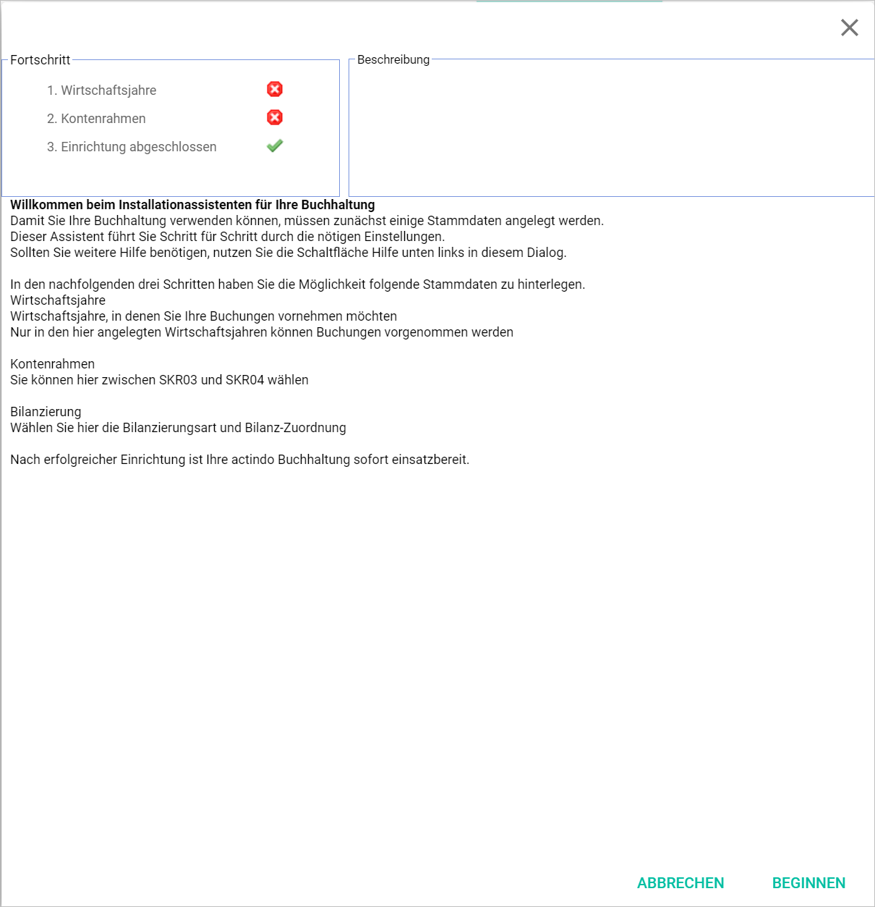
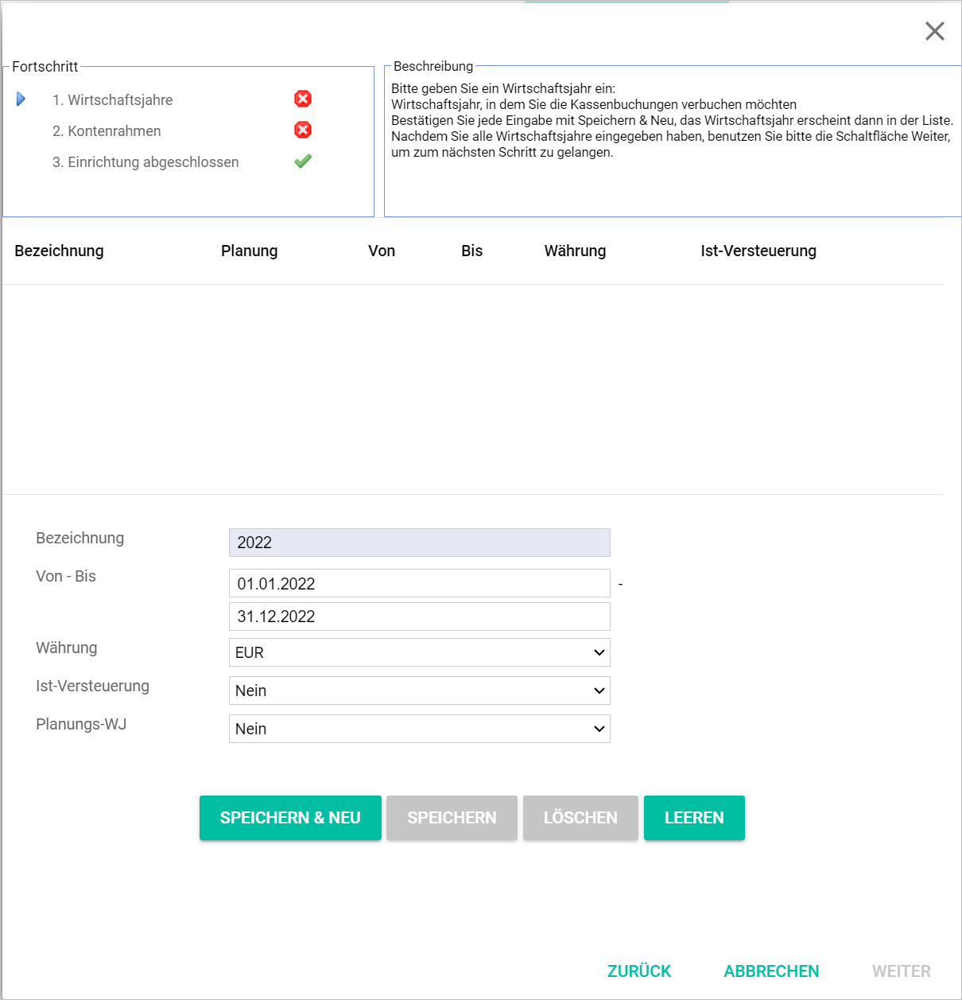
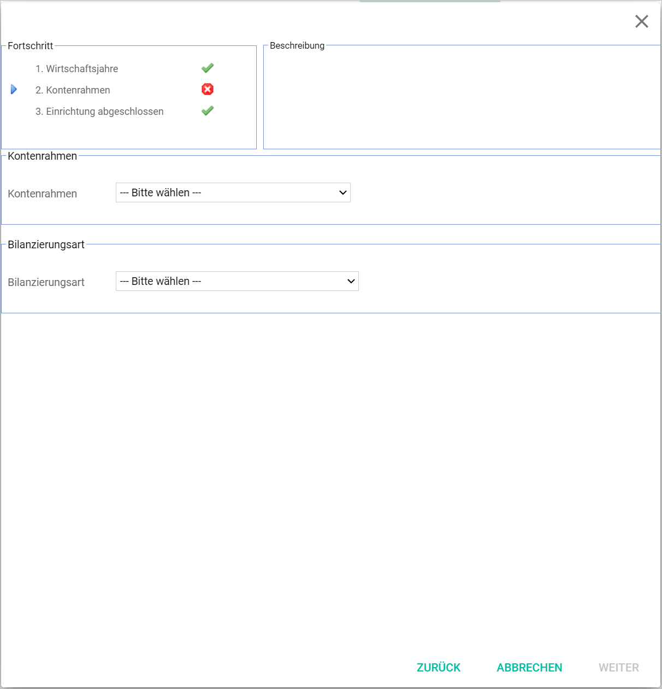
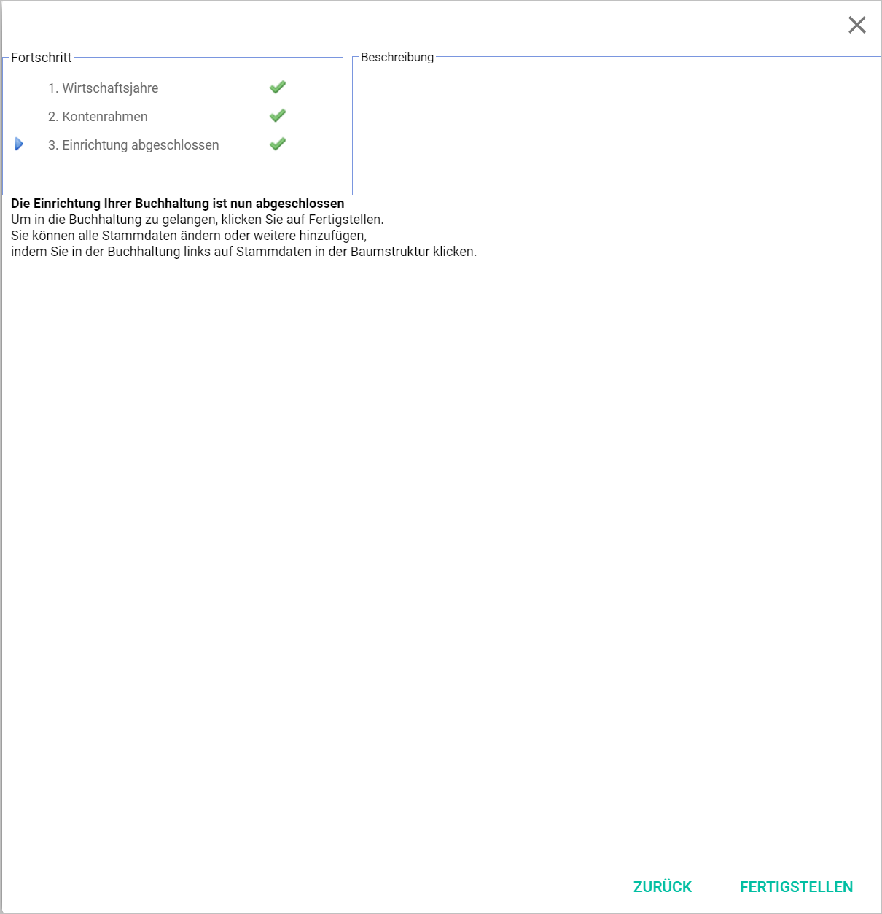

[!!User Interface Settings fiscal years](../UserInterface/02d_FiscalYears.md)  
[!!Manage the Accounts](./03_ManageAccounts.md)  
[!!Manage the Fiscal year](./04_ManageFiscalYear.md)  

# Run the accounting wizard

In order to use the *Accounting* module, you need to configure the master data first. The accounting wizard guides you through the configuration process. Once the configuration process is finished, the *Accounting* module will be set up and ready to use. Since the *Accounting* module works together with many other modules, it is highly recommended to carry out the configuration as one of the first steps when installing the system.

The accounting wizard starts automatically when opening the *Accounting* module for the first time. If you cancel the accounting wizard, you have to run it at a later point to use the *Accounting* module. In this case, the [START WIZARD] button will be displayed when accessing the *Accounting* module again.

## Start wizard

The accounting wizard will help you enter all necessary data step by step.

#### Prerequisites

No prerequisites to fulfill.

#### Procedure

*Accounting*  
*Accounting > Button START WIZARD*

  

Click the [START] button.   
The configuration process starts. The *Fiscal years* wizard window is displayed.

> [Info] The progress in the wizard is displayed on the top left corner in the accounting wizard window.

## Fiscal years

In this step, you must configure at least one fiscal year.

#### Prerequisites

The accounting wizard has been started, see [Start wizard](#start-wizard).

#### Procedure

*Accounting > Button START > Fiscal years*  
*Accounting > Button START WIZARD > Button START > Fiscal years*  

1. Enter a description for the fiscal year in the *Description* field. The current year is preselected by default.  

   > [Info] It is possible to enter digits, letters or combinations of characters. The number of characters is limited to 10.

2. Enter the start and end date of your fiscal year in the *From - To* fields. The fiscal year displayed by default is the current calendar year.

 > [Info] The fiscal year must consist of 12 months. However, it does not have to be a calendar year, but can be, for example from April 1 to March 31.

3. Click the *Currency* drop-down list and select the base currency. The drop-down list displays all currencies configured in the system. However, the accounting module works with the base currency only.

 > [Info] The base currency is the currency used by a company for accounting purposes, usually the currency of the country where the business is primarily based, even if it operates in other countries and currencies.

[comment]: <> (FH: Wo wird die Basiswährung eingestellt? Bei der Einrichtung beim Kunden?)

4. Click the *Cash accounting* drop-down list and select the appropriate option. The following options are available:

  - **Yes**  
  Select this option for the cash accounting method, where receipts are recorded during the period they are received, and expenses are recorded in the period in which they are actually paid.
  - **No**  
  Select this option for the accrual accounting method, where revenue is recognized when earned rather than when collected, and expenses are recognized when incurred rather than when paid.

    > [Info] This option has fundamental implications for the system automatic recording of taxes. In case of doubt, please check with your tax advisor.

5. Click the *Planning FY* drop-down list and select the appropriate option. The following options are available:  

  - **No**  
  Select this option to set up an actual fiscal year.
  - **Fiscal year for planning purposes only**   
  Select this option to set up a fiscal year for planning purposes only.

    > [Info] A fiscal year for planning purposes will not be recognized as an actual fiscal year by the system, and therefore the automatic functions in the interaction with other modules will not apply.

6. Click the [SAVE & NEW] button.  
The new fiscal year is created. A small pop-up window and a green check mark confirm that the new fiscal year has been saved. The newly created fiscal year is also displayed in the list.

7. Click the [CONTINUE] button.   
The *Chart of accounts* wizard window is displayed.

## Chart of accounts

In this step, you must select a chart of accounts and an accounting system.

#### Prerequisites

- The accounting wizard has been started, see [Start wizard](#start-wizard).
- At least one fiscal year has been configured, see [Fiscal years](#fiscal-years).

#### Procedure

*Accounting > Button START > Chart of accounts*   
*Accounting > Button START WIZARD > Button START > Chart of accounts*  

1. Click the *Chart of accounts* drop-down list and select the appropriate option. The following options are available:

    - **SKR03 - Standard Chart of accounts**
    - **SKR04 - Standard Chart of accounts new version**
    - **Swiss Chart of accounts KMU**
    - **Swiss Chart of accounts Käfer**

 > [Info] The chart of accounts can only be set up once and cannot be changed afterwards. Any later modifications have to be done manually on an individual customer account level.

2. Click the *Accounting system* drop-down list and select the appropriate option. The following options are available:

    - **German Commercial Code: P&L**
    - **German Commercial Code: Balance partnerships**
    - **German Commercial Code: Balance small, mid-sized, large corporations**
    - **Cash flow**
    - **US-GAAP: Statement of earnings**
    - **US-GAAP: Statement of financial position**
    - **US-GAAP: Statement of cash flow**
    - **IAS: P&L**
    - **IAS: Balance**
    - **IAS: Cash flow**

  > [Info] The *Accounting* module can neither create a balance sheet nor an annual financial statement. Therefore, the selection of any of the drop-down list options suggested serves merely a pro-forma purpose.

3. Click the [CONTINUE] button.  
The *Accounting* module is set up. A pop-up window and a green check mark confirm that the chart of accounts and the accounting system have been saved. The *Installation completed* wizard window is displayed.

## Installation completed

In the *Installation completed* wizard window all three progress steps are now checked.

#### Prerequisites

- The accounting wizard has been started, see [Start wizard](#start-wizard).
- At least one fiscal year has been configured, see [Fiscal year](#fiscal-years).
- The chart of accounts has been configured, see [Chart of accounts](#chart-of-accounts).

#### Procedure

*Accounting > Button START > Installation completed*  
*Accounting > Button START WIZARD > Button START > Installation completed*  

Click the [FINALIZE] button.     
The accounting wizard closes and the system loads all data. This may take a few seconds. Then, the fiscal year selection window is displayed.
