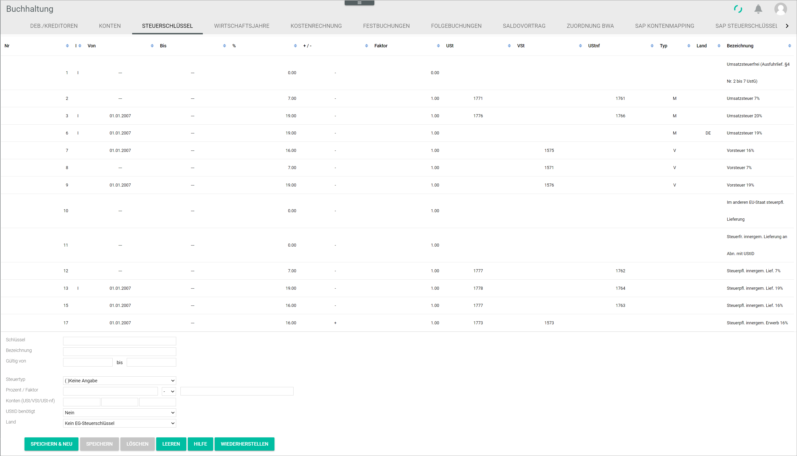
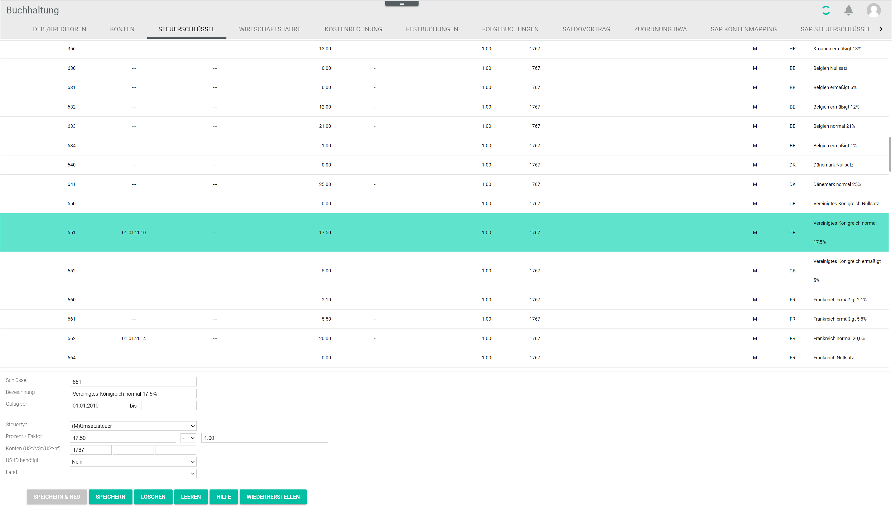

[!!Invoicing](RetailSuiteFaktBase)
[!!Taxes](Taxes)
[!!User Interface tax keys](../UserInterface/02c_TaxKeys.md)

# Manage the tax keys

Tax keys are a list of values, each of them linked to a specific tax rate. They are essential for the automatic tax functions, for example the automatic VAT tax booking. Every existing tax rate in the different accounts is assigned a tax key. The *Invoicing* module extracts data on the applicable tax rate from the tax keys.

## Create a tax key

You can create a tax key that is not yet available in the list.

#### Prerequisites

- The accounting is configured via the configuration wizard, see [Run the accounting wizard](./01_RunAccountingWizard.md).
- A valid fiscal year is created, see [Create a fiscal year](./04_ManageFiscalYear.md#create-a-fiscal-year).

#### Procedure

*Accounting > Select the fiscal year > Settings > Tab TAX KEYS*

1. Enter an available tax key in the *Key* field.

    > [Info] Check which tax keys are still available by navigating through the list. Make sure that the entry fields are cleared before entering any data. If they are not, click the [CLEAR] button.

2. Enter a description for the tax key in the *Description* field, for example VAT 19%.

3. Enter a validity time frame for the tax key in the *Valid from - to* field.

4.  Click the *Tax type* drop-down list and select the appropriate option:
      - **( )Not specified**
      - **(I)Input tax**
      - **(V)VAT**
      - **(IV)Input tax and VAT**

5. Enter the appropriate data in the *Percent / Factor* field.

    > [Info] Companies selling products to foreign EU countries must be aware of the applicable VAT in the shipping country. It is recommended to check the validity of the tax rate in the corresponding country and update it accordingly in this field.

6. Enter the appropriate account(s) in the *Account (VAT/input tax/VAT not due)* field.

7. Click the *VAT needed* drop-down list and select the appropriate option (**No/Yes**).

8. Click the *Country* drop-down list and select the appropriate EU country or the option **No EU tax key**.

9. Click the [SAVE & NEW] button.  
The new tax key has been created.

    > [Info] If you inadvertently choose a tax key number that is already assigned, an error message will be displayed. Choose a different number to save your newly created tax key.

## Edit a tax key

You can edit an available tax key, for example if a tax rate needs to be updated.

#### Prerequisites

- The accounting is configured via the configuration wizard, see [Run the accounting wizard](./01_RunAccountingWizard.md).
- A valid fiscal year is created, see [Create a fiscal year](./04_ManageFiscalYear.md#create-a-fiscal-year).

#### Procedure

*Accounting > Select the fiscal year > Settings > Tab TAX KEYS*

1. Click on the existing tax key to be edited.   
The existing data for the selected tax key are displayed in the corresponding fields.

    > [Warning] Be aware that any changes made to an existing tax key will overwrite the preset values.

2. Edit the fields as appropriate.

3. Click the [SAVE] button.   
The tax key has been edited. The edited tax key is displayed in the list.

## Delete a tax key

You can delete an existing tax key, for example if it is no longer applicable.

#### Prerequisites

- The accounting is configured via the configuration wizard, see [Run the accounting wizard](./01_RunAccountingWizard.md).
- A valid fiscal year is created, see [Create a fiscal year](./04_ManageFiscalYear.md#create-a-fiscal-year).

#### Procedure

*Accounting > Select the fiscal year > Settings > Tab TAX KEYS*

1. Select the tax key to be deleted.
  > [Warning] Be aware that the existing tax key will be deleted permanently.

2. Click the [DELETE] button.  
The selected tax key will be deleted.
