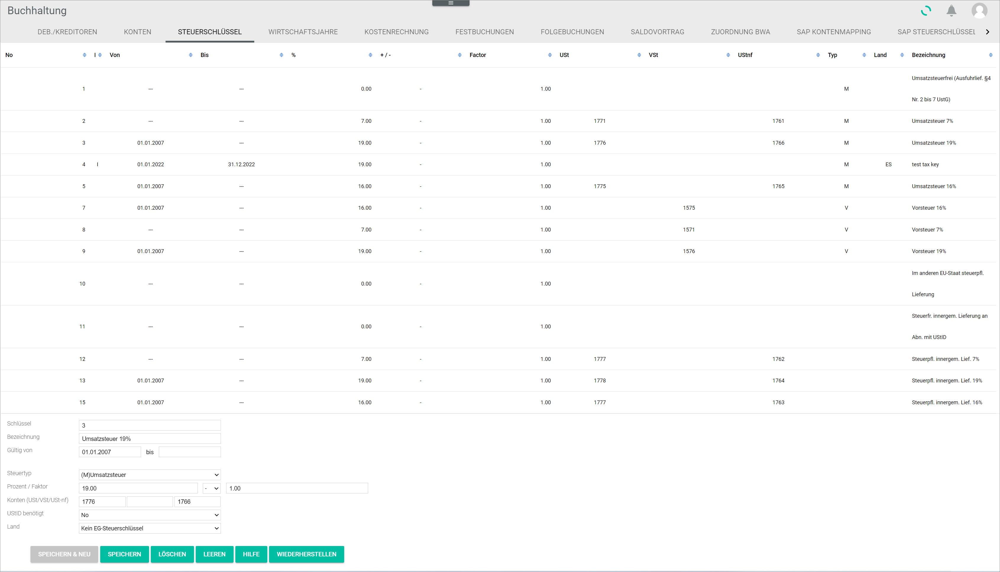

[!!Order management](../../RetailSuiteFaktBase/Overview/01_General.md)  
[!!Taxes](../../Taxes/Overview/01_General.md)  
[!!User Interface Tax keys](../UserInterface/02c_TaxKeys.md)  

# Manage the tax keys

Tax keys are a list of values, each of them linked to a specific tax rate. They are essential for the automatic tax functions, for example the automatic VAT tax posting. Every tax rate in the different accounts is assigned a tax key. The *Order management* module extracts data on the applicable tax rate from the tax keys.

## Create a tax key

You can create a tax key that is not yet available in the list.

#### Prerequisites

A fiscal year has been selected, see [Select the fiscal year](../Operation/01_SelectFiscalYear.md).

#### Procedure

*Accounting > Settings > Tab TAX KEYS*

1. Enter an available tax key in the *Key* field.

  > [Info] Check which tax keys are still available by navigating through the list. Make sure that the input fields are cleared before entering any data. If they are not, click the [CLEAR] button.

2. Enter a description for the tax key in the *Description* field, for example **VAT 19%**.

3. Enter a validity start and end date for the tax key in the *Valid from* and *to* fields.

4. Click the *Tax type* drop-down list and select the appropriate option. The following options are available:

    - **( )Not specified**
    - **(I)Input tax**
    - **(V)VAT**
    - **(IV)Input tax and VAT**

5. Enter the applicable tax rate and factor in the *Percent* and *Factor* fields. Click the *+/-* drop-down list to select *+* or *-* if the posting is a net or a gross amount respectively.

  > [Info] Companies selling products to foreign EU countries must be aware of the applicable VAT in the shipping country. It is recommended to check the validity of the tax rate in the corresponding country and update it accordingly in this field.

  [comment]: <> (Check!)

6. Enter the applicable account(s) in the *Account (VAT/input tax/VAT not due)* field.

7. Click the *VAT ID needed* drop-down list and select the appropriate option. The following options are available:

  - **Yes**  
  Select this option in case of business-to-business transactions.
  - **No**  
  Select this option in case of business-to-customer transactions.

8. Click the *Country* drop-down list and select the appropriate option. The following options are available:

  - (EU country)  
  Select the EU member state where the specified tax key is applicable.

  - **No EU tax key**  
  Select this option if the tax key does not apply to an EU member state.

[comment]: <> (FH: Stimmt das so? Kein EG-Steuerschlüssel Option in Drop-down-Liste wird nicht nur bei Drittländern angezeigt.)

9. Click the [SAVE & NEW] button.  
  A small pop-up window confirms that the new tax key has been saved. The new tax key is displayed in the list.

  

  > [Info] If you try to save a tax key number that is already assigned, an error message will be displayed. Select a different number to save the new tax key.

## Edit a tax key

You can edit an available tax key, for example if a tax rate needs to be updated.

#### Prerequisites

- A fiscal year has been selected, see [Select the fiscal year](../Operation/01_SelectFiscalYear.md).

#### Procedure

*Accounting > Settings > Tab TAX KEYS*

1. Select the tax key to be edited.   
The data for the selected tax key are displayed in the corresponding fields at the bottom.

    > [Note] Be aware that any changes made to a tax key will overwrite the preset values.

2. Edit the fields as appropriate.  

  > [Info] Tax keys are configured during the initial installation process and are not automatically updated. Therefore, it is recommended to check the validity of the tax rate in the corresponding country and update it accordingly in this field if necessary.

3. Click the [SAVE] button.   
A small pop-up window confirms that the edited tax key has been saved. The edited tax key is displayed in the list.

  

## Delete a tax key

You can delete a tax key, for example if it is no longer applicable.

#### Prerequisites

- A fiscal year has been selected, see [Select the fiscal year](../Operation/01_SelectFiscalYear.md).

#### Procedure

*Accounting > Settings > Tab TAX KEYS*

1. Select the tax key to be deleted.  
The data for the selected tax key are displayed in the corresponding fields at the bottom.  

  > [Note] Be aware that the tax key will be deleted permanently.

2. Click the [DELETE] button.  
  A small pop-up window confirms that the tax key has been deleted. The deleted tax key is no longer displayed in the list.

  
