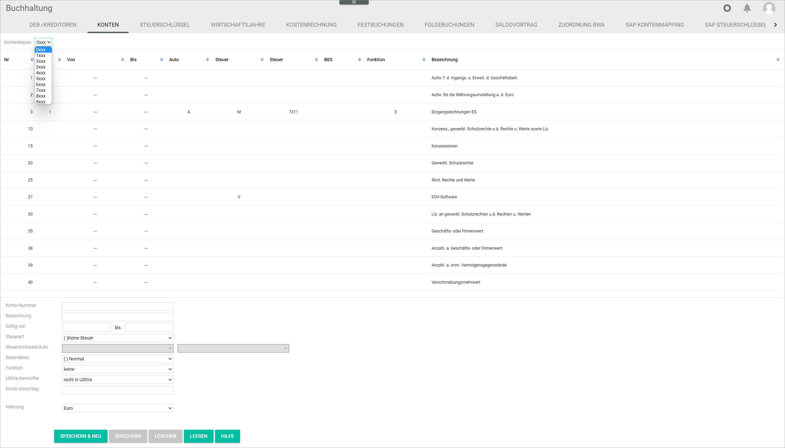
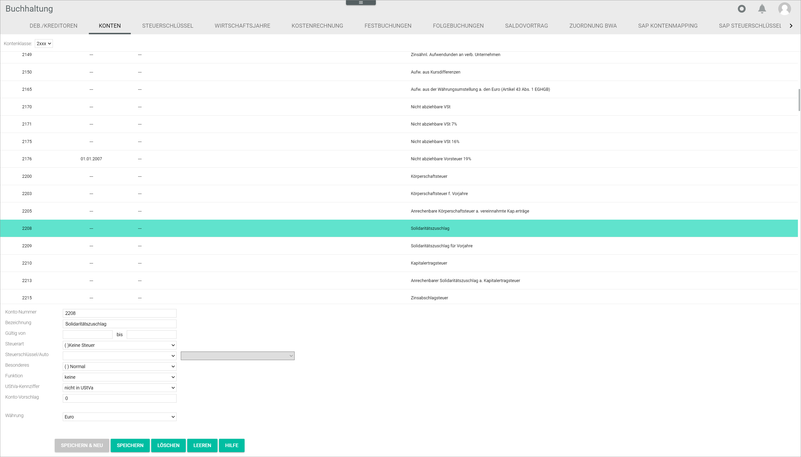

[!!User Interface accounts](../UserInterface/02b_Accounts.md)
[!!Review an account](../Operation/02_ReviewAccount.md)

# Manage the accounts

The accounts are set up during the configuration process via the accounting wizard, see [Charts of accounts](./01_RunAccountingWizard.md#chart-of-accounts). However, you can create, edit or delete an account if necessary in the *Accounting* module, for example if a specific account is not yet available in the system or the settings of an existing one need to be adjusted.

> [Warning] Any modifications in the accounts have far-reaching consequences for the *Accounting* module and the system automatic bookings. It is highly recommended not to make any changes in the accounts, unless you have an in-depth knowledge of their functions. In case of doubt, contact our support team.

## Check the account availability

You may check the availability of a certain account number before creating it, as account numbers can only be assigned once.    
Each account number is assigned to a specific number range, which indicates the account class.    
For detailed information about the account classes, see [User Interface accounts](../UserInterface/02b_Accounts.md).

#### Prerequisites

- The accounting is configured via the configuration wizard, see [Run the accounting wizard](./01_RunAccountingWizard.md).
- A valid fiscal year is created, see [Create a fiscal year](./04_ManageFiscalYear.md#create-a-fiscal-year).

#### Procedure

*Accounting > Select the fiscal year > Settings > Tab ACCOUNTS*

1. Select the corresponding number range in the *Account class* drop-down list.   
  All accounts of the selected account class are displayed in the list.

2. Check which account numbers are still available by navigating through the list.

## Create an account

You can create an account that is not yet available in the system.

#### Prerequisites

- The accounting is configured via the configuration wizard, see [Run the accounting wizard](./01_RunAccountingWizard.md).
- A valid fiscal year is created, see [Create a fiscal year](./04_ManageFiscalYear.md#create-a-fiscal-year).
- The account availability is checked, see [Check the account availability](#check-the-account-availability).
- The tax key validity is checked and, if necessary, updated, see [Edit a tax key](./02_ManageTaxKeys.md#edit-a-tax-key).

#### Procedure

*Accounting > Select the fiscal year > Settings > Tab ACCOUNTS*

1. Enter an available account number in the *Account number* field.

2. Enter an account name in the *Description* field.

3. Click the *Tax type* drop-down list and select the appropriate option:

      - **( )No tax**
      - **(I)Input tax**
      - **(V)VAT**
      - **(IV)Input tax and VAT**
      - **(NV)No VAT possible**

4. Click the *Tax key/auto* drop-down list and select the appropriate option.

  > [Info] Before creating an account, it is recommended to check the validity of the tax rate in the corresponding country in the *TAX KEYS* tab.

5. Click the *Special features* drop-down list and select the appropriate option:

     - **( )Normal**
     - **(L)Locked**
     - **(DA)Debtor collective account**
     - **(CA)Creditor collective account**
     - **(MT)Money transit account**

6. Select the corresponding function for the account in the *Function* drop-down list. For detailed information, see [User Interface accounts](../UserInterface/02b_Accounts.md).

7. Click the *Currency* drop-down list and select the appropriate option.

8. Click the [SAVE & NEW] button.   
  The account has been saved. The new account is displayed in the account list.

## Edit an account

You can edit an existing account, for example if a tax rate needs to be updated.

#### Prerequisites

- The accounting is configured via the configuration wizard, see [Run the accounting wizard](./01_RunAccountingWizard.md).
- A valid fiscal year is created, see [Create a fiscal year](./04_ManageFiscalYear.md#create-a-fiscal-year).

#### Procedure

*Accounting > Select the fiscal year > Settings > Tab ACCOUNTS*

1. Select the corresponding number range in the *Account class* drop-down list.   
  All accounts of the selected account class are displayed in the list.

2. Select the account to be edited.
  > [Warning] Be aware that any changes made to an existing account will overwrite the preset values.

3. Edit the fields as appropriate.

4. Click the [SAVE] button.   
The account has been edited. The edited account is displayed in the list.

## Delete an account

You can delete an existing account, for example if it is no longer applicable.

### Prerequisites

- The accounting is configured via the configuration wizard, see [Run the accounting wizard](./01_RunAccountingWizard.md).
- A valid fiscal year is created, see [Create a fiscal year](./04_ManageFiscalYear.md#create-a-fiscal-year).

### Procedure

*Accounting > Select the fiscal year > Settings > Tab ACCOUNTS*

1. Select the account to be deleted.
  > [Warning] Be aware that the existing account will be deleted permanently.

2. Click the [DELETE] button.  
The selected account has been deleted.
