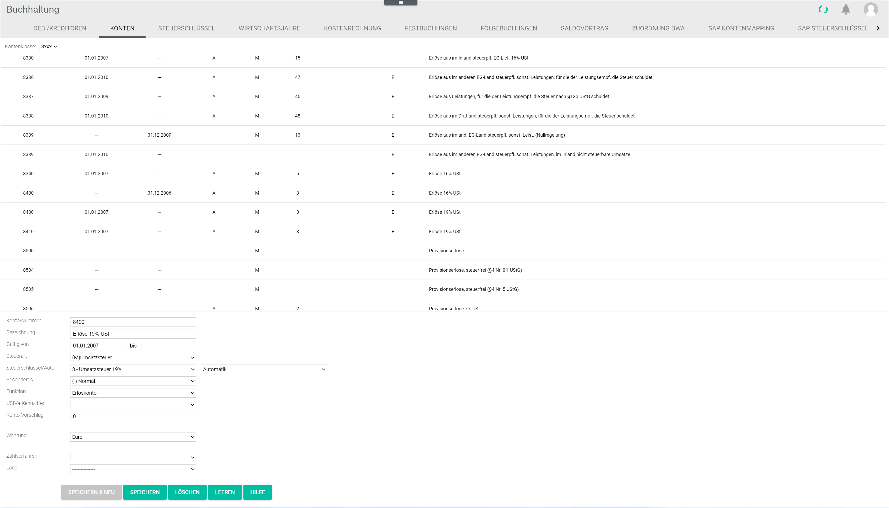

[!!Review an account](../Operation/02_ReviewAccount.md)  
[!!User interface Accounts](../UserInterface/02b_Accounts.md)  

# Manage the accounts

The accounts are set up during the configuration process via the accounting wizard, see [Chart of accounts](./01_RunAccountingWizard.md#chart-of-accounts). However, you can create, edit or delete an account, for example if a specific account is not yet available in the system or the settings of an account need to be adjusted.

> [Info] Any modifications in the accounts have far-reaching consequences for the *Accounting* module and the system automatic postings. It is highly recommended not to make any changes in the accounts, unless you have an in-depth knowledge of their functions. In case of doubt, please contact our customer support.

## Check the account availability

You may check the availability of a certain account number before creating it, as account numbers can only be assigned once. Each account number is assigned to a specific number range, which indicates the account class. For detailed information about the account classes, see [User Interface Accounts](../UserInterface/02b_Accounts.md).

#### Prerequisites

A fiscal year has been selected, see [Select the fiscal year](../Operation/01_SelectFiscalYear.md).

#### Procedure

*Accounting > Settings > Tab ACCOUNTS*

1.  Click the  *Account class* drop-down list and select the desired number range.   
    All accounts of the selected account class are displayed in the list.

2. Check which account numbers are still available by navigating through the list.

## Create an account

You can create an account that is not yet available in the system.

#### Prerequisites

- A fiscal year has been selected, see [Select the fiscal year](../Operation/01_SelectFiscalYear.md).
- The account availability has been checked, see [Check the account availability](#check-the-account-availability).
- The tax key validity has been checked and, if necessary, updated, see [Edit a tax key](./02_ManageTaxKeys.md#edit-a-tax-key).

#### Procedure

*Accounting > Settings > Tab ACCOUNTS*

1. Enter an available account number in the *Account number* field.

2. Enter an account name in the *Description* field.

3. Click the *Tax type* drop-down list and select the appropriate option. The following options are available:

    - **( )No tax**
    - **(I)Input tax**
    - **(V)VAT**
    - **(IV)Input tax and VAT**
    - **(NV)No VAT possible**

4. Click the *Tax key/Auto* drop-down lists and select the appropriate options. Select the applicable tax key from the configured tax keys in the *Tax key* drop-down list. Select **Automatic** in the *Auto* drop-down list to activate the automatic posting function. This feature allows to deduct the applicable taxes automatically when posting. 

    > [Info] Before creating an account, it is recommended to check the validity of the tax key and the tax rate in the corresponding country in the *TAX KEYS* tab. For detailed information, see [Manage the tax keys](./02_ManageTaxKeys.md).

5. Click the *Special features* drop-down list and select the appropriate option. The following options are available:

    - **( )Normal**
    - **(L)Locked**
    - **(DA)Debtor collective account**
    - **(CA)Creditor collective account**
    - **(MT)Money transit account**

6. Click the *Function* drop-down list and select the applicable function for the account. For detailed information, see [User Interface Accounts](../UserInterface/02b_Accounts.md).

7. Click the *Currency* drop-down list and select the applicable option for the account. The drop-down list displays all currencies configured in the system.

    > [Info] The account-specific currency may differ from the base currency, for instance if transactions are performed in a different country.

8. Click the [SAVE & NEW] button.   
    A small pop-up window confirms that the new account has been saved. The new account is displayed in the list.

    

## Edit an account

You can edit an account, for example if a tax rate needs to be updated.

#### Prerequisites

A fiscal year has been selected, see [Select the fiscal year](../Operation/01_SelectFiscalYear.md).

#### Procedure

*Accounting > Settings > Tab ACCOUNTS*

1. Click the  *Account class* drop-down list and select the desired number range.  
    All accounts of the selected account class are displayed in the list.

2. Select the account to be edited.  
    The data for the selected account are displayed in the corresponding fields at the bottom.

    > [Caution] **Potential loss of data**   
    Editing has the potential to cause loss of data due to overwrite. The overwrite cannot be undone and the overwritten data cannot be restored.    
    Check all your entries before proceeding.

3. Edit the fields as appropriate.

4. Click the [SAVE] button.   
    A small pop-up window confirms that the edited account has been saved. The edited account is displayed in the list.

    

## Delete an account

You can delete an account, for example if it is no longer applicable.

#### Prerequisites

A fiscal year has been selected, see [Select the fiscal year](../Operation/01_SelectFiscalYear.md).

#### Procedure

*Accounting > Settings > Tab ACCOUNTS*

1. Select the account to be deleted.

    > [Caution] **Loss of data**   
    Deleting will permanently remove the selected data. The deletion cannot be undone and the deleted data cannot be restored.       
    Problems may occur due to unresolved dependencies.   
    Make sure you really want to delete the selected data.

2. Click the [DELETE] button.  
    A small pop-up window confirms that the account has been deleted. The deleted account is no longer displayed in the list.

    
