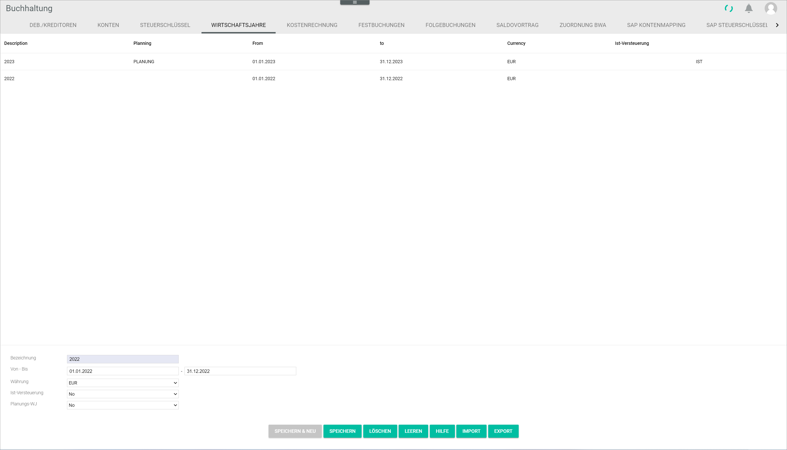

[!!Fakturierung](RetailSuiteFaktBase)  
[!!User Interface Select fiscal year](../UserInterface/00a_FiscalYear.md)  
[!!User Interface Settings fiscal years](../UserInterface/02d_FiscalYears.md)  
[!!Select fiscal year](../Operation/01_SelectFiscalYear.md)  

# Manage the fiscal year

The fiscal year is set up during the configuration process via the accounting wizard. For detailed information, see [Fiscal years](./01_RunAccountingWizard.md#fiscal-years). After the initial fiscal year is set up during configuration, any subsequent fiscal years must be created manually. Fiscal years can also edited and deleted if necessary.

## Create a fiscal year

You can create a fiscal year that is not yet available in the system.

> [Info] It is essential to create a new fiscal year in the system at the beginning of the new fiscal year. If the system cannot find a fiscal year to post any newly issued invoices, they will remain unrecognized and will have to be posted again manually via the *Invoicing* module, once the new fiscal year has been created.  

#### Prerequisites

A fiscal year has been selected, see [Select the fiscal year](../Operation/01_SelectFiscalYear.md).

#### Procedure

*Accounting > Settings > Tab FISCAL YEARS*

1. Enter a description for the fiscal year in the *Description* field.

 > [Info] It is possible to enter digits, letters or combinations of characters. The number of characters is limited to 10.

2.  Enter the start and end date of the fiscal year in the *From* and *To* fields. By default, the current calendar year is preselected as time period for the fiscal year.

  > [Info] The fiscal year must consist of 12 months. However, it does not have to be a calendar year, but can be, for example from April 1 to March 31. Fiscal years cannot overlap in time, for example, fiscal years 2022 and 2022-2023 cannot coexist. If two fiscal years overlap, an error message will be displayed.

3. Click the *Currency* drop-down list and select the base currency. The drop-down list displays all currencies configured in the system. However, the accounting module works with the base currency only.

 > [Info] The base currency is the currency used by a company for accounting purposes, usually the currency of the country where the business is primarily based, even if it operates in other countries and currencies.

4. Click the *Cash accounting* drop-down list and select the appropriate option. The following options are available:

  - **Yes**  
  Select this option for the cash accounting method, where receipts are recorded during the period they are received, and expenses are recorded in the period in which they are actually paid.
  - **No**  
  Select this option for the accrual accounting method, where revenue is recognized when earned rather than when collected, and expenses are recognized when incurred rather than when paid.

    > [Info] This option has fundamental implications for the system automatic recording of taxes. In case of doubt, please check with your tax advisor.

5. Click the *Planning FY* drop-down list and select the appropriate option. The following options are available:  

  - **No**  
  Select this option to set up an actual fiscal year.
  - **Fiscal year for planning purposes only**   
  Select this option to set up a fiscal year for planning purposes only.

    > [Info] A fiscal year for planning purposes will not be recognized as an actual fiscal year by the system, and therefore the automatic functions in the interaction with other modules will not apply. On the other hand, a fiscal year for planning purposes can overlap in time with actual fiscal years.

6. Click the [SAVE & NEW] button.  
A small pop-up window confirms that the new fiscal year has been saved. The new fiscal year is displayed in the list.

  

## Edit a fiscal year

You can edit an available fiscal year, for example if a setting must be changed.

#### Prerequisites

- The accounting has been configured via the configuration wizard, see [Run the accounting wizard](./01_RunAccountingWizard.md).
- A valid fiscal year has been created, see [Create a fiscal year](#create-a-fiscal-year).

#### Procedure

*Accounting > Settings > Tab FISCAL YEARS*

1. Click the fiscal year to be edited.   
  The data for the selected fiscal year are displayed in the corresponding fields at the bottom.

    > [Note] Be aware that any changes made to a fiscal year will overwrite the preset values.

2. Edit the fields as appropriate.

3. Click the [SAVE] button.   
   A small pop-up window confirms that the edited fiscal year has been saved. The edited fiscal year is displayed in the list.

  

## Delete a fiscal year

You can delete a fiscal year, for example if it is no longer applicable.

#### Prerequisites

- The accounting has been configured via the configuration wizard, see [Run the accounting wizard](./01_RunAccountingWizard.md).
- A valid fiscal year has been created, see [Create a fiscal year](#create-a-fiscal-year).

#### Procedure

*Accounting > Settings > Tab FISCAL YEARS*

1. Select the fiscal year to be deleted.
  > [Note] Be aware that the fiscal year will be deleted permanently.

2. Click the [DELETE] button.  
   A confirmation window warns about a potential loss of data. Click [OK] if you want to proceed. A small pop-up confirms that the fiscal year has been deleted. The deleted fiscal year is no longer displayed in the list.

  
