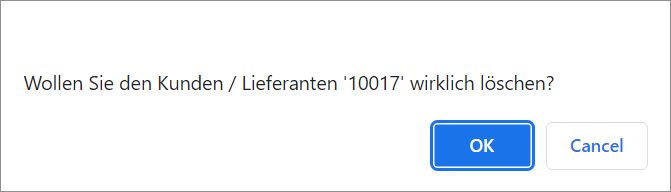

[!!Fakturierung](RetailSuiteFaktBase)  
[!!User Interface Debtors/creditors](../UserInterface/02a_DebtorsCreditors.md)  

# Manage the customer/supplier

The *Accounting* module contains a function to create new customers and suppliers, and to enter all relevant information about them. This function is also available in the *Invoicing* module. This information is needed for both modules to operate.

> [Info] The customer and supplier list in the *Accounting* and in the *Invoicing* module are synchronized with each other. Therefore, it may be necessary to refresh the list to display any changes that have been made.

## Create a customer/supplier

You can create a customer/supplier that is not yet available in the system.

#### Prerequisites

A fiscal year has been selected, see [Select the fiscal year](../Operation/01_SelectFiscalYear.md).

#### Procedure

*Accounting > Settings > Tab DEBTORS/CREDITORS > Tab Create customer/supplier*

1. Click the *Create debtor/creditor* drop-down list in the *Address/Contact* sub-tab and select the appropriate option. The following options are available:

  - **Debtor (customer)**  
  Select this option to create a customer.
  - **Creditor (supplier)**  
  Select this option to create a supplier.

2. Leave the *Debtor/creditor no.* field empty. The system enters the next free number automatically when saving the customer/supplier.  

  > [Info] If you enter a number, make sure that the number is within the valid range: 10000-69999 for customers and 70000-99999 for suppliers. Otherwise, a warning message will be displayed.

3. Enter a short name in the *Short name* field. This field is mandatory.

4. If desired, enter the company name in the *Company* field.   

5. If desired, enter the surname in the *Surname* field.   

  > [Info] Note that either the *Company* or the *Surname* field must be filled out to create a new customer/supplier.   

6. If desired, enter any other relevant customer/supplier information in the corresponding fields.

7. Click the [SAVE] button.  
A pop-up window is displayed to confirm that the customer/supplier has been created. If you have created a new customer, the *Customer list* tab is displayed, to which the new customer has been added. If you have created a new supplier, the *Supplier list* tab is displayed, to which the new customer has been added.

  

## Edit a customer/supplier

You can edit a customer/supplier, for example, if certain data need to be changed.

#### Prerequisites

- A fiscal year has been selected, see [Select the fiscal year](../Operation/01_SelectFiscalYear.md).
- At least one customer or supplier is created, see [Create a customer/supplier](#create-a-customersupplier).

#### Procedure

*Accounting > Settings > Tab DEBTORS/CREDITORS > Tab Customer/supplier list*
*Accounting > Settings > Tab DEBTORS/CREDITORS > Tab Customer list*
*Accounting > Settings > Tab DEBTORS/CREDITORS > Tab Supplier list*

> [Info] If a new customer has been previously created, only the *Customer list* is displayed. If a new supplier has been previously created, only the *Supplier list* is displayed.

1. Double click the customer or supplier to be edited.   
  The *Customer/Supplier (XXXXX)* tab with the corresponding customer/supplier number is displayed. By default, the *Address/Contact* sub-tab is preselected. The data for the selected customer/supplier are displayed in the corresponding fields.

  > [Warning] Be aware that any changes made to a customer/supplier will overwrite the existing values.

2. Edit the desired fields in the sub-tab.   

3. If desired, switch to another sub-tab to edit the corresponding data.

  > [Info] Repeat step **2** and **3** until you have edited the data as desired.

4. Click the [SAVE] button.   
A pop-up window is displayed to confirm that the customer/supplier has been edited.

  

5. Press F5 to initialize the Core1 Platform and to apply the changes.  
The edited customer/supplier displays the changes in the *Customer/supplier list* tab.

## Delete a customer/supplier

You can delete a customer/supplier, for example if it is no longer applicable.

#### Prerequisites

- A fiscal year has been selected, see [Select the fiscal year](../Operation/01_SelectFiscalYear.md).
- At least one customer or supplier is created, see [Create a customer/supplier](#create-a-customersupplier).

#### Procedure

*Accounting > Settings > Tab DEBTORS/CREDITORS > Tab Customer/supplier list*  
*Accounting > Settings > Tab DEBTORS/CREDITORS > Tab Customer list*  
*Accounting > Settings > Tab DEBTORS/CREDITORS > Tab Supplier list*  

1. Double click the customer or supplier to be deleted.

  > [Warning] Be aware that the customer/supplier will be deleted permanently.

2. Click the [DELETE CUSTOMER/SUPPLIER (XXXX)] button.  
A confirmation window is displayed.

  

3. Click [OK] if you want to proceed. A pop-up window is displayed to confirm that the customer/supplier has been deleted.

  

4. Press F5 to initialize the Core1 Platform and to apply the changes.  
The selected customer/supplier is no longer displayed in the list.
