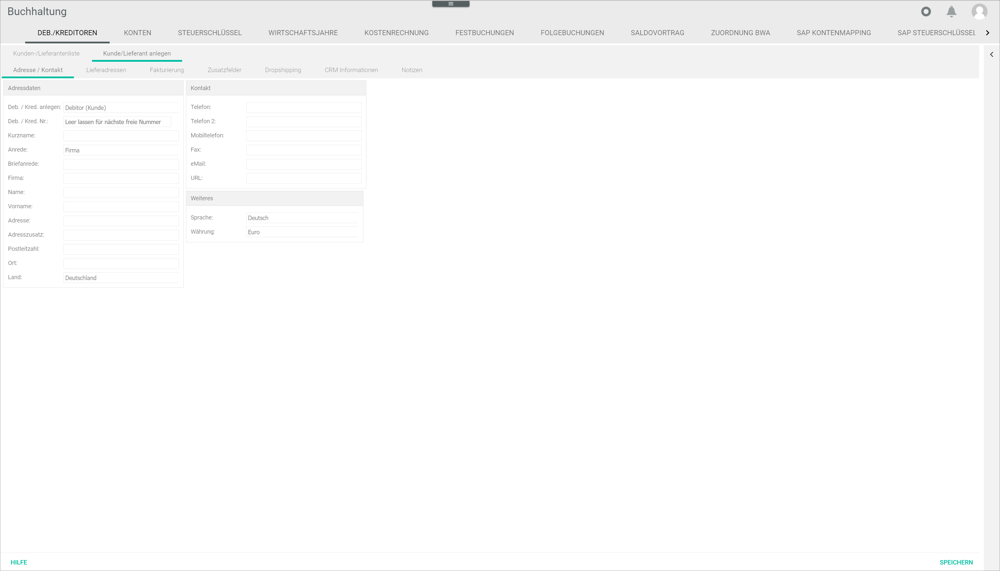
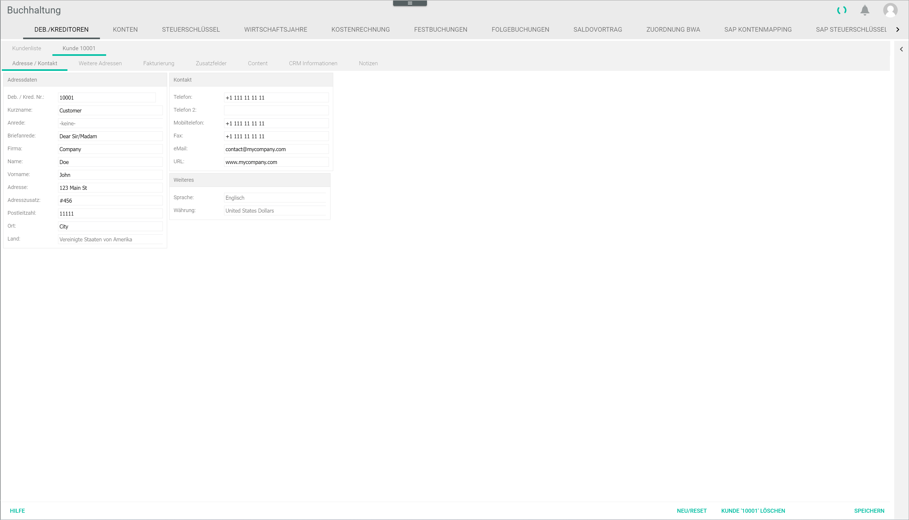
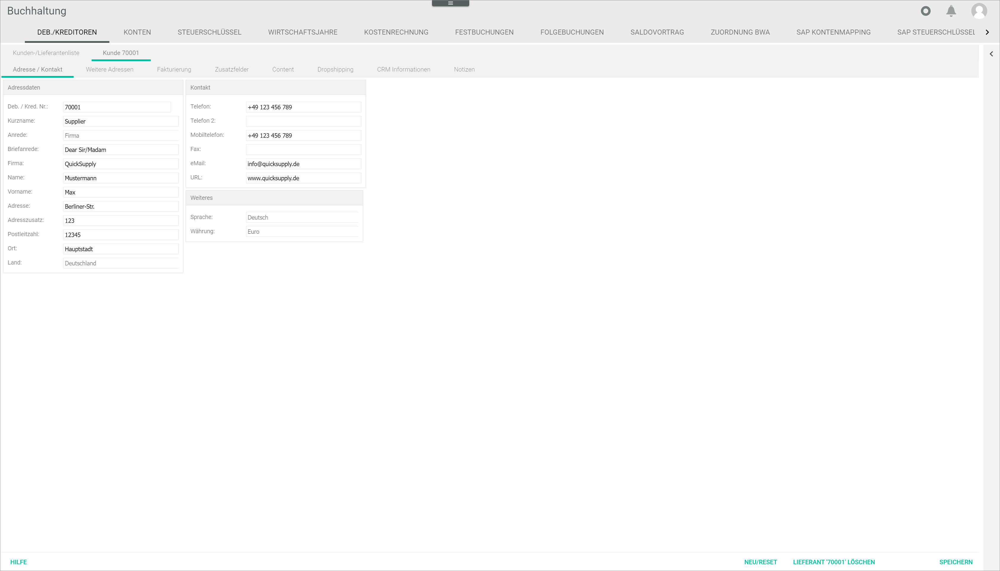

[!!Fakturierung](RetailSuiteFaktBase)  
[!!User Interface debtors/creditors](../UserInterface/02a_DebtorsCreditors.md)  

# Manage the customer/supplier

The *Accounting* module contains a function to create new customers and suppliers, and to enter all relevant information about them. This function is also available in the *Invoicing* module. This information is needed for both modules to operate.

> [Info] Any customer/supplier information created, edited or deleted in the *Accounting* module will be also be created, edited or deleted in the *Invoicing* module, and vice versa. It may be necessary to refresh the page with the F5 key, though, to see the changes in the *Customer/supplier list* tab.

## Create a customer/supplier

You can create a customer/supplier that is not yet available in the system.

#### Prerequisites

- The accounting is configured via the configuration wizard, see [Run the accounting wizard](./01_RunAccountingWizard.md).
- A valid fiscal year is created, see [Create a fiscal year](./04_ManageFiscalYear.md#create-a-fiscal-year).

#### Procedure

*Accounting > Select the fiscal year > Settings > Tab DEBTORS/CREDITORS > Tab Create customer/supplier*

1. Click the *Create debtor/creditor* drop-down list in the *Address/Contact* sub-tab and select the appropriate option (**Debtor (customer)/Creditor (supplier)**).

2. Enter a number for the customer/supplier in the *Debtor/creditor no.* field or leave it empty for the next free number.

  > [Info] Make sure that the number entered is within the valid range (10000-69999 for customers and 70000-99999 for suppliers). Otherwise, a warning message will be displayed.

3. Enter a short name in the *Short name* field. This field is compulsory.

4. Enter a company name in the *Company* field.

5. Enter a surname in the *Surname* field.

  > [Info] Note that either the *Company* or the *Surname* field must be filled out to be able to create a new customer/supplier.

6. Enter any other relevant customer/supplier information in the corresponding fields.

7. Click the [SAVE] button.  
A pop-up window is displayed to confirm that the customer/supplier has been created. The newly created customer/supplier is displayed in the *Customer/supplier list* tab.

## Edit a customer/supplier

You can edit an existing customer/supplier, for example if a setting must be changed.

#### Prerequisites

- The accounting is configured via the configuration wizard, see [Run the accounting wizard](./01_RunAccountingWizard.md).
- A valid fiscal year is created, see [Create a fiscal year](./04_ManageFiscalYear.md#create-a-fiscal-year).
- A customer/supplier is created, see [Create a customer/supplier](#create-a-customer-supplier).

#### Procedure

*Accounting > Select the fiscal year > Settings > Tab DEBTORS/CREDITORS > Tab Customer/supplier list*

1. Double click on the existing customer/supplier to be edited.   
A new tab opens with the customer/supplier number. The existing data for the selected customer/supplier are displayed in the corresponding fields in the *Address/Contact* sub-tab.

  > [Warning] Be aware that any changes made to an existing customer/supplier will overwrite the existing values.

2. Edit the fields as appropriate.

3. Click the [SAVE] button.   
A pop-up window is displayed to confirm that the customer/supplier has been edited. The edited customer/supplier displays the changes in the *Customer/supplier list* tab.

  > [Info] It may be necessary to refresh the page with the F5 key to see the changes in the *Customer/supplier list* tab.

## Delete a customer/supplier

You can delete an existing customer/supplier, for example if it is no longer applicable.

#### Prerequisites

- The accounting is configured via the configuration wizard, see [Run the accounting wizard](./01_RunAccountingWizard.md).
- A valid fiscal year is created, see [Create a fiscal year](./04_ManageFiscalYear.md#create-a-fiscal-year).
- A customer/supplier is created, see [Create a customer/supplier](#create-a-customer-supplier).

#### Procedure

*Accounting > Select the fiscal year > Settings > Tab DEBTORS/CREDITORS > Tab Customer/supplier list*

1. Double click on the existing customer/supplier to be deleted.
  > [Warning] Be aware that the existing customer/supplier will be deleted permanently.

2. Click the [DELETE] button.  
The selected customer/supplier is deleted.

[comment]: <> (Schaltfläche heißt nicht genau LÖSCHEN sondern [KUNDE Kundennr. LÖSCHEN] oder [LIEFERANT Lieferantnr. LÖSCHEN]. Andere Lösung?)
