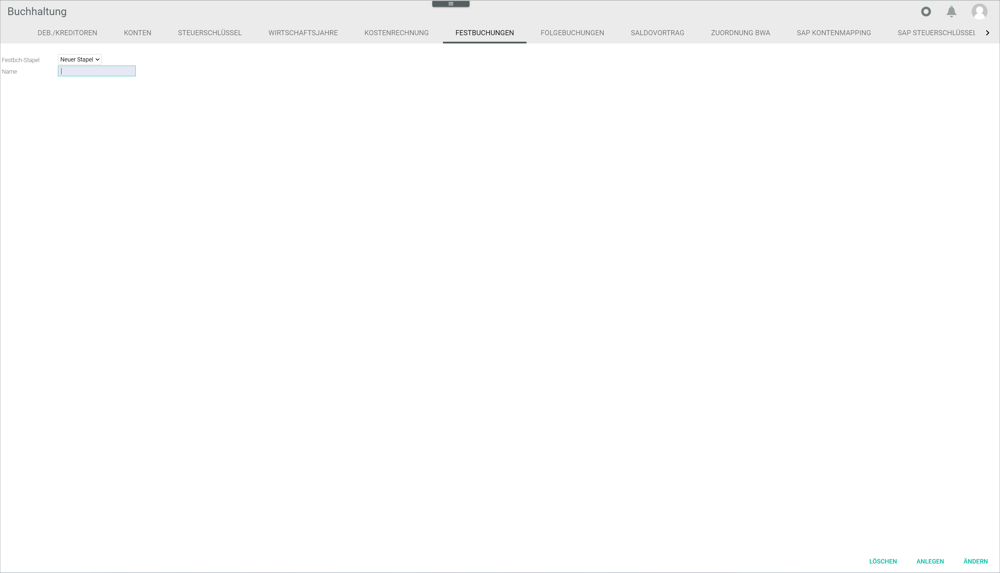
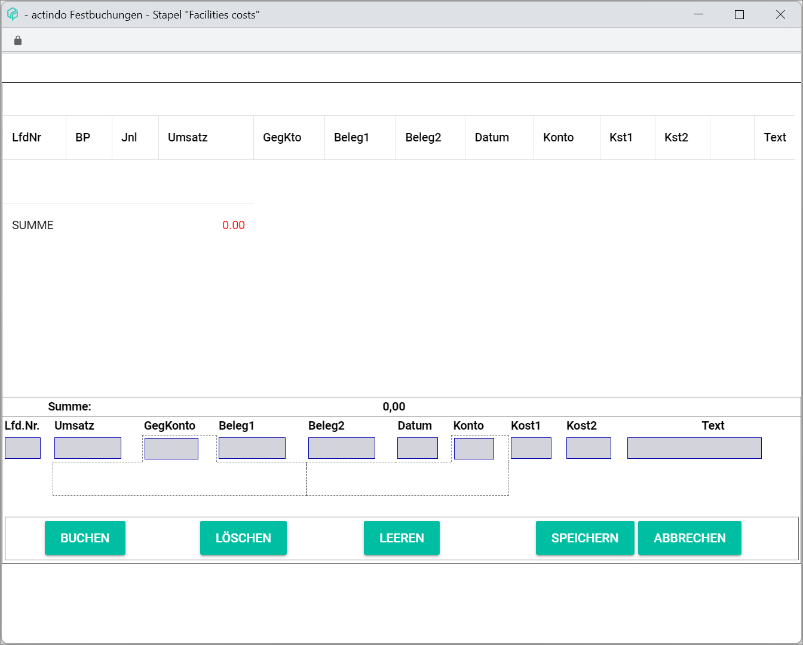
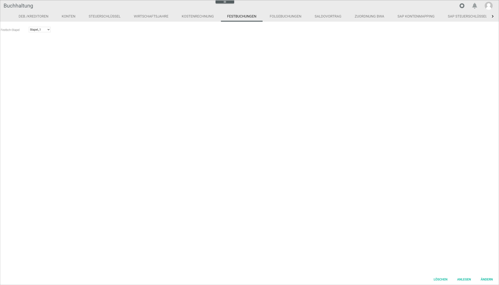
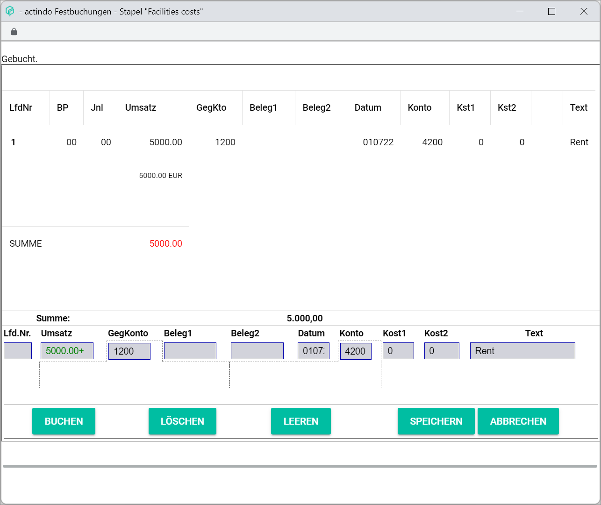
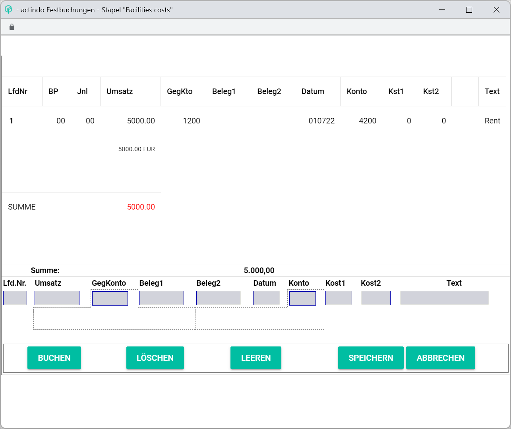
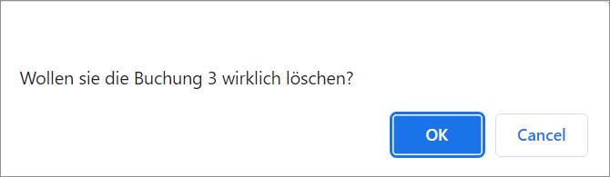
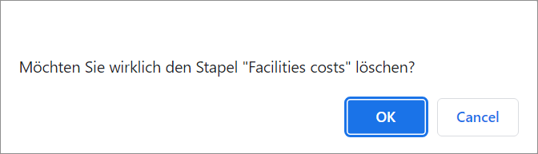

[!!Select a fiscal year](../Operation/01_SelectFiscalYear.md)  
[!!User Interface Select fiscal year](../UserInterface/00a_FiscalYear.md)  
[!!User Interface Fixed postings](../UserInterface/02f_FixedBookings.md)  

# Manage the fixed postings

Fixed postings are recurring transactions that must be posted regularly, for example facilities costs. The *FIXED POSTINGS* tab in the *Accounting* module enables to automate recurring postings. The fixed postings to be automated can be applied when selecting the fiscal year, see [Select the fiscal year](../Operation/01_SelectFiscalYear.md). By doing so, the system will apply automatically the configured fixed postings in the corresponding fiscal year and journal.

Fixed postings can be created, edited and deleted.

## Create fixed postings

To create fixed postings, a batch must be selected or a new one must be created first.

### Create a fixed posting batch

You can create a fixed posting batch that is not yet available in the system.

#### Prerequisites

A fiscal year has been selected, see [Select the fiscal year](../Operation/01_SelectFiscalYear.md).

#### Procedure

*Accounting > Settings > Tab FIXED POSTINGS*

1. Click the *Fixed posting batch* drop-down list and select the **New batch** option.

    > [Info] By default, the **New batch** option is preselected in the drop-down list.

2. Enter a batch name in the *Name* field.  

3. Click the [CREATE] button.   
    The *Fixed postings &ndash; Batch* window is displayed.

    

4. Click the [SAVE] button.  
    The notice *Fixed posting batch applied* is displayed in the upper left corner of the window. The created fixed posting batch has been saved in the *Fixed posting batch* drop-down list.

    > [Info] If you click the [CANCEL] button, the fixed posting batch will be rejected.

5. For the next steps to create a fixed posting, follow the procedure [Add a fixed posting](#add-a-fixed-posting) below.

### Add a fixed posting

You can add fixed postings to an existing or a new fixed posting batch.

#### Prerequisites

- A fiscal year has been selected, see [Select the fiscal year](../Operation/01_SelectFiscalYear.md).
- A fixed posting batch has been created, see [Create a fixed posting batch](#create-a-fixed-posting-batch).

#### Procedure

*Accounting > Settings > Tab FIXED POSTINGS*

1. Click the *Fixed posting batch* drop-down list and select the fixed posting batch to which you want to add a fixed posting.  
    The *Fixed postings &ndash; Batch* window is displayed.  

    > [Info] If the window is not automatically displayed, click the [EDIT] button to display it.

    

2. Leave the *Seq. no.* field empty. The posting numbers are added by the system automatically.

3. Enter the amount to be posted in the *Turnover* field.  

    > [Info] The fields *Turnover*, *Contra account*, *Date* and *Account* must be filled out to add a fixed posting. Otherwise, a warning message is displayed.

4. Enter a contra account number in the *Contra account* field.

    > [Info] After you have entered at least two numbers in the field, a list is displayed below the field with all accounts matching the entry. You can also select the corresponding account in the list.

5. Enter the date for the fixed posting in the *Date* field. The valid date format is *DDMMYY*.

6. Enter an account number in the *Account* field.

    > [Info] After you have entered at least two numbers in the field, a list is displayed below the field with all accounts matching the entry. You can also select the corresponding account in the list.

7. If desired, enter any other relevant fixed posting information in the corresponding fields.

8. Click the [POST] button.  
    The fixed posting is posted. The notice *Posted* is displayed in the upper left corner of the window. The created fixed posting is displayed in the *Fixed postings &ndash; Batch* window.

    

9. Click the [SAVE] button.   
    The notice *Fixed posting batch applied* is displayed in the upper left corner of the window. The posting has been saved in the batch.

    > [Info] If you click the [CANCEL] button, the fixed posting will be rejected.

## Edit a fixed posting

You can edit fixed postings included in a fixed posting batch.  

The fixed posting editing process comprises two steps:

  1. reposting the edited posting as a new posting in the fixed posting batch
  2. deleting the old unedited posting from the fixed posting batch

This two-step editing process prevents inadvertently overwriting.

#### Prerequisites

- A fiscal year has been selected, see [Select the fiscal year](../Operation/01_SelectFiscalYear.md).
- A fixed posting has been created, see [Create fixed postings](#create-fixed-postings).

#### Procedure

*Accounting > Settings > Tab FIXED POSTINGS*

1. Click the *Fixed posting batch* drop-down list and select the fixed posting batch where the fixed posting to be edited is included.     
    The *Fixed postings &ndash; Batch* window is displayed.

    > [Info] If the window is not automatically displayed, click the [EDIT] button to display it.

    

2. Click the fixed posting to be edited.  
    The details of the selected fixed posting are displayed in the input fields.

3. Edit the desired data of the fixed posting in the corresponding fields.

4. Click the [POST] button.  
    A new fixed posting with the indicated modifications is added to the fixed posting batch with a new sequential number.

5. Select now the old unedited fixed posting to delete it.  
    The details of the selected fixed posting are displayed in the input fields.

6. Click the [DELETE] button.  
    A confirmation window is displayed.  

    

7. Click [OK] if you want to proceed.  
    The notice *Deleted* is displayed in the upper left corner of the window.

8. Click the [SAVE] button.   
    The notice *Fixed posting batch applied* is displayed in the upper left corner of the window. All changes to the fixed postings are saved.

    > [Info] If you click the [CANCEL] button, the changes will be rejected.

## Delete a fixed posting

You can delete a fixed posting in a fixed posting batch.

#### Prerequisites

- A fiscal year has been selected, see [Select the fiscal year](../Operation/01_SelectFiscalYear.md).
- A fixed posting has been created, see [Create fixed postings](#create-fixed-postings).

#### Procedure

*Accounting > Settings > Tab FIXED POSTINGS*

1. Click the *Fixed posting batch* drop-down list and select the batch where the fixed posting to be deleted is included.  
    The *Fixed postings &ndash; Batch* window is displayed.

    > [Info] If the window is not automatically displayed, click the [EDIT] button to display it.

    

2. Click the fixed posting to be deleted.
    The details of the selected fixed posting are displayed in the input fields.

    > [Note] Be aware that the fixed posting will be deleted permanently from the fixed postings batch. The fixed posting itself, however, will not be deleted from the system and will continue to be displayed in the *POSTINGS* tab.

3. Click the [DELETE] button.  
    A confirmation window is displayed.  

    

4.  Click [OK] if you want to proceed.  
    The notice *Deleted* is displayed in the upper left corner of the window. The deleted fixed posting is no longer displayed in the fixed posting batch.

5. Click the [SAVE] button.   
    The notice *Fixed posting batch applied* is displayed in the upper left corner of the window. The fixed posting deletion has been saved in the fixed posting batch.

    > [Info] If you click the [CANCEL] button, the deletion will be rejected.

## Delete a fixed posting batch

You can delete a fixed posting batch if it is no longer applicable.

#### Prerequisites

- A fiscal year has been selected, see [Select the fiscal year](../Operation/01_SelectFiscalYear.md).
- At least one fixed posting batch has been created, see [Create a fixed posting batch](#create-a-fixed-posting-batch).

#### Procedure

*Accounting > Settings > Tab FIXED POSTINGS*

1. Click the *Fixed posting batch* drop-down list and select the fixed posting batch to be deleted.   
    The *Fixed postings &ndash; Batch* window is displayed.

    

    > [Note] Be aware that the selected fixed posting batch will be deleted permanently. The postings contained in it, however, will not be deleted but will still be displayed in the *POSTINGS* tab.

2. Click the [DELETE] button.  
    A confirmation window is displayed.

    

3. Click [OK] if you want to proceed.  
    The selected fixed posting batch is deleted from the *Fixed posting batch* drop-down list.

[comment]: <> (Kein "Deleted" Pop-Up-Fenster angezeigt!)
