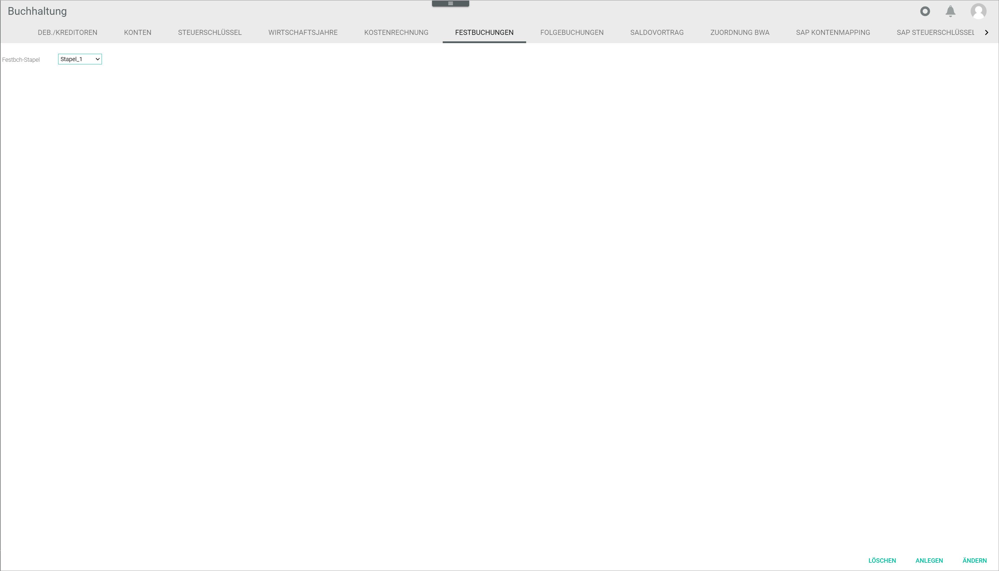
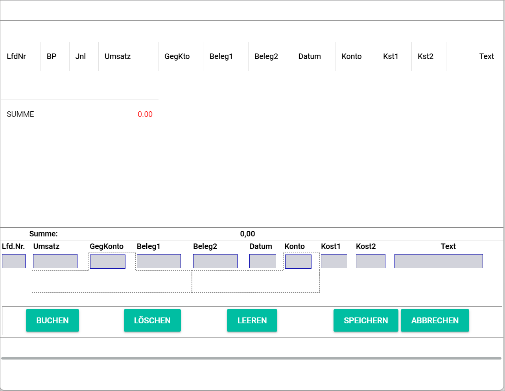
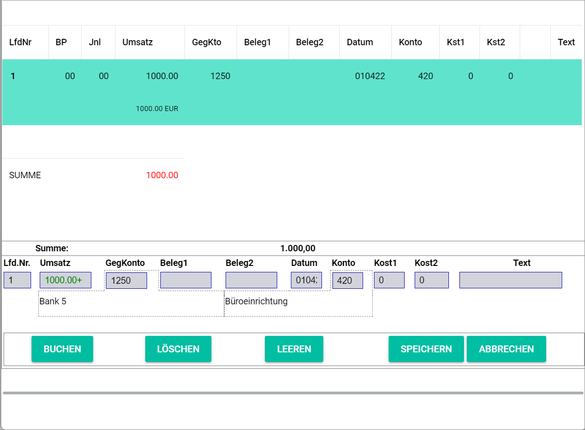

[!!User Interface Fixed bookings](../UserInterface/02f_FixedBookings.md)  
[!!User Interface Select fiscal year](../UserInterface/00a_FiscalYear.md)  
[!!Select a fiscal year](../Operation/01_SelectFiscalYear.md)  

# Manage the fixed bookings

The *FIXED BOOKINGS* tab in the *Accounting* module enables to automate recurring bookings. The fixed bookings to be automated can be applied when selecting the fiscal year, see [Select the fiscal year](../Operation/01_SelectFiscalYear.md). By doing so, the system will apply automatically the setup fixed bookings in the corresponding fiscal year and journal.

To be able to create fixed postings, a batch must be selected or a new one must be created first.

## Create a fixed booking batch

You can create a fixed booking batch that is not yet available in the system.

#### Prerequisites

- The accounting is configured via the configuration wizard, see [Run the accounting wizard](./01_RunAccountingWizard.md).
- A valid fiscal year is created, see [Create a fiscal year](./04_ManageFiscalYear.md#create-a-fiscal-year).

#### Procedure

*Accounting > Select the fiscal year > Settings > Tab FIXED BOOKINGS*

1. Click the *Fixed booking batch* drop-down list and select the *New batch* option.

  > [Info] By default, the *New batch* option is preselected in the drop-down list.

2. Enter a batch name in the *Name* field.  

3. Click the [CREATE] button.   
A new window opens where the new fixed bookings can be registered.

## Delete a fixed booking batch

You can delete a fixed posting batch if it is no longer applicable.

#### Prerequisites

- The accounting is configured via the configuration wizard, see [Run the accounting wizard](./01_RunAccountingWizard.md).
- A valid fiscal year is created, see [Create a fiscal year](./04_ManageFiscalYear.md#create-a-fiscal-year).
- At least one fixed booking batch is created, see [Create a fixed booking batch](#create-a-fixed-booking-batch).

#### Procedure

*Accounting > Select the fiscal year > Settings > Tab FIXED BOOKINGS*

1. Click the *Fixed booking batch* drop-down list and select the fixed booking batch to be deleted.   

  > [Warning] Be aware that the selected fixed posting batch will be deleted permanently. The postings contained in it, however, will not be deleted but are still displayed in the *POSTINGS* tab.

2. Click the [DELETE] button.  
A window comes up asking for confirmation. The selected fixed booking batch is deleted.

  > [Info] You may need to refresh the page with the F5 key to see the changes in the Fixed booking batch drop-down list.

## Create a fixed booking

You add fixed postings to an existing or a new fixed posting batch.

#### Prerequisites

- The accounting is configured via the configuration wizard, see [Run the accounting wizard](./01_RunAccountingWizard.md).
- A valid fiscal year is created, see [Create a fiscal year](./04_ManageFiscalYear.md#create-a-fiscal-year).
- A fixed booking batch is created, see [Create a fixed booking batch](#create-a-fixed-booking-batch).

#### Procedure

*Accounting > Select the fiscal year > Settings > Tab FIXED BOOKINGS*

1. Click the *Fixed posting batch* drop-down list and select the fixed posting batch to which you want to add a fixed posting.
The fixed booking window opens automatically. If it does not, click the [EDIT] button.

  

2. Enter a value in the *Turnover* field.

  > [Info] The booking numbers must be sequential and are added by the system automatically.

3. Enter a contra account number in the *Contra account* field.

  > [Info] After you have entered at least two numbers in the field, a list is displayed below the field with all accounts matching the entry. You can also select the corresponding account in the list.

4. Enter the date for the fixed booking in the *Date* field. The valid date format is *DDMMYY*.

5. Enter an account number in the *Account* field.
  > [Info] After you have entered at least two numbers in the field, a list is displayed below the field with all accounts matching the entry. You can also select the corresponding account in the list.
  > [Info] Note that the fields *Contra account*, *Date* and *Account* must be filled out to be able to create a new fixed booking.

6. If desired, enter any other relevant fixed posting information in the corresponding fields.

7. Click the [BOOK] button.  
The fixed booking is booked. The notice *Booked* is displayed in the upper left corner of the window. The created fixed booking is displayed in the *Fixed bookings &ndash; Batch* window.

  

8. Click the [SAVE] button.   
The posting has been saved in the batch.

 > [Info] If you click the [CANCEL] button, the fixed posting will be rejected.

## Edit a fixed booking

You can edit fixed postings registered in a fixed posting batch.

### Prerequisites

- The accounting is configured via the configuration wizard, see [Run the accounting wizard](./01_RunAccountingWizard.md).
- A valid fiscal year is created, see [Create a fiscal year](./04_ManageFiscalYear.md#create-a-fiscal-year).
- A fixed booking batch is created, see [Create a fixed booking batch](#create-a-fixed-booking-batch).
- A fixed booking is created, see [Create a fixed booking](#create-a-fixed-booking).

### Procedure

*Accounting > Select the fiscal year > Settings > Tab FIXED BOOKINGS*

1. Click the *Fixed posting batch* drop-down list and select the fixed posting batch of the fixed posting to be edited.   
The fixed booking window opens automatically. If it does not, click the [EDIT] button.

2. Click the fixed booking to be edited.
  The details of the selected fixed posting are displayed in the fields.

  

3. Edit the desired data of the fixed booking in the corresponding fields.

4. Click the [BOOK] button.  
A new fixed booking with the indicated modifications is added to the fixed booking batch with a new sequential number.

  > [Info] The old fixed booking can be now deleted from the batch. This two-step editing process prevents inadvertently overwriting.

5. Click the [SAVE] button.   
All changes to the fixed bookings are saved.  

  > [Info] If you click the [CANCEL] button, the changes will be rejected.

## Delete a fixed booking

You can delete a fixed booking in a fixed booking batch.

#### Prerequisites

- The accounting is configured via the configuration wizard, see [Run the accounting wizard](./01_RunAccountingWizard.md).
- A valid fiscal year is created, see [Create a fiscal year](./04_ManageFiscalYear.md#create-a-fiscal-year).
- A fixed booking batch is created, see [Create a fixed booking batch](#create-a-fixed-booking-batch).
- A fixed booking is created, see [Create a fixed booking](#create-a-fixed-booking).

#### Procedure

*Accounting > Select the fiscal year > Settings > Tab FIXED BOOKINGS*

1. Click the *Fixed posting batch* drop-down list and select the batch of the fixed posting to be deleted.  
The fixed booking window opens automatically. If it does not, click the [EDIT] button.

  

2. Click the fixed posting to be deleted.
  The details of the selected fixed posting are displayed in the fields.

  > [Warning] Be aware that the fixed posting will be deleted permanently from the fixed postings batch. The fixed posting itself, however, will not be deleted from the system and will continue to be displayed in the *POSTINGS* tab.

3. Click the [DELETE] button.  
A window comes up asking for confirmation. The selected fixed booking is deleted from the batch.

4. Click the [SAVE] button.   
The fixed posting deletion has been saved in the batch.

 > [Info] If you click the [CANCEL] button, the deletion will be rejected.
