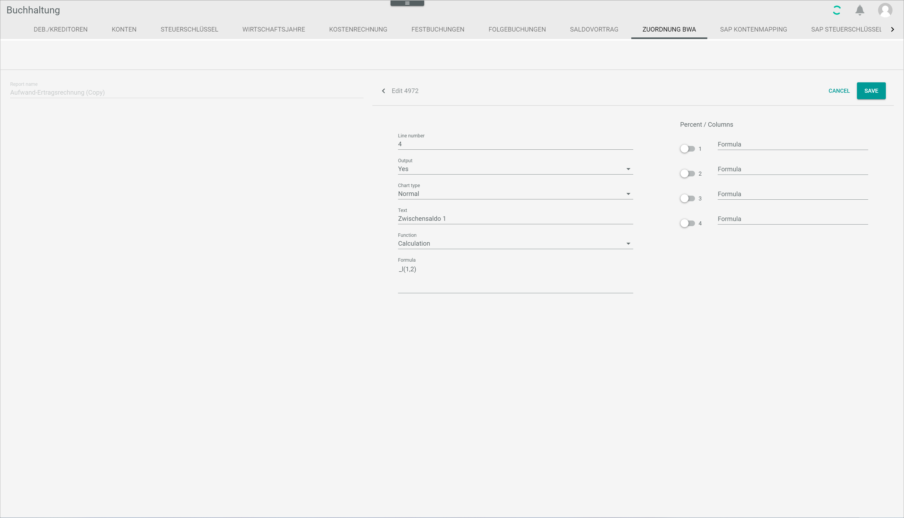

[!!Provide accounting data](../Operation/15_ProvideAccountingData.md)  
[!!User interface Postings header](../UserInterface/01_Header.md)  
[!!User interface BWA assignment](../UserInterface/02i_BWAAssignment.md)  

# Manage the BWA reports

[comment]: <> (BWA reports or Accounting Reports? See Accounting Reports view -> ZUORDNUNG BWA tab)

The business evaluation (BWA) is a reporting system based on company financial data and provides information about the company's current cost and revenue situation and, consequently, its  profitability. BWA reports serve as a basis for managerial future decisions, and they are widely used by capital investors and credit institutions for company assessment. BWA provides important information for the controlling of the company.

You can create new BWA reports, copy and edit one of the predefined system reports or delete any report. All available reports can be fully customized.

> [Info] Be aware that any deletion is permanent and cannot be undone, and that any changes made will overwrite the preset values.

When customizing existing reports, bear in mind that the reports use the standard accounts set up in the *Accounting* module configuration process. For detailed information, see [Chart of accounts](./01_RunAccountingWizard.md#chart-of-accounts). If the accounts have been customized manually, they must be set up again individually for the BWA reports. Otherwise, they will not be recognized by the BWA reports.

## Create a BWA report

You can create a BWA report that is not yet available in the system.

### Add a BWA report

Your can add a BWA report to the *Accounting reports* list.  

#### Prerequisites

A fiscal year has been selected, see [Select the fiscal year](../Operation/01_SelectFiscalYear.md).

#### Procedure

*Accounting > Settings > Tab BWA ASSIGNMENT*

1. Click the  (Add) button in the bottom right corner.  
    The *Create* view is displayed.

    

2. Enter a name in the *Report name* field.

3. Click the [SAVE] button.  
    A new BWA report has been added to the *Accounting reports* list.

### Add report lines

You can add report lines to a BWA report.

#### Prerequisites

- A fiscal year has been selected, see [Select the fiscal year](../Operation/01_SelectFiscalYear.md).
- A BWA report has been added, see [Add a BWA report](#add-a-BWA-report).

#### Procedure

*Accounting > Settings > Tab BWA ASSIGNMENT*

1. Select a BWA report in the *Accounting reports* list.  
    The *Accounting report lines* section is displayed.

    

    > [Info] If a newly added BWA report is selected, the *No report lines created. Use + button to create one* notice is displayed. If the selected BWA report already contains report lines, they are displayed in this section.  

2. Click the  (Add) button in the bottom right corner.  
    The *Create* section is displayed.

    

3. Enter a number in the *Line number* field. You can use the keyboard or the increase and decrease arrows on the right.  

    > [Info] Every line in a BWA report has a fixed number. This way, it is possible to refer back to it when calculations are performed.  

4. Click the *Output* drop-down list and select the appropriate option to configure the report print layout. The following options are available:  

    - **Yes**  
        Select this option for the line to be printed.   
    - **No**  
      Select this option for the line not to be printed.  
    - **Space**  
      Select this option to insert a blank line between two lines.
    - **New page**  
      Select this option to insert a page break.

5. Click the *Chart type* drop-down list and select the appropriate option. The following options are available:

    - **Normal**  
    - **Sum**  
    - **Don't show**  

[comment]: <> (Sum and don't show? Warte auf Feedback von Patrick. Alternativtext: Click the *Chart type* drop-down list and select the **Normal** option. The options **Sum** and **Don't show** are currently not supported.)

6. Enter the line description in the *Text* field.

7. Click the *Function* drop-down list and select the appropriate option. The following options are available:  

    - **Text only**  
      Select this option to enter text only.  
    - **Calculation**  
      Select this option to enter a calculation formula. When selecting this option, the *Formula* field becomes active.  
    - **Assessment**    
      This option is currently not supported.

[comment]: <> (Info fehlt! Feedback von Patrick. Alternativtext: ...select **Text only** if the line contains just text or **Calculation**, if you wish to add a formula. The *Formula* field becomes active.)

8. If the **Calculation** option has been previously selected, enter the applicable formula in the *Formula* field to calculate the value to be output in the report line. The basic calculating operations (+, -, *, /) are permitted.

    Below, the most usual formulas and functions are explained.

    > [Info] The arguments enclosed in square brackets are optional. The brackets must not be included in the formula when calling the function, since they could cause an error. DEBIT balances are always displayed as negative ("-") numbers and CREDIT balances as positive ("+") numbers, irrespectively of the account type.

    | Formula         | Function      | 
    |-----------------|---------------|
    | _l(from[, to])  | Lines          | 
    |                 | Lines from - to are added up. If only "from" is specified, only the value of the specified line will be output.|
    |_k(from[, to])   | Accounts        |
    |                 | Accounts from - to are added up. If only "from" is specified, only the value of the specified account will be output.|
    |_kh(from[, to])  | Accounts CREDIT |
    |                 | Accounts from - to are added up if the account balance of the respective accounts is in CREDIT.|
    |_ks(from[, to])  | Accounts DEBIT |
    |                 | Accounts from - to are added up if the account balance of the respective accounts is in DEBIT.|
    |_uh(from[, to])  | Turnover CREDIT |
    |                 | This function outputs only the CREDIT part of the account.|
    |_us(from[, to])  | Turnover DEBIT | 
    |                 | This function outputs only the DEBIT part of the account.|
    |_bh(from, to[, from, to][, from, to]...)| Block CREDIT | 
    |                 | Several from - to combinations can be specified here. If this block of account numbers is in CREDIT, the function provides a balance, otherwise "0" is displayed.|
    |_bs(from, to[, from, to][, from, to]...)| Block DEBIT | 
    |                 | Several from - to combinations can be specified here. If this block of account numbers is in DEBIT, the function provides a balance, otherwise "0" is displayed.|

9. If desired, activate the first toggle button in the *Percent / Columns* field and enter the applicable formula in the *Formula* field. This function is used to calculate the percentage of the value expressed in the current line in relation to the overall turnover and display it in an additional column in the BWA report. 

[comment]: <> (Spalten 2-4 nicht definiert bzw. weiterentwickelt, da nicht in Gebrauch, bestätigt in RS mit Teamlead Finance)

10. Click the [SAVE] button.  
    The new report line has been added to the BWA report.

11. Repeat this procedure to add as many lines as necessary to create your BWA report. 

    > [Info] Creating a BWA report is extremely complex. All relevant accounts must be specified and no duplicates must be included, otherwise the calculations will be distorted.   
    To simplify the process, it is recommended to use one of the predefined BWA reports as a basis and edit it to adjust it to your needs, see [Copy a predefine BWA report](#copy-a-predefined-bwa-report).

## Edit a BWA report

You can edit a BWA report to make any necessary changes, for example, change the report name and layout, as well as add, edit or delete report lines. To add report lines, see [Add report lines](#add-report-lines).

> [Info] Be aware that any changes made to a BWA report will overwrite the existing values. If you are using one of the predefined system reports as a basis, it is highly recommended to make a copy of it first. For detailed information, see [Copy a BWA report](#copy-a-bwa-report).

#### Prerequisites

A fiscal year has been selected, see [Select the fiscal year](../Operation/01_SelectFiscalYear.md).

#### Procedure

*Accounting > Settings > Tab BWA ASSIGNMENT*

1. Click the BWA report to be edited.  
    The *Edit* section is displayed.

    

2. If desired, click the *Report name* field and edit the name of the BWA report.

3. Click the accounting report line to be edited.  
    The *Edit* section is displayed. For detailed information, see [Edit report lines](../UserInterface/02i_BWAAssignment.md#edit-report-line).  
    
    
    
    > [Caution] **Potential loss of data**   
    Editing has the potential to cause loss of data due to overwrite. The overwrite cannot be undone and the overwritten data cannot be restored.    
    Check all your entries before proceeding.

4. If necessary, you can also delete accounting report lines. To do so, select the report line to be deleted by clicking the checkbox on the left.  
    The toolbar is displayed.

    > [Caution] **Loss of data**   
    Deleting will permanently remove the selected data. The deletion cannot be undone and the deleted data cannot be restored.       
    Problems may occur due to unresolved dependencies.   
    Make sure you really want to delete the selected data.

5. Click the  (Delete) button in the toolbar to delete the selected accounting report line.  
    The selected accounting report line is deleted.

8. Click the [SAVE] button in the upper right corner.   
    All changes to the BWA report have been saved.

## Copy a BWA report

You can copy an existing BWA report, either predefined in the system or previously custom-made, and adjust it further to your needs.

### Copy a predefined BWA report

You can make a copy of one of the BWA reports predefined in the system.

#### Prerequisites  

A fiscal year has been selected, see [Select the fiscal year](../Operation/01_SelectFiscalYear.md).

#### Procedure  

*Accounting > Settings > Tab BWA ASSIGNMENT*

1. Click the  (Copy) button in the upper right corner.  
    The *Copy from predefined system report* window is displayed.

    

2. Click the *Report name* drop-down list and select the appropriate option. The following options are available:  

    - **Profit and loss account**
    - **Cash basis accounting**
    - **Liquidity statement**
    - **Liquidity**
    - **Monthly balance**

3. Click the [COPY] button.  
    The copied report is displayed in the *Accounting reports* list. The word *(Copy)* has been added after the report name.

### Copy a custom BWA report

You can make a copy of a self-created BWA report.

#### Prerequisites  

- A fiscal year has been selected, see [Select the fiscal year](../Operation/01_SelectFiscalYear.md).
- A BWA report has been created, see [Create a BWA report](#create-a-BWA-report).

#### Procedure

*Accounting > Settings > Tab BWA ASSIGNMENT*

1. Select the BWA report to be copied by clicking the checkbox on the left.  
    The toolbar is displayed above the *Accounting reports* list.

2. Click the  (Copy) button in the upper right corner.  
    The copied report is displayed in the *Accounting reports* list. The word *(Copy)* has been added after the report name.

## Delete a BWA report

You can delete a BWA report if it is no longer needed, either one of the predefined system reports or a self-created report.

#### Prerequisites

- A fiscal year has been selected, see [Select the fiscal year](../Operation/01_SelectFiscalYear.md).
- A BWA report has been created, see [Create a BWA report](#create-a-BWA-report).

#### Procedure

*Accounting > Settings > Tab BWA ASSIGNMENT*

1. Select the BWA report to be deleted by clicking the checkbox on the left.    
    The toolbar is displayed above the *Accounting reports* list.

    > [Caution] **Loss of data**   
    Deleting will permanently remove the selected data. The deletion cannot be undone and the deleted data cannot be restored.       
    Problems may occur due to unresolved dependencies.   
    Make sure you really want to delete the selected data.

2. Click the  (Delete) button in the toolbar.  
    The selected BWA report is deleted and no longer displayed in the *Accounting reports* list.
