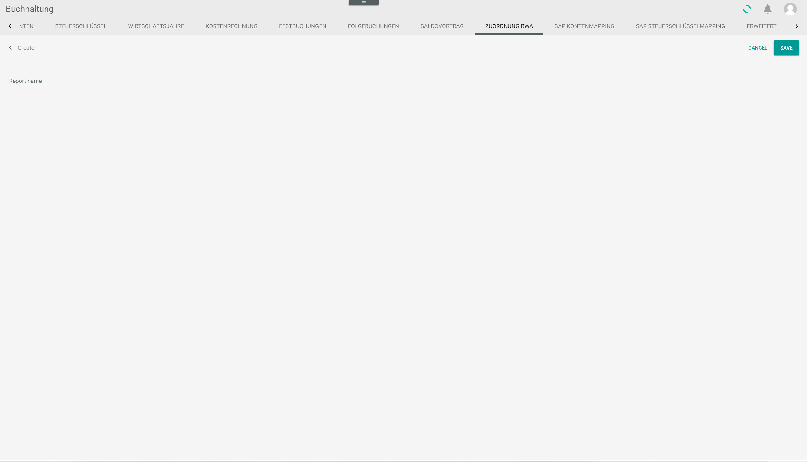
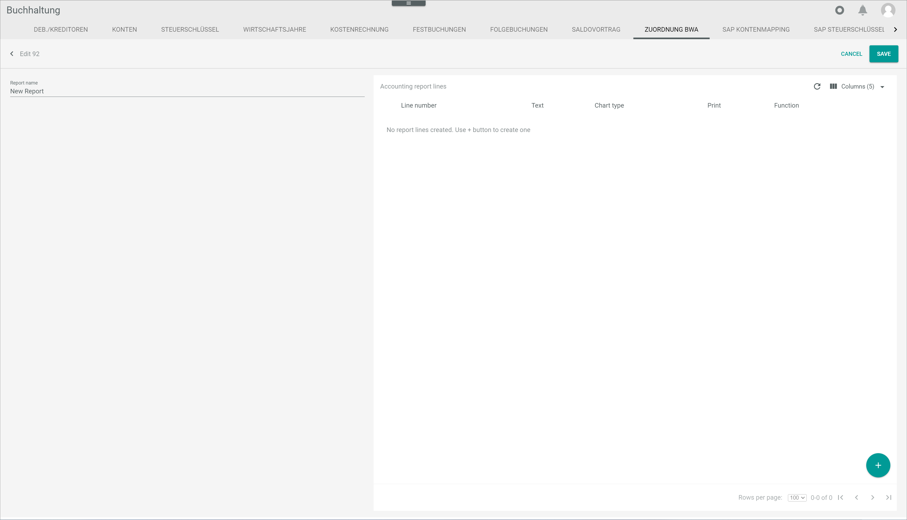
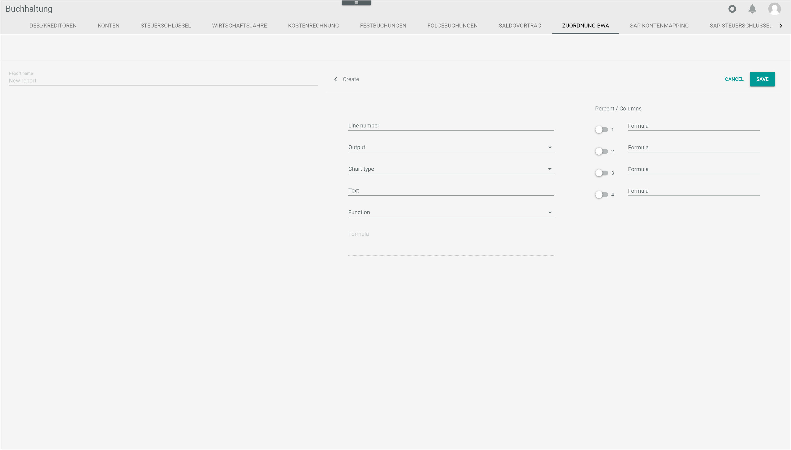
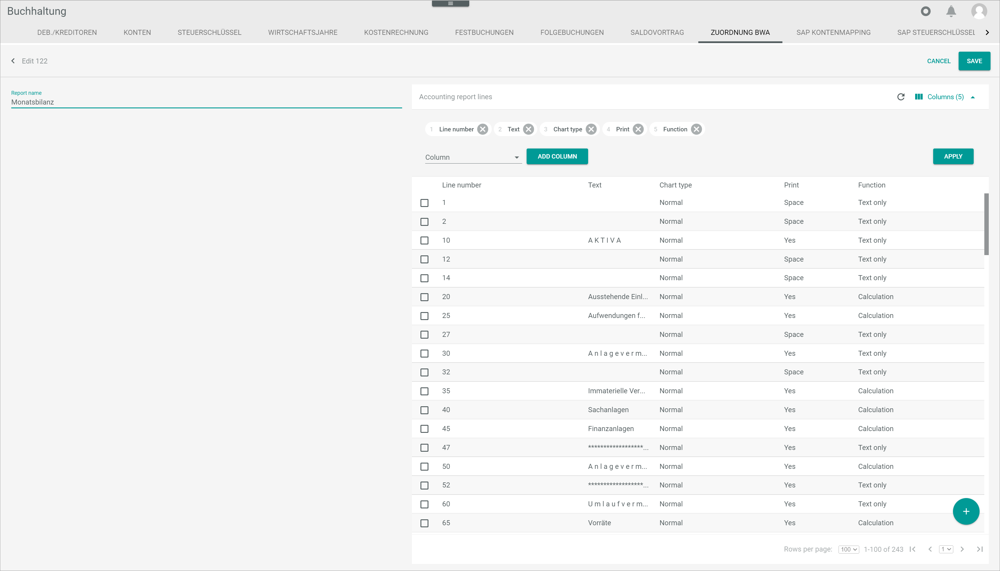

[!!User Interface BWA assignment](../UserInterface/02i_BWAAssignment.md)  
[!!User Interface Evaluations](../UserInterface/01_Book.md#evaluations)  
[!!Create a PDF evaluation](../Operation/15_ProvideAccountingData.md#create-a-pdf-evaluation)  

# Manage the BWA reports

[comment]: <> (BWA reports or Accounting Reports? See Accounting Reports view -> ZUORDNUNG BWA tab)

The business evaluation (BWA) is a reporting system based on company financial data and provides information about the company's current cost and revenue situation and, consequently, its  profitability. BWA reports serve as a basis for managerial future decisions, and they are widely used by capital investors and credit institutions for company assessment. BWA is an essential planning and controlling tool for the company's future development.

You can create new BWA reports, copy and edit one of the predefined system reports or delete any report. All available reports can be fully customized.

 > [Note] Be aware that any deletion is permanent and cannot be undone, and any changes made will overwrite the preset values.

When customizing existing reports, bear in mind that the reports use the standard accounts set up in the *Accounting* module configuration process. For detailed information, see [Chart of accounts](./01_RunAccountingWizard.md#chart-of-accounts). If the accounts have been customized manually, they must  be set up again individually for the BWA reports. Otherwise, they will not be recognized by the BWA reports.

## Create a BWA report

You can create a BWA report that is not yet available in the system.

### Add a BWA report

You can add a BWA report to the BWA report list.  

#### Prerequisites

A fiscal year has been selected, see [Select the fiscal year](../Operation/01_SelectFiscalYear.md).

#### Procedure

*Accounting > Settings > Tab BWA ASSIGNMENT*

1. Click the  (Add) button in the bottom right corner.  
  The *Create* view is displayed.

  

2. Enter a name in the *Report name* field.

3. Click the [SAVE] button.  
  The new BWA report has been added.

  

### Add report lines

You can add report lines to a newly added BWA report.

#### Prerequisites

- A fiscal year has been selected, see [Select the fiscal year](../Operation/01_SelectFiscalYear.md).
- A new BWA report is added, see [Add a BWA report](#add-a-BWA-report).

[comment]: <> (Zweite Voraussetzung trifft nicht unbending/nicht nur: man kann Zeilen zu einem bestehenden Bericht hinzufügen)
[comment]: <> (Add a BWA report vielleicht doch nicht so schön...)

#### Procedure

*Accounting > Settings > Tab BWA ASSIGNMENT > Select a BWA report*

1. Click the new BWA report in the list.  
  The *Accounting report lines* section is displayed.

  

2. Click the  (Add) button in the bottom right corner.  
  The *Create* section is displayed.

  

3. Enter any relevant information in the corresponding fields. You can also add different formulas to it. For detailed information, see [BWA assignment](../UserInterface/02i_BWAAssignment.md).

[comment]: <> (Das ist ein bisschen zu knapp formuliert. Ich weiß nicht, welche Felder ich ausfüllen muss und was da rein soll - auch nicht nach Lesen des UI Kapitels. Hier müssen noch mehr Schritte rein, die das genauer beschreiben)

4. Click the [SAVE] button.  
  The new report lines have been added to the BWA report.

## Edit a BWA report

You can edit a BWA report to make any necessary changes, for example, change the report name and layout, and edit or delete report lines.

 > [Note] Be aware that any changes made to a BWA report will overwrite the existing values. If you are taking one of the predefined system reports as a basis, it is highly recommended to make a copy of it first. For detailed information, see [Copy a BWA report](#copy-a-bwa-report).

 [comment]: <> (Verweis auf Add report lines!)

#### Prerequisites

- A fiscal year has been selected, see [Select the fiscal year](../Operation/01_SelectFiscalYear.md).
- A BWA report is created, see [Create a BWA report](#create-a-BWA-report).

#### Procedure

*Accounting > Settings > Tab BWA ASSIGNMENT*

1. Select the BWA report to be edited by clicking the checkbox on the left.   
  The toolbar is displayed in the right upper corner.

  

2. Click the  (Edit) button to edit the BWA report.  
  The *Edit* section is displayed.

3. If desired, click the *Report name* field and edit the name of the BWA report.

4. Click the *Columns* button in the right upper corner.   
  The columns bar is displayed. You can add or delete columns, and change their order by clicking and moving them with the mouse.

    

5. Click the [APPLY] button.   
  The changes are applied.

  > [Info] The width of the individual columns in the table header can also be modified using the mouse.

6. Select any accounting report line to be edited by clicking the checkbox on the left.  
  The toolbar is displayed in the right upper corner.

  

7. Click the  (Edit) button to edit the selected accounting report line.  
  The *Edit* section is displayed.   

    > [Note] Be aware that any changes made to a BWA report will overwrite the existing values.

    You can also delete an accounting report line. Click the  (Delete) button in the toolbar to delete the selected accounting report line.  

     > [Note] Be aware that the selected accounting report line will be deleted permanently.

8. Click the [SAVE] button in the upper right corner.   
  All changes to the BWA report have been saved.

## Copy a BWA report

### Copy a predefined BWA report

You can make a copy of one of the BWA reports predefined in the system.

#### Prerequisites
#### Procedure

*Accounting > Settings > Tab BWA ASSIGNMENT*

1. Click the  (Copy) button.  
The *Copy from predefined system report* window is displayed.

  

### Copy a custom BWA report

You can make a copy of a self-created BWA report.

#### Prerequisites

#### Procedure

*Accounting > Settings > Tab BWA ASSIGNMENT*

1. Select the checkbox of the BWA report to be copied.    
The editing toolbar is displayed above the reports list.

## Delete a BWA report

You can delete a BWA report if it is no longer needed, either one of the predefined system reports or a manually created report.

#### Prerequisites

- A fiscal year has been selected, see [Select the fiscal year](../Operation/01_SelectFiscalYear.md).
- A BWA report is created, see [Create a BWA report](#create-a-BWA-report).

#### Procedure

*Accounting > Settings > Tab BWA ASSIGNMENT*

1. Select the checkbox of the BWA report to be deleted.    
The editing toolbar is displayed above the reports list.

  > [Note] Be aware that the existing BWA report will be deleted permanently.

2. Click the  (Delete) button in the toolbar.
The selected BWA report is deleted.
