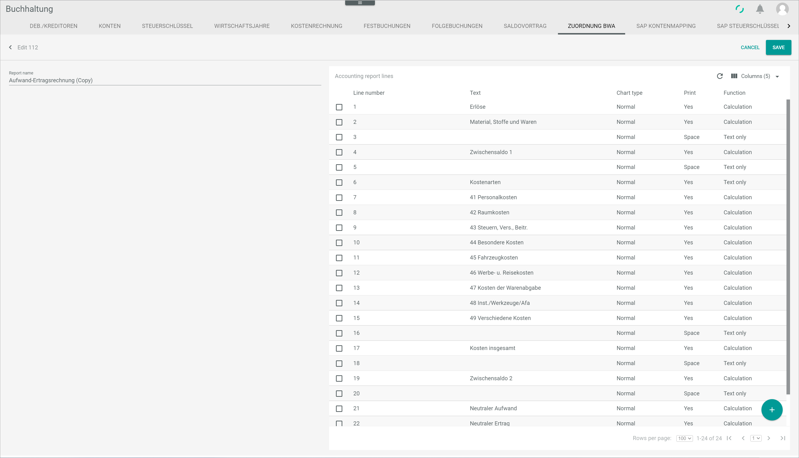
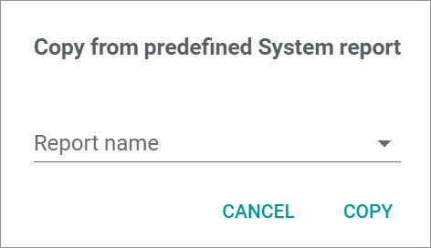

[!!User Interface BWA assignment](../UserInterface/02i_BWAAssignment.md)  
[!!User Interface Evaluations](../UserInterface/01_Book.md#evaluations)  
[!!Create a PDF evaluation](../Operation/15_ProvideAccountingData.md#create-a-pdf-evaluation)  

# Manage the BWA reports

[comment]: <> (BWA reports or Accounting Reports? See Accounting Reports view -> ZUORDNUNG BWA tab)

The business evaluation (BWA) is a reporting system based on company financial data and provides information about the company's current cost and revenue situation and, consequently, its  profitability. BWA reports serve as a basis for managerial future decisions, and they are widely used by capital investors and credit institutions for company assessment. BWA is an essential planning and controlling tool for the company's future development.

You can create new BWA reports, copy and edit one of the predefined system reports or delete any report. All available reports can be fully customized.

 > [Note] Be aware that any deletion is permanent and cannot be undone, and any changes made will overwrite the preset values.

When customizing existing reports, bear in mind that the reports use the standard accounts set up in the *Accounting* module configuration process. For detailed information, see [Chart of accounts](./01_RunAccountingWizard.md#chart-of-accounts). If the accounts have been customized manually, they must be set up again individually for the BWA reports. Otherwise, they will not be recognized by the BWA reports.

## Create a BWA report

You can create a BWA report that is not yet available in the system.

### Add a BWA report

Your can add a BWA report to the *Accounting reports* list.  

#### Prerequisites

A fiscal year has been selected, see [Select the fiscal year](../Operation/01_SelectFiscalYear.md).

#### Procedure

*Accounting > Settings > Tab BWA ASSIGNMENT*

1. Click the  (Add) button in the bottom right corner.  
  The *Create* view is displayed.

  

2. Enter a name in the *Report name* field.

3. Click the [SAVE] button.  
  A new BWA report has been added to the *Accounting reports* list.

### Add report lines

You can add report lines to a BWA report.

#### Prerequisites

- A fiscal year has been selected, see [Select the fiscal year](../Operation/01_SelectFiscalYear.md).
- A BWA report has been added, see [Add a BWA report](#add-a-BWA-report).

#### Procedure

*Accounting > Settings > Tab BWA ASSIGNMENT*

1. Select a BWA report in the *Accounting reports* list.  
  The *Accounting report lines* section is displayed.

  

  > [Info] If a newly added BWA report is selected, the notice *No report lines created. Use + button to create one* is displayed. If the selected BWA report already contains report lines, they are displayed in this section.  

2. Click the  (Add) button in the bottom right corner.  
  The *Create* section is displayed.

  

3. Enter a number in the *Line number* field. You can use the keyboard or the increase and decrease arrows on the right.

4. Click the *Output* drop-down list and select the appropriate option to configure the report print layout. The following options are available:  

  - **Yes**  
  Select this option for the line to be printed.   
  - **No**  
  Select this option for the line not to be printed.  
  - **Space**  
  Select this option to insert a blank line between two lines.
  - **New page**  
  Select this option to insert a page break.

5. Click the *Chart type* drop-down list and select the appropriate option. The following options are available:

  - **Normal**  
  - **Sum**  
  - **Don't show**  

[comment]: <> (Info fehlt! Alle/Fast alle Zeilen in bestehenden Berichten sind Normal. Was passiert mit Sum und Don't show? Rücksprache mit FH)

6. Enter the line description in the *Text* field.

7. Click the *Function* drop-down list and select the appropriate option. The following options are available:  

  - **Text only**  
  Select this option to enter text only.  
  - **Calculation**  
  Select this option to enter a calculation formula. When selecting this option, the *Formula* field becomes active.  
  - **Assessment**  

[comment]: <> (Info fehlt! Rücksprache mit FH)

8. If the **Calculation** option has been previously selected, enter the applicable formula in the *Formula* field. The basic calculating operations (+, -, *, /) are permitted.

9. If necessary, activate the toggle button(s) in the *Percent / Columns* field and enter the applicable formula(s) in the *Formula* field(s). Up to four applicable formulas can be added per line.

[comment]: <> (Info fehlt! Rücksprache mit FH)

10. Click the [SAVE] button.  
  The new report lines have been added to the BWA report.

## Edit a BWA report

You can edit a BWA report to make any necessary changes, for example, change the report name and layout, as well as add, edit or delete report lines. To add report lines, see [Add report lines](#add-report-lines).

 > [Note] Be aware that any changes made to a BWA report will overwrite the existing values. If you are taking one of the predefined system reports as a basis, it is highly recommended to make a copy of it first. For detailed information, see [Copy a BWA report](#copy-a-bwa-report).

#### Prerequisites

- A fiscal year has been selected, see [Select the fiscal year](../Operation/01_SelectFiscalYear.md).

#### Procedure

*Accounting > Settings > Tab BWA ASSIGNMENT*

1. Click the BWA report to be edited.  
The *Edit* section is displayed.

  

2. If desired, click the *Report name* field and edit the name of the BWA report.

3. Click the *Columns* button in the right upper corner in the *Accounting report lines*  section.   
  The columns bar is displayed. You can add or delete columns, and change their order by clicking and moving them with the mouse.

  

4. Click the [APPLY] button.   
  The changes are applied.

5. Click the accounting report line to be edited.  
The *Edit* section is displayed. For detailed information, see [Edit report lines](../UserInterface/02i_BWAAssignment.md#edit-report-lines).  

  > [Note] Be aware that any changes made to a BWA report will overwrite the existing values.

6. If necessary, you can also delete accounting report lines. To do so, select the report line to be deleted by clicking the checkbox on the left.  
The toolbar is displayed.

  > [Note] Be aware that the selected accounting report line will be deleted permanently.

7. Click the  (Delete) button in the toolbar to delete the selected accounting report line.  
The selected accounting report line is deleted.

8. Click the [SAVE] button in the upper right corner.   
All changes to the BWA report have been saved.

## Copy a BWA report

### Copy a predefined BWA report

You can make a copy of one of the BWA reports predefined in the system.

#### Prerequisites  

A fiscal year has been selected, see [Select the fiscal year](../Operation/01_SelectFiscalYear.md).

#### Procedure  

*Accounting > Settings > Tab BWA ASSIGNMENT*

1. Click the  (Copy) button in the upper right corner.  
The *Copy from predefined system report* window is displayed.

  

2. Click the *Report name* drop-down list and select the appropriate option. The following options are available:  

  - **Profit and loss account**
  - **Cash basis accounting**
  - **Liquidity statement**
  - **Liquidity**
  - **Monthly balance**

3. Click the [COPY] button.  
The copied report is displayed in the *Accounting reports* list.

### Copy a custom BWA report

You can make a copy of a self-created BWA report.

#### Prerequisites  

- A fiscal year has been selected, see [Select the fiscal year](../Operation/01_SelectFiscalYear.md).
- A BWA report has been created, see [Create a BWA report](#create-a-BWA-report).

#### Procedure

*Accounting > Settings > Tab BWA ASSIGNMENT*

1. Select the BWA report to be copied by clicking the checkbox on the left.  
The toolbar is displayed above the *Accounting reports* list.

2. Click the  (Copy) button in the upper right corner.  
The copied report is displayed in the *Accounting reports* list.

## Delete a BWA report

You can delete a BWA report if it is no longer needed, either one of the predefined system reports or a self-created report.

#### Prerequisites

- A fiscal year has been selected, see [Select the fiscal year](../Operation/01_SelectFiscalYear.md).
- A BWA report has been created, see [Create a BWA report](#create-a-BWA-report).

#### Procedure

*Accounting > Settings > Tab BWA ASSIGNMENT*

1. Select the BWA report to be deleted by clicking the checkbox on the left.    
The toolbar is displayed above the *Accounting reports* list.

  > [Note] Be aware that the existing BWA report will be deleted permanently.

2. Click the  (Delete) button in the toolbar.  
The selected BWA report is deleted and no longer displayed in the *Accounting reports* list.
