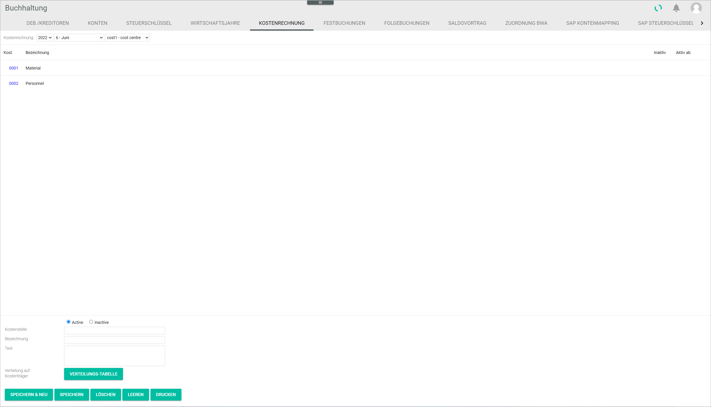
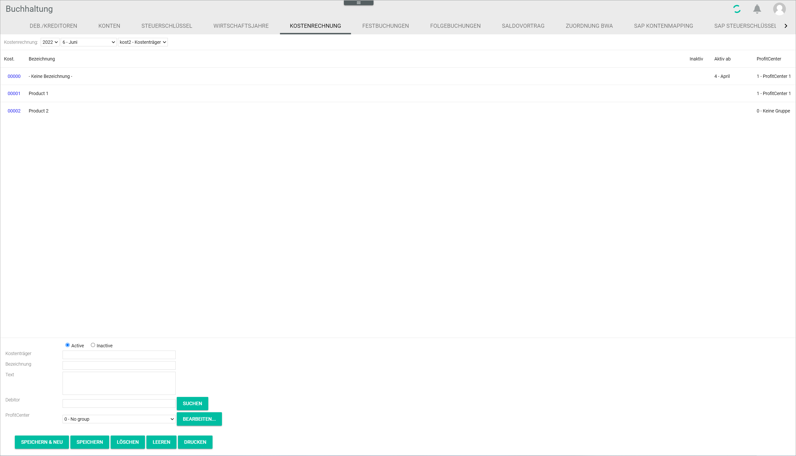

[!!User Interface Cost accounting](../UserInterface/02e_CostAccounting.md)  

# Manage the cost accounting

Cost accounting is a method to identify, measure and record all costs associated with a company's production process. It serves as an internal controlling tool to assess the different business costs and determine profitability by department, producer, client, product, or other criteria.   

A cost center is a department or a function within a company to which costs may be allocated, such as HR, Accounting or IT. It can also be defined at a smaller level according to management needs, for instance involving a particular job position or machine.  

A cost unit, or cost object, is a unit of product or service in relation to which costs are ascertained. The cost unit is determined by the nature of business. It can be the final item produced or a part of it, but can also be expressed differently, for instance in batches of items.  

[comment]: <> (Cost unit vs. Cost object. Manchmal als Synonym verwendet, aber nicht immer. Evtl. durchgängig ändern auf Cost object)

Both cost centers and cost units can be created, edited, and deleted in the *Cost accounting* tab.

##  Create a cost center

You can create a cost center that is not yet available in the system.

#### Prerequisites

A fiscal year has been selected, see [Select the fiscal year](../Operation/01_SelectFiscalYear.md).

#### Procedure

*Accounting > Settings > Tab COST ACCOUNTING > Drop-down option Cost1 - Cost center*

1. Click the *Cost accounting* left and middle drop-down lists and select the desired fiscal year and posting period.

2. Enter a number in the *Cost center* field.  

  > [Info] If a number is entered that is already in used, an error message is displayed.

3. Enter a name in the *Description* field.  

4. If desired, enter any additional information in the *Text* field.

5. If desired, click the *Inactive* radio button to deactivate the cost center temporarily. By default, the radio button is set to *Active*.

6. Click the [SAVE & NEW] button.  
A small pop-up window confirms that the new cost center has been saved. The new cost center is displayed in the list.

  

##  Edit a cost center

You can edit a cost center, for example if it needs to be deactivated.  

  > [Note] Be aware that any changes made to a cost center may have consequences for the posting process.

#### Prerequisites

- A fiscal year has been selected, see [Select the fiscal year](../Operation/01_SelectFiscalYear.md).
- A cost center has been created, see [Create a cost center](#create-a-cost-center).

#### Procedure

*Accounting > Settings > Tab COST ACCOUNTING > Drop-down option Cost1 - Cost center*

1. Click the *Cost accounting* left and middle drop-down lists and select the desired fiscal year and posting period.

2. Select the cost center to be edited in the list.  
The cost center details are displayed in the input fields.

3. Make any necessary changes.  

  > [Info] The cost center number cannot be changed. If you try to change the number, a new cost center will be created and added to the list.

4. Click the [SAVE] button.  
A small pop-up window confirms that the edited cost center has been saved. The edited cost center is displayed in the list.

  

##  Delete a cost center

*Accounting > Settings > Tab COST ACCOUNTING > Drop-down option Cost1 - Cost center*

You can delete a cost center, for example if it is no longer applicable.

 > [Info] If a date is displayed in the *Active from* column, it means that the cost center is currently being used and, therefore, cannot be deleted.

#### Prerequisites

- A fiscal year has been selected, see [Select the fiscal year](../Operation/01_SelectFiscalYear.md).
- A cost center has been created, see [Create a cost center](#create-a-cost-center).

#### Procedure

*Accounting > Settings > Tab COST ACCOUNTING > Drop-down option Cost1 - Cost center*

1. Click the *Cost accounting* left and middle drop-down lists and select the desired fiscal year and posting period.  

2. Select the cost center to be deleted in the list.  
The cost center details are displayed in the input fields.

  > [Note] Be aware that the cost center will be deleted permanently.

3. Click the [DELETE] button.  
A small pop-up window confirms that the cost center has been deleted. The deleted cost center is no longer displayed in the list.

  

##  Create a cost unit

You can create a cost unit that is not yet available in the system.

#### Prerequisites

A fiscal year has been selected, see [Select the fiscal year](../Operation/01_SelectFiscalYear.md).

#### Procedure

*Accounting > Settings > Tab COST ACCOUNTING > Drop-down option Cost2 - Cost unit*

1. Click the *Cost accounting* left and middle drop-down lists and select the desired fiscal year and posting period.

2. Enter a number in the *Cost unit* field.  

  > [Info] If a number is entered that is already in used, an error message is displayed.

3. Enter a name in the *Description* field.  

4. If desired, enter any additional information in the *Text* field.

5. If necessary, enter a debtor number in the *Debtor* field. If the debtor number is not known, click the [SEARCH] button to display the *Select address* window containing a list of all customers.

6. If desired, click the drop-down list and select a ProfitCenter. All available ProfitCenters are displayed in the drop-down list. By default, the *0 - No group* option is displayed.

  > [Info] If necessary, click the [EDIT] button to create or edit a ProfitCenter.

[comment]: <> (0 - No group oder kein ProfitCenter??? - Soeben geändert, nach Problemen mit SQL-Server-Verbindung)

7. If desired, click the *Inactive* radio button to deactivate the cost unit temporarily. By default, the radio button is set to *Active*.

8. Click the [SAVE & NEW] button.  
A small pop-up window confirms that the new cost unit has been saved. The new cost unit is displayed in the list.

  

##  Edit a cost unit

You can edit a cost unit, for example if it needs to be deactivated.  

  > [Note] Be aware that any changes made to a cost unit may   have consequences for the posting process.

#### Prerequisites

- A fiscal year has been selected, see [Select the fiscal year](../Operation/01_SelectFiscalYear.md).
- A cost unit has been created, see [Create a cost unit](#create-a-cost-unit).

#### Procedure

*Accounting > Settings > Tab COST ACCOUNTING > Drop-down option Cost2 - Cost unit*

1. Click the *Cost accounting* left and middle drop-down lists and select the desired fiscal year and posting period.

2. Select the cost unit to be edited in the list.  
  The cost unit details are displayed in the input fields.

3. Make any necessary changes.  

  > [Info] The cost unit number cannot be changed. If you try to change the number, the edited cost unit will replace the existing one.

[comment]: <> (Vielleicht ist das ein Bug? Komisches Verhalten. Wie soll es funktionieren? RS FH)

4. Click the [SAVE] button.  
A small pop-up window confirms that the edited cost unit has been saved. The edited cost unit is displayed in the list.

  

##  Delete a cost unit

*Accounting > Settings > Tab COST ACCOUNTING > Drop-down option Cost2 - cost unit*

You can delete a cost unit, for example if it is no longer applicable.

  > [Info] If a date is displayed in the *Active from* column, it means that the cost unit is currently being used and, therefore, cannot be deleted. A warning message with the notice "The cost unit (number) cannot be deleted: it is distributed to the cost center/cost unit" is displayed.

  [comment]: <> (Check, warum / warum nicht kann man das löschen... In Verteilungstabelle? Mit Buchungen verlinkt? Auch wenn keine "Aktiv ab" angezeigt, bekommt man eine Fehlermeldung.)

#### Prerequisites

- A fiscal year has been selected, see [Select the fiscal year](../Operation/01_SelectFiscalYear.md).
- A cost unit has been created, see [Create a cost unit](#create-a-cost-unit).

#### Procedure

*Accounting > Settings > Tab COST ACCOUNTING > Drop-down option Cost2 - Cost unit*

1. Click the *Cost accounting* left and middle drop-down lists and select the desired fiscal year and posting period.  

2. Select the cost unit to be deleted in the list.  
The cost unit details are displayed in the input fields.

  > [Note] Be aware that the cost unit will be deleted permanently.

3. Click the [DELETE] button.  
A small pop-up window confirms that the cost unit has been deleted. The deleted cost unit is no longer displayed in the list.

  
