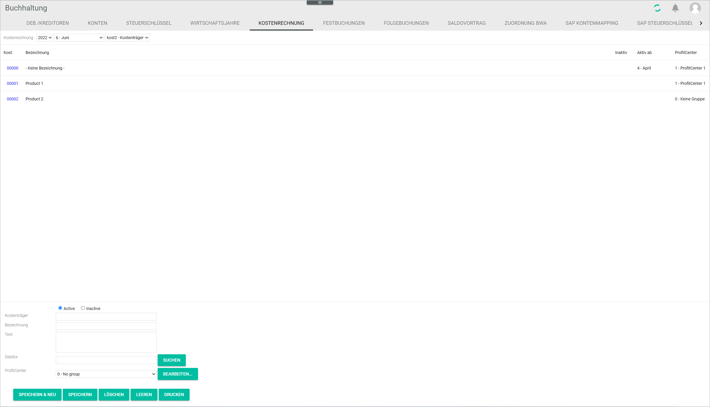

[!!User Interface Cost accounting](../UserInterface/02e_CostAccounting.md)  

# Manage the cost accounting

Cost accounting is a method to identify, measure and record all costs associated with a company's production process. It serves as an internal controlling tool to assess the different business costs and determine profitability by department, producer, client, product, or other criteria.   

A cost center is a department or a function within a company to which costs may be allocated, such as HR, Accounting or IT. It can also be defined at a smaller level according to management needs, for instance involving a particular job position or machine.  

A cost object is a product or service in relation to which costs are ascertained. The cost object is determined by the nature of business. It can be the final item produced or a part of it, but can also be expressed differently, for instance in batches of items.  

You can create, edit and delete both cost centers and cost objects.

##  Create a cost center

You can create a cost center that is not yet available in the system.

#### Prerequisites

A fiscal year has been selected, see [Select the fiscal year](../Operation/01_SelectFiscalYear.md).

#### Procedure

*Accounting > Settings > Tab COST ACCOUNTING*

1. In the header, configure the following options:
  - Click the left *Cost accounting* drop-down list and select the desired fiscal year. All available fiscal years are displayed.   
  - Click the middle *Cost accounting* drop-down list and select the desired posting period. All available posting periods are displayed.
  - Click the right *Cost accounting* drop-down list and select the **Cost 1 - cost center** option.

  All existing cost centers for the selected period are displayed in the list below. The input lines at the bottom are displayed for a cost center.

2. Enter a number in the *Cost center* field in the bottom input lines.  

  > [Info] If a number is entered that is already in use, an error message is displayed when clicking the [SAVE & NEW] button.

3. Enter a name for the cost center in the *Description* field.  

4. If desired, enter any additional information in the *Text* field.

5. If desired, select the *Inactive* radio button to deactivate the cost center temporarily. An inactive cost center is locked for postings. By default, the *Active* radio button is selected.

  > [Info] If a cost object has already been posted or allocated to a cost center, the cost center cannot be deactivated. A warning message is then displayed.

[comment]: <> (check this info - for me it's possible to deactivate a cost center even if a cost object is allocated to it.)

6. Click the [SAVE & NEW] button.  
  The new cost center has been saved and is displayed in the list. The *Saved* pop-up window is displayed.

    

##  Edit a cost center

You can edit a cost center, for example if it needs to be deactivated.  

> [Info] Be aware that any changes made to a cost center may have consequences for the posting process.

#### Prerequisites

- A fiscal year has been selected, see [Select the fiscal year](../Operation/01_SelectFiscalYear.md).
- A cost center has been created, see [Create a cost center](#create-a-cost-center).

#### Procedure

*Accounting > Settings > Tab COST ACCOUNTING*

1. In the header, configure the following options:
  - Click the left *Cost accounting* drop-down list and select the desired fiscal year. All available fiscal years are displayed.   
  - Click the middle *Cost accounting* drop-down list and select the desired posting period. All available posting periods are displayed.
  - Click the right *Cost accounting* drop-down list and select the **Cost 1 - cost center** option.

  All existing cost centers for the selected period are displayed in the list below. The input lines at the bottom are displayed for a cost center.

2. Select the cost center to be edited in the list.  
  The cost center details are displayed in the input fields.

[comment]: <> (Add screenshot showing the filled input lines and the selected cost center)

3. Make any necessary changes.  

  > [Info] The cost center number cannot be changed. If you change the number and save the cost center, a new cost center will be created and added to the list.

4. Click the [SAVE] button.  
  All changes have been saved. The edited cost center is displayed in the list. The *Saved* pop-up window is displayed.

  

##  Delete a cost center

You can delete a cost center, for example if it is no longer applicable.  If a date is displayed in the *Active from* column, the cost center is currently in use and cannot be deleted.

#### Prerequisites

- A fiscal year has been selected, see [Select the fiscal year](../Operation/01_SelectFiscalYear.md).
- A cost center has been created, see [Create a cost center](#create-a-cost-center).

#### Procedure

*Accounting > Settings > Tab COST ACCOUNTING*

1. In the header, configure the following options:
  - Click the left *Cost accounting* drop-down list and select the desired fiscal year. All available fiscal years are displayed.   
  - Click the middle *Cost accounting* drop-down list and select the desired posting period. All available posting periods are displayed.
  - Click the right *Cost accounting* drop-down list and select the **Cost 1 - cost center** option.

  All existing cost centers for the selected period are displayed in the list below. The input lines at the bottom are displayed for a cost center.

2. Select the cost center to be deleted in the list.  
The cost center details are displayed in the input fields.

[comment]: <> (Add screenshot showing the filled input lines and the selected cost center)

  > [Caution] Be aware that the cost center will be deleted permanently.

3. Click the [DELETE] button.  
  The selected cost center has been deleted and is removed from the list. The *Deleted* pop-up window is displayed.

  

##  Create a cost object

You can create a cost object that is not yet available in the system.

#### Prerequisites

A fiscal year has been selected, see [Select the fiscal year](../Operation/01_SelectFiscalYear.md).

#### Procedure

*Accounting > Settings > Tab COST ACCOUNTING*

1. In the header, configure the following options:
  - Click the left *Cost accounting* drop-down list and select the desired fiscal year. All available fiscal years are displayed.   
  - Click the middle *Cost accounting* drop-down list and select the desired posting period. All available posting periods are displayed.
  - Click the right *Cost accounting* drop-down list and select the **Cost 2 - cost object** option.

  All existing cost objects for the selected period are displayed in the list below. The input lines at the bottom are displayed for a cost object.

2. Enter a number in the *Cost object* field in the bottom input lines.  

  > [Info] If a number is entered that is already in use, an error message is displayed when clicking the [SAVE & NEW] button.

3. Enter a name for the cost object in the *Description* field.  

4. If desired, enter any additional information in the *Text* field.

5. If necessary, enter a debtor number in the *Debtor* field. If the debtor number is unknown, click the [SEARCH] button to display the *Select address* window and search for a debtor in the list of all customers.

6. If desired, click the drop-down list and select a profit center. All available profit centers are displayed in the drop-down list. By default, the *0 - No group* option is preselected.

  > [Info] If necessary, click the [EDIT] button to create or edit a profit center.

7. If desired, click the *Inactive* radio button to deactivate the cost object temporarily. By default, the radio button is set to *Active*. The inactive cost object is then locked for postings.

 > [Info] If a cost object has already been posted to or allocated to a cost center, the cost object cannot be deactivated. When selecting the *Inactive* radio button, a warning message is displayed.

8. Click the [SAVE & NEW] button.  
  The new cost object has been saved and is displayed in the list. The *Saved* pop-up window is displayed.

  

##  Edit a cost object

You can edit a cost object, for example if it needs to be deactivated.  

> [Info] Be aware that any changes made to a cost object may have consequences for the posting process.

#### Prerequisites

- A fiscal year has been selected, see [Select the fiscal year](../Operation/01_SelectFiscalYear.md).
- A cost object has been created, see [Create a cost object](#create-a-cost-object).

#### Procedure

*Accounting > Settings > Tab COST ACCOUNTING*

1. In the header, configure the following options:
  - Click the left *Cost accounting* drop-down list and select the desired fiscal year. All available fiscal years are displayed.   
  - Click the middle *Cost accounting* drop-down list and select the desired posting period. All available posting periods are displayed.
  - Click the right *Cost accounting* drop-down list and select the **Cost 2 - cost object** option.

  All existing cost objects for the selected period are displayed in the list below. The input lines at the bottom are displayed for a cost object.

2. Select the cost object to be edited in the list.  
  The cost object details are displayed in the input fields.

  [comment]: <> (Add screenshot showing the filled input lines and the selected cost object)

3. Make any necessary changes.  

  > [Info] The cost object number cannot be changed. If you change the number and save the cost object, a new cost object will be created and added to the list.

4. Click the [SAVE] button.  
  All changes have been saved. The edited cost object is displayed in the list. The *Saved* pop-up window is displayed.

  

##  Delete a cost object

You can delete a cost object, for example if it is no longer applicable. If a posting period is displayed in the *Active from* column, it means that the cost object has been posted to and, therefore, cannot be deleted. A warning message with the notice "The cost object (number) cannot be deleted: it is distributed to the cost center/cost object" is displayed.

[comment]: <> (Check, warum / warum nicht kann man das löschen... In Verteilungstabelle? Mit Buchungen verlinkt? Auch wenn keine "Aktiv ab" angezeigt, bekommt man eine Fehlermeldung.)

#### Prerequisites

- A fiscal year has been selected, see [Select the fiscal year](../Operation/01_SelectFiscalYear.md).
- A cost object has been created, see [Create a cost object](#create-a-cost-object).

#### Procedure

*Accounting > Settings > Tab COST ACCOUNTING*

1. In the header, configure the following options:
  - Click the left *Cost accounting* drop-down list and select the desired fiscal year. All available fiscal years are displayed.   
  - Click the middle *Cost accounting* drop-down list and select the desired posting period. All available posting periods are displayed.
  - Click the right *Cost accounting* drop-down list and select the **Cost 2 - cost object** option.

  All existing cost objects for the selected period are displayed in the list below. The input lines at the bottom are displayed for a cost object.

2. Select the cost object to be deleted in the list.  
  The cost object details are displayed in the input fields.

[comment]: <> (Add screenshot showing the filled input lines and the selected cost object)

  > [Caution] Be aware that the cost object will be deleted permanently.

3. Click the [DELETE] button.  
  The selected cost object has been deleted and is removed from the list. The *Deleted* pop-up window is displayed.

  
