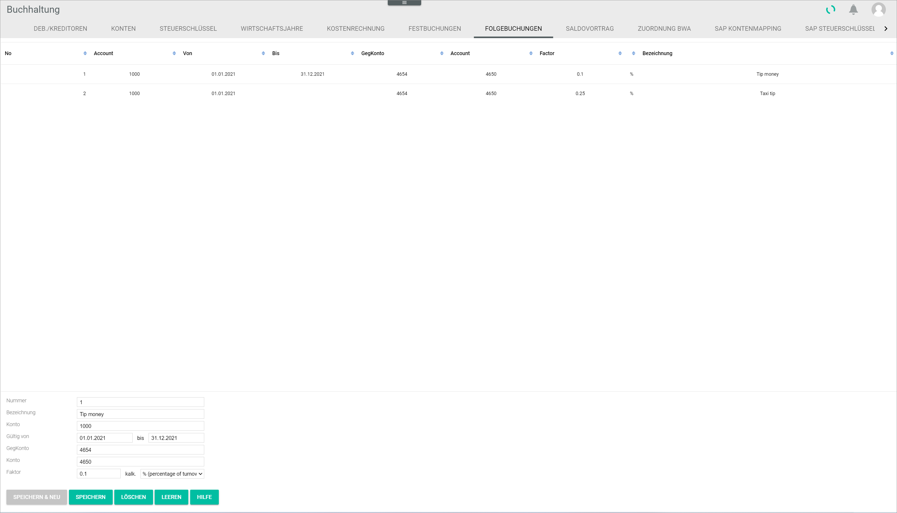

[!!Select the fiscal year](../Operation/01_SelectFiscalYear.md)
[!!User interface Follow-on postings](../UserInterface/02g_FollowOnBookings.md)

# Manage the follow-on postings

A follow-on posting is a posting that must be performed as a result of a main posting. Routine operations, such as the posting of a non-deductible percentage of hospitality costs, can be automated in the system, thereby minimizing the need of manual posting. As soon as a specific account is posted to, the system performs the follow-on posting automatically as configured.

You can create, edit and delete the follow-on postings.

##  Create a follow-on posting

You can create a follow-on posting that is not yet available in the system.

#### Prerequisites

A fiscal year has been selected, see [Select the fiscal year](../Operation/01_SelectFiscalYear.md).

#### Procedure

*Accounting > Settings > Tab FOLLOW-ON POSTINGS*

1. Leave the *Number* field empty. The follow-on posting numbers must be sequential and are added by the system automatically. Any number entered is overwritten by the system.

2. Enter a description in the *Description* field.    

3. Enter the account number to trigger the automatic follow-on posting function in the *Account* field.  

4. Enter the validity start and end dates for the follow-on posting in the *Valid from - to* fields. The valid date format is DD.MM.YYYY.  

    > [Info] It is possible to leave the end date field empty. In this case, the follow-on posting have no expiration date until an end date has been set.

5. Enter the number of the contra account to which the follow-on posting is to be made in the *Contra account* field.

6. Enter the number of the account to which the follow-on posting is to be made in the *Account* field.

7. Enter a factor value to be applied to the main posting amount in the *Factor* field.

8. Click the *calc.* drop-down list to select the appropriate calculating method to the selected factor.   The following options are available:  

    - **% percentage of turnover**  
        Select this option for the system to calculate a percentage of the posted turnover.
    - **\* turnover times factor**  
        Select this option for the system to multiply the turnover by the specified factor.
    - **/ turnover divided by factor**  
        Select this option for the system to divide the turnover by the specified factor.

  [comment]: <> (Divide scheint nicht zu funktionieren. Bug Ticket?)

9. Click the [SAVE & NEW] button.  
    The new follow-on posting has been saved and is displayed in the list. The *Saved* pop-up window is displayed.

    

##  Edit a follow-on posting

You can edit a follow-on posting, for example if the factor needs to be updated.  

> [Info] Be aware that any changes made to a follow-on posting may have consequences for the posting process.

#### Prerequisites

- A fiscal year has been selected, see [Select the fiscal year](../Operation/01_SelectFiscalYear.md).
- A follow-on posting has been created, see [Create a follow-on posting](#create-a-follow-on-posting).

#### Procedure

*Accounting > Settings > Tab FOLLOW-ON POSTINGS*

1. Select the follow-on posting to be edited.  
    The follow-on posting details are displayed in the input fields.

    > [Info] Be aware that any changes made to a follow-on posting will overwrite the preset values.

    

2. Make any necessary changes.  

    > [Info] The follow-on posting number cannot be changed.

3. Click the [SAVE] button.  
    All changes have been saved. The edited follow-on posting is displayed in the list. The *Saved* pop-up window is displayed.

    

##  Delete a follow-on posting

You can delete a follow-on posting, for example if it is no longer applicable.

#### Prerequisites

- A fiscal year has been selected, see [Select the fiscal year](../Operation/01_SelectFiscalYear.md).
- A follow-on posting has been created, see [Create a follow-on posting](#create-a-follow-on-posting).

#### Procedure

*Accounting > Settings > Tab FOLLOW-ON POSTINGS*

1. Select the follow-on posting to be deleted.  
    The follow-on posting details are displayed in the input fields.

    > [Caution] **Loss of data**   
    Deleting will permanently remove the selected data. The deletion cannot be undone and the deleted data cannot be restored.       
    Problems may occur due to unresolved dependencies.   
    Make sure you really want to delete the selected data.

    

2. Click the [DELETE] button.  
    The selected follow-on posting has been deleted and is removed from the list. The *Deleted* pop-up window is displayed.

    
