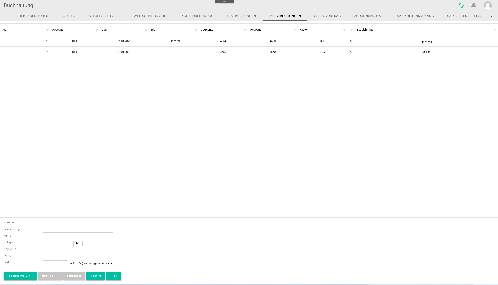

[!!User Interface Follow-on postings](../UserInterface/02g_FollowOnBookings.md)  

# Manage the follow-on postings

A follow-on posting is a posting that must be performed as a result of an main posting. The follow-on posting function allows to automatize routine operations, such as the posting of a non-deductible percentage of hospitality costs. As soon as a specific account is posted to, the system posts automatically the configured percentage of the posted main amount to the defined account and contra account.

The follow-on postings can be created, edited and deleted in the *Follow-on postings* tab.

##  Create a follow-on posting

You can create a follow-on posting that is not yet available in the system.

#### Prerequisites

A fiscal year has been selected, see [Select the fiscal year](../Operation/01_SelectFiscalYear.md).

#### Procedure

*Accounting > Settings > Tab FOLLOW-ON POSTINGS*

1. Leave the *Number* field empty. The follow-on posting numbers must be sequential and are added by the system automatically.

2. Enter a description in the *Description* field.    

3. Enter the account number to trigger the automatic follow-on posting function in the *Account* field.  

  > [Info] If the account number is not known, use the account search function, see [Search for an account](../Operation/14_SearchAccounting.md#search-for-an-account).

4. Enter the validity start and end dates for the follow-on posting in the *Valid from - to* fields. The valid date format is DD.MM.YYYY.  

  > [Info] It is possible to leave the end date field empty. In this case, the follow-on posting continues to be valid until an end date has been set.

5. Enter the contra account number to register the follow-on posting in the *Contra account* field.

  > [Info] If the account number is not known, use the account search function, see [Search for an account](../Operation/14_SearchAccounting.md#search-for-an-account).

6. Enter the account number to register the follow-on posting in the *Account* field.

  > [Info] If the account number is not known, use the account search function, see [Search for an account](../Operation/14_SearchAccounting.md#search-for-an-account).

7. Enter a factor value to be applied to the main posting amount and click the drop-down list to select the appropriate calculating method. The following options are available:  

  - **% percentage of turnover**  
  Select this option for the system to calculate a percentage of the posted turnover.
  - *** turnover times factor**  
  Select this option to multiply the turnover by the specified factor.
  - **/ turnover divided by factor**  
  Select this option to divide the turnover by the specified factor.

  [comment]: <> (Check, wie das funktioniert/ob das stimmt.)

8. Click the [SAVE & NEW] button.  
A small pop-up window confirms that the new follow-on posting has been saved. The new follow-on posting is displayed in the list.

  

##  Edit a follow-on posting

You can edit a follow-on posting, for example if the factor needs to be updated.  

  > [Note] Be aware that any changes made to a follow-on posting may have consequences for the posting process.

#### Prerequisites

- A fiscal year has been selected, see [Select the fiscal year](../Operation/01_SelectFiscalYear.md).
- A follow-on posting has been created, see [Create a follow-on posting](#create-a-cost-posting).

#### Procedure

*Accounting > Settings > Tab FOLLOW-ON POSTINGS*

1. Select the follow-on posting to be edited.  
The follow-on posting details are displayed in the input fields.

  > [Note] Be aware that any changes made to a follow-on posting will overwrite the preset values.

2. Make any necessary changes.  

  > [Info] The follow-on posting number cannot be changed.

3. Click the [SAVE] button.  
A small pop-up window confirms that the edited follow-on posting has been saved. The edited follow-on posting is displayed in the list.

  

##  Delete a follow-on posting

*Accounting > Settings > Tab FOLLOW-ON POSTINGS*

You can delete a follow-on posting, for example if it is no longer applicable.

 > [Info] If a date is displayed in the *Active from* column, it means that the cost center is currently being used and, therefore, cannot be deleted.

#### Prerequisites

- A fiscal year has been selected, see [Select the fiscal year](../Operation/01_SelectFiscalYear.md).
- a follow-on posting has been created, see [Create a follow-on posting](#create-a-cost-center).

#### Procedure

*Accounting > Settings > Tab COST ACCOUNTING > Drop-down option Cost1 - Cost center*

1. Click the *Cost accounting* left and middle drop-down lists and select the desired fiscal year and posting period.  

2. Select the cost center to be deleted in the list.  
The cost center details are displayed in the input fields.

  > [Note] Be aware that the cost center will be deleted permanently.

3. Click the [DELETE] button.  
A small pop-up window confirms that the cost center has been deleted. The deleted cost center is no longer displayed in the list.

  
