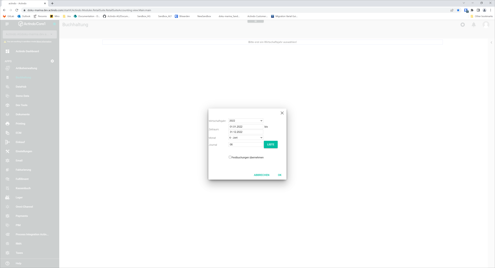
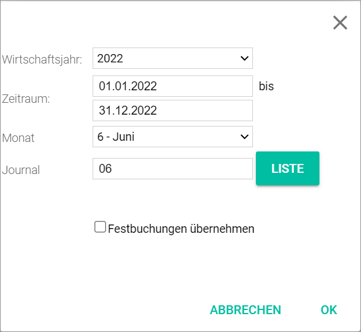
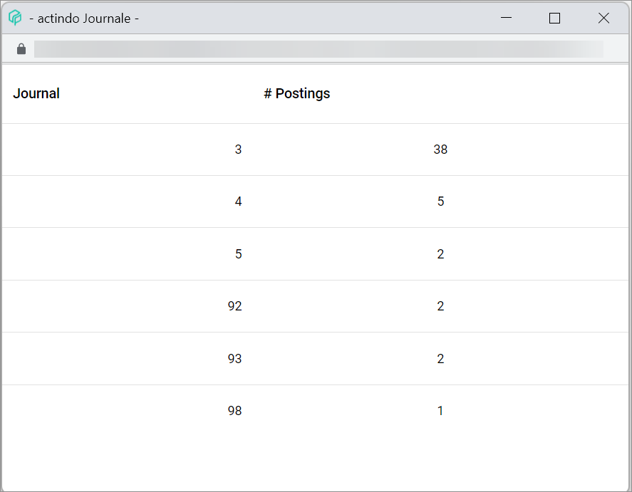

[!!User Interface Select fiscal year](../UserInterface/00a_FiscalYear.md)  
[!!User Interface FY/MONTH/JOURNAL](../UserInterface/01_Book.md#fymonthjournal)  
[!!User Interface Fixed postings](../UserInterface/02f_FixedBookings.md)  
[!!Manage the fixed postings](../Integration/06_ManageFixedBookings.md)  

# Select the fiscal year

When you open the *Accounting* module for the first time after login or after reloading the system, a window to select the fiscal year is displayed. You have to select the fiscal year, the month and the journal to display the postings in the corresponding period. You must have selected a fiscal year to perform any action in the *Accounting* module.

#### Prerequisites

- The accounting is configured via the configuration wizard, see [Run the accounting wizard](../Integration/01_RunAccountingWizard.md).
- A valid fiscal year has been created, see [Create a fiscal year](../Integration/04_ManageFiscalYear.md#create-a-fiscal-year).

#### Procedure

*Accounting*

1. Select a fiscal year in the *Fiscal year* drop-down list.   
  The *Period* date fields are filled in automatically.

  

2. Select a month in the *Month* drop-down list. The selected month determines the posting period, this means, the period where the transaction is posted.

  > [Info] Apart from the calendar months, special posting periods can also be chosen to post balances carried forward, subsequent postings or closing postings. For detailed information, see [Select fiscal year](../UserInterface/00a_FiscalYear.md).

[comment]: <> (Check!)

3. Enter a journal number in the *Journal* field. Alternatively, click the [LIST] button. The *Journals* window is displayed with the available journals and their postings.

  

  > [Info] Journals 1-12 are paired with the corresponding calendar months, regardless of whether the fiscal year coincides with the calendar year or not. Therefore, it is highly recommended to select the first month of the fiscal year with journal 1, the second month of the fiscal year with journal 2, and so on.  
  Journals 90 to 99 are special journals configured in the accounting settings for balances carried forward. For detailed information, see [Balance carried forward](../UserInterface/02h_BalanceCarriedForward.md).

[comment]: <> (Journals 1-12 are assigned to the corresponding months, regardless of whether the fiscal year coincides with the calendar year or not. This means that all postings registered in the first month of the fiscal year will be found in the journal 1, all postings registered in the second month of the fiscal year in the journal 2, and so on. - Ich denke, das stimmt so nicht - Prüfen!)

4. If required, select first the *Include fixed postings* checkbox and then a batch from the displayed list.

  > [Info] If the *Include fixed postings* checkbox is selected, all fixed postings in the selected batch will be automatically posted when opening the selected period in the fiscal year.   
  For detailed information about creating fixed postings, see [Create fixed postings](../Integration/06_ManageFixedBookings.md#create-fixed-postings).

5. Click the [OK] button in the bottom right corner.   
  The postings registered in the selected posting period (fiscal year, month and journal) are displayed in the *POSTINGS* tab in the *Post* menu entry.  
