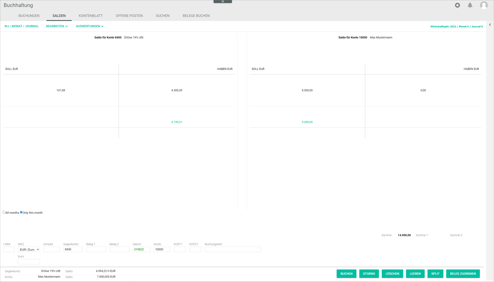

[!!User Interface balances](../UserInterface/01b_Balances.md)  
[!!User Interface account sheet](../UserInterface/01c_AccountSheet.md)  
[!!User Interface accounts](../UserInterface/02b_Accounts.md)  
[!!Manage the accounts](../Integration/03_ManageAccounts.md)  

# Check an account

The *Book* menu entry in the *Accounting* module contains specific functions to display different views of the data available in the system. All bookings recorded in the *Accounting* module can be filtered per account and period and visually displayed for better clarity or for checking purposes.

## Access the balance view of an account

Access the *BALANCES* tab to display a T-account view of the current credit and debit situation, and the resulting balance of a selected account and/or contra account.
The balance value represents the difference between the credit and the debit of an account. If the debit and credit totals are equal, the balance is settled. If there is a difference between them, an open balance must be settled, for example a payment must be made to bring the account balance to zero.

 > [Info] When directly clicking the *BALANCES* tab, a blank T-account view with the notice *No account selected* on each side is displayed. An account and/or contra account must be selected to display the corresponding details. If a booking has been previously selected in the *BOOKINGS* tab, the corresponding account and contra account details are displayed in the *BALANCES* tab.

#### Prerequisites

A fiscal year has been selected, see [Select fiscal year](./01_SelectFiscalYear.md).

#### Procedure

*Accounting > Select fiscal year > Book > Tab BALANCES*

1. Enter an account number in the *Contra account* field.  
The balance for the selected account is displayed on the left side of the workspace.

2. Enter an account number in the *Account* field.  
The balance for the selected account is displayed on the right side of the workspace.

3. Select *[All months]* or *[Only this month]* radio button to filter the values to be displayed as necessary.  
The balance for all months (entire fiscal year) or for the current month is displayed.

  

## Access the account sheet

The *ACCOUNT SHEET* tab displays a chronologically ordered list of all movements in a specific account. Account sheets can be later used for balance sheet calculations and profit and loss statements.

> [Info] When directly clicking the *ACCOUNT SHEET* tab, a blank tab with the notice *No account selected* is displayed. An account must be selected to display the corresponding details. If a booking has been previously selected in the *BOOKINGS* tab, the details of the account specified in the *Contra Account* field are displayed in the *ACCOUNT SHEET* tab. If the *Contra Account* field is empty, the details of the account specified in the *Account* field are displayed.

#### Prerequisites

A fiscal year has been selected, see [Select fiscal year](./01_SelectFiscalYear.md).

#### Procedure

*Accounting > Select fiscal year > Book > Tab ACCOUNT SHEET*

1. Enter an account number in the *Contra account* or *Account* field. Press Enter.  
A chronologically ordered list of all bookings in the selected account is displayed in the workspace.

  > [Info] If both *Contra account* and *Account* fields are filled in, the details of the account entered in the *Contra account* field are displayed. If no account number is entered in the *Contra account* field, the details of the account entered in the *Account* field are displayed.  

2. If desired, select the *All months* radio button to display the balances for the entire fiscal year. By default, the *Only this month* radio button is preselected and the balances for the current month are displayed. 

  
