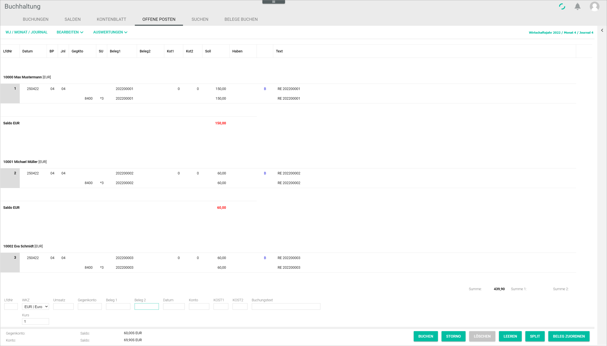
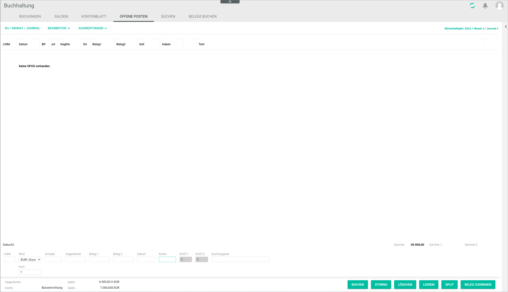

[!!Zahlungsabwicklung](RetailSuiteBanking)
[!!User Interface open items](../UserInterface/01d_OpenItems.md)  

# Manage the open items

Open items are any business transactions that have not yet been completed. By checking the open items, you can monitor cash movements and avoid liquidity problems.

There are two view modes:

- If no account is selected, all open items in the *Accounting* module are displayed in the *OPEN ITEMS* tab. 
- If a personal account, that is, a creditor or debtor account, is selected, only the open items for the selected account are displayed in the *OPEN ITEMS* tab.

> [Info] An account can be selected either by entering an account number in the *Account* or *Contra account* field, or by selecting a booking in the *BOOKINGS* tab.  

## Check all open items

You can display all open items recorded in the system to check the open items across all accounts. 

#### Prerequisites

- The accounting is configured via the configuration wizard, see [Run the accounting wizard](../Integration/01_RunAccountingWizard.md).
- A valid fiscal year is created, see [Create a fiscal year](../Integration/04_ManageFiscalYear.md#create-a-fiscal-year).
- A fiscal year is selected, see [Select fiscal year](./01_SelectFiscalYear.md).

#### Procedure

*Accounting > Select fiscal year > Book > Tab OPEN ITEMS*

1. Check that no account number is entered in the *Account* or *Contra account* fields.
The open items across all accounts are displayed.

 > [Info] If the *Account* or *Contra account* fields are filled in, clear the fields by clicking the [CLEAR] button.
 
2. Check the list of open items.

 > [Info] If there are no open items, the notice *No open items available* is displayed.

  

## Access the open items for an account

You can display all open items of a specific personal account, that is a creditor or debtor account, for example to check the open items for a certain customer or supplier.

#### Prerequisites

A fiscal year has been selected, see [Select fiscal year](./01_SelectFiscalYear.md).

#### Procedure

*Accounting > Select fiscal year > Book > Tab OPEN ITEMS*

1. Enter a personal account number in the *Contra account* or in the *Account* field. Alternatively, click a corresponding booking in the *BOOKINGS* tab.
All open items of the corresponding account are displayed.

2. If desired, select the *Show manually cleared open items* radio button to display only the manually cleared open items for the selected account. By default, the *Standard open items view* radio button is preselected and all open items for the selected account are displayed. 
3. Check the list of open items for the selected account.

 > [Info] If required, you can manually clear open items, see [Clear an open item manually](#clear-an-open-item-manually).
3. If necessary, clear open items manually. To do so, select the checkbox of the corresponding bookings to be settled in the *M* column.
The total amount of the bookings is displayed in the upper right corner of the workspace.

  > [Info] The total amount of the booking must equal **0,00 H** to be cleared out manually.

  

4. Click the [CLEAR MANUALLY] button.  
 The bookings are cleared. The open items disappear from the open items list with the *Standard open items view* radio button selected.

5. If necessary, you can reverse manually cleared bookings. To do so, click the *Show manually cleared open items* radio button.   
 All manually cleared bookings for the selected account are displayed. The manually cleared bookings are marked with an asterisk next to the checkbox.

   

6. Select the checkbox of the cleared bookings to be reversed in the *M* column.
  The total amount of the bookings is displayed in the upper right corner of the workspace.
  
  > [Info] The total amount of the bookings must equal **0,00 H** to be reversed.

7. Click the [UNDO CLEARING] button to reverse the clearing.  
The manual clearing for the selected bookings has been undone. The corresponding bookings are removed from the manually cleared open items list.
