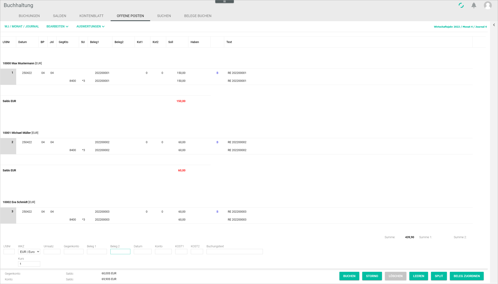
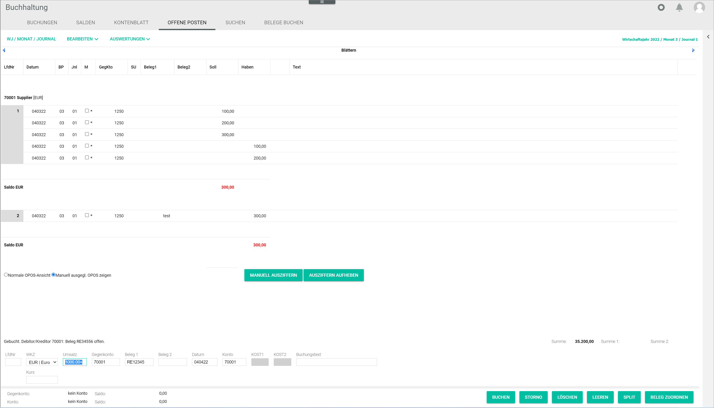
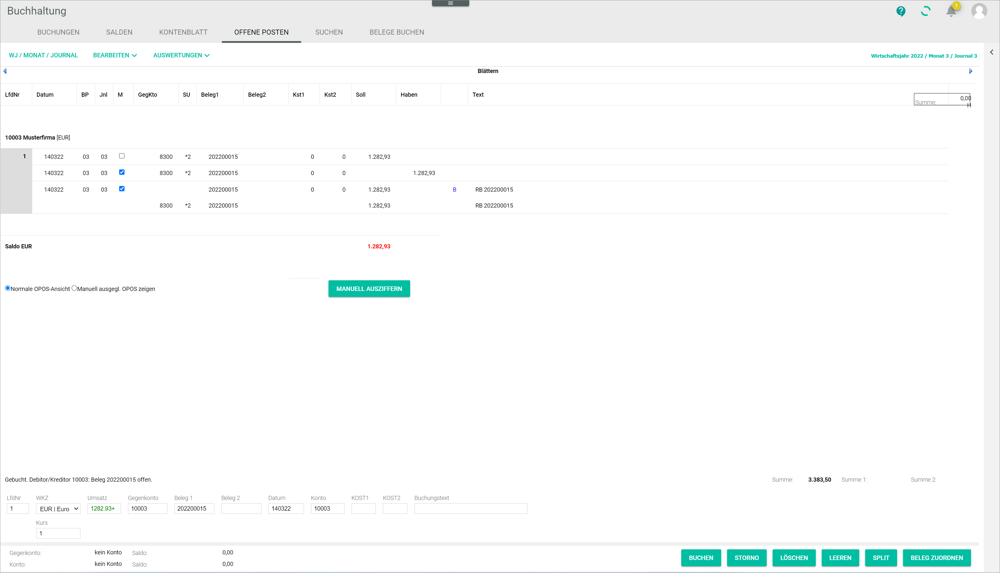
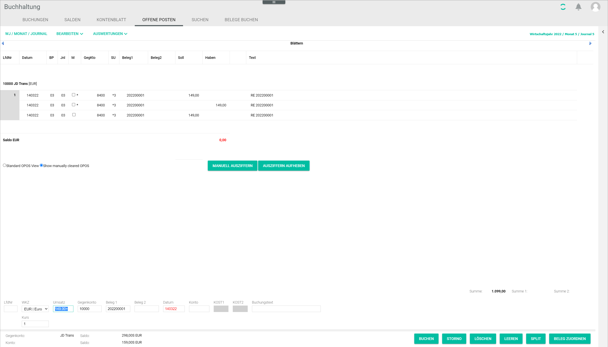

[!!Payment processing](RetailSuiteBanking)  
[!!User Interface Open items](../UserInterface/01d_OpenItems.md)  

# Manage the open items

Open items are any business transactions that have not yet been completed. By checking the open items, you can monitor cash movements and avoid liquidity problems.

There are two view modes:

- If no account is selected, all open items in the *Accounting* module are displayed in the *OPEN ITEMS* tab.
- If a personal account, that is, a creditor or debtor account, is selected, only the open items for the selected account are displayed in the *OPEN ITEMS* tab.

> [Info] An account can be selected either by entering an account number in the *Account* or *Contra account* field, or by selecting a posting in the *POSTINGS* tab.  

## Check all open items

You can display all open items recorded in the system to check the open items across all accounts.

#### Prerequisites

A fiscal year has been selected, see [Select fiscal year](./01_SelectFiscalYear.md).

#### Procedure

*Accounting > Select fiscal year > Post > Tab OPEN ITEMS*

1. Check that no account number is entered in the *Account* or *Contra account* fields.
The open items across all accounts are displayed.

 > [Info] If the *Account* or *Contra account* fields are filled in, clear the fields by clicking the [CLEAR] button.

2. Check the list of open items.

 > [Info] If there are no open items, the notice *No open items available* is displayed.

## Check the open items for an account

You can display all open items of a specific personal account, that is, a creditor or debtor account, for example to check the open items for a certain customer or supplier.

#### Prerequisites

A fiscal year has been selected, see [Select fiscal year](./01_SelectFiscalYear.md).

#### Procedure

*Accounting > Select fiscal year > Post > Tab OPEN ITEMS*

1. Enter a personal account number in the *Contra account* or in the *Account* field. Alternatively, select a posting in the *POSTINGS* tab.
All open items of the corresponding account are displayed.  

  

2. If desired, select the *Show manually cleared open items* radio button to display only the manually cleared open items for the selected account. By default, the *Standard open items view* radio button is preselected and all open items for the selected account are displayed.

3. Check the list of open items for the selected account.

 > [Info] If required, you can manually clear open items, see [Clear an open item manually](#clear-an-open-item-manually).

## Clear an open item manually

You can clear open items manually in a selected account.

#### Prerequisites

- A fiscal year has been selected, see [Select fiscal year](./01_SelectFiscalYear.md).
- An open item is displayed in the selected account, see [Check the open items for an account](#check-the-open-items-for-an-account).

#### Procedure

*Accounting > Select fiscal year > Post > Tab OPEN ITEMS > Select a personal account*

1. Select the checkbox of the corresponding postings to be cleared in the *M* column.
The total amount of the postings is displayed in the upper right corner of the workspace. The total amount of the posting must equal **0,00**.

  

  > [Info] The *Standard open items view* radio button must be selected.

2. Click the [CLEAR MANUALLY] button.  
The selected postings are cleared. The corresponding open items are removed from the open items list.

3. If necessary, you can reverse manually cleared postings. To do so, click the *Show manually cleared open items* radio button.   
All manually cleared postings for the selected account are displayed.

   

4. Select the checkbox of the cleared postings to be reversed in the *M* column.
The total amount of the postings is displayed in the upper right corner of the workspace.

  > [Info] The total amount of the postings must equal **0,00 H** to be reversed.

5. Click the [UNDO CLEARING] button to reverse the clearing.  
The manual clearing for the selected postings has been undone. The corresponding postings are removed from the manually cleared open items list.
