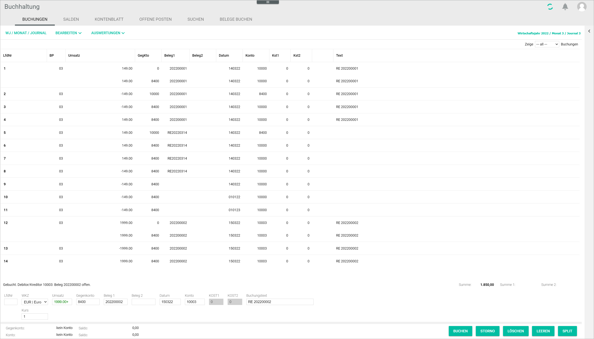

[!!User Interface bookings](../UserInterface/01a_Bookings.md)  
[!!User Interface select fiscal year](../UserInterface/00a_FiscalYear.md)   
[!!User Interface FY/MONTH/JOURNAL](../UserInterface/00_Book.md#fymonthjournal)  

# Create a manual booking

Even though the system usually books transactions automatically through the automated functions across the different modules, the *Accounting* module also allows to record bookings manually. In some cases, it may be necessary to record transactions manually when a transaction has been performed but not yet recorded, for example a cash payment or an issued invoice.

 > [Info] It is essential to select the correct booking period, that is, the correct fiscal year, month and journal, before making a manual booking. For detailed information, see [Select fiscal year](./01_SelectFiscalYear).

#### Prerequisites

- The accounting is configured via the configuration wizard, see [Run the accounting wizard](../Integration/01_RunAccountingWizard.md).
- A valid fiscal year is created, see [Create a fiscal year](../Integration/04_ManageFiscalYear.md#create-a-fiscal-year).
- A fiscal year is selected, see [Select fiscal year](./01_SelectFiscalYear.md).

#### Procedure

*Accounting > Select fiscal year > Book > Tab BOOKINGS*

1. Select the appropriate currency for the booking in the *Currency code* drop-down list.

  > [Info] The booking numbers must be sequential and are added by the system automatically.

2. Enter a value in the *Turnover* field.

3. Enter an account number in the *Contra account* field.

  > [Info] When you start typing in an account number, a context menu is displayed. You can also select the appropriate option from the menu.

4. Enter the date for the manual booking in the *Date* field. Date format must be DDMMYY.

5. Enter an account number in the *Account* field.

  > [Info] Note that the fields *Contra account*, *Date* and *Account* must be filled out to be able to create a booking.

6. Enter any other relevant booking information in the corresponding fields.

  > [Info] Even though it is not compulsory, it is highly recommended to fill in the *Receipt 1* field, as the system identifies and groups together any subsequent bookings taking this field as reference, for example for an invoice settlement or a credit note in case of refund.

7. Click the [BOOK] button.  
A message above the input line confirms that the booking is recorded. The newly created manual booking is displayed in the bookings list.

  
