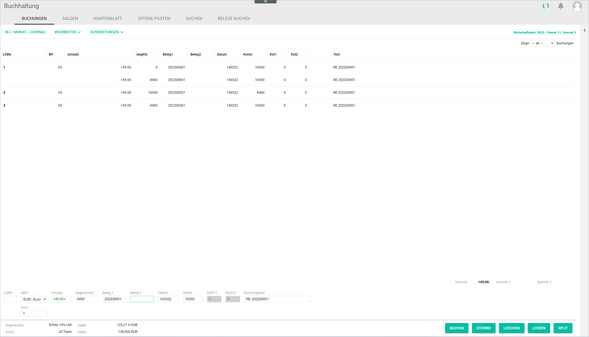

[!!User interface Select fiscal year](../UserInterface/00a_FiscalYear.md)
[!!User interface Postings header](../UserInterface/01_Header.md)
[!!User interface Postings](../UserInterface/01a_Bookings.md)  

# Create a manual posting

Even though a lot of transactions can be posted automatically through the automated functions across the different modules, manual record postings are still necessary.

> [Info] It is essential to select the correct accounting period, that is, the correct fiscal year, month and journal, before making a manual posting. For detailed information, see [Select fiscal year](./01_SelectFiscalYear.md).

#### Prerequisites

A fiscal year has been selected, see [Select fiscal year](./01_SelectFiscalYear.md).

#### Procedure

*Accounting > Post > Tab POSTINGS*

1. If necessary, click the *Currency code* drop-down list and select the appropriate currency for the posting. All available currencies are displayed in the list. By default, the base currency is preselected.

2. Enter the posting amount in the *Turnover* field. This field is mandatory.

    > [Info] The fields *Turnover*, *Contra account*, *Date* and *Account* must be filled to create a manual posting.

3. Enter an account number in the *Contra account* field.

    > [Info] After you have entered at least two numbers in the field, a list is displayed below the field with all accounts matching the entry. You can also select the corresponding account in the list.

4. Enter a reference number, usually the invoice number, in the *Receipt 1* field.

5. Enter the date for the manual posting in the *Date* field. The valid date format is *DDMMYY*.

6. Enter an account number in the *Account* field.

    > [Info] After you have entered at least two numbers in the field, a list is displayed below the field with all accounts matching the entry. You can also select the corresponding account in the list.

7.  If desired, enter any other relevant manual posting information in the corresponding fields, for example the detailed description of the transaction background or the cost center/object number in case you work with cost accounting.

8. Click the [POST] button.  
    The manual posting is created. The notice "Posted." is displayed above the input line. The manual posting is displayed in the postings list.
