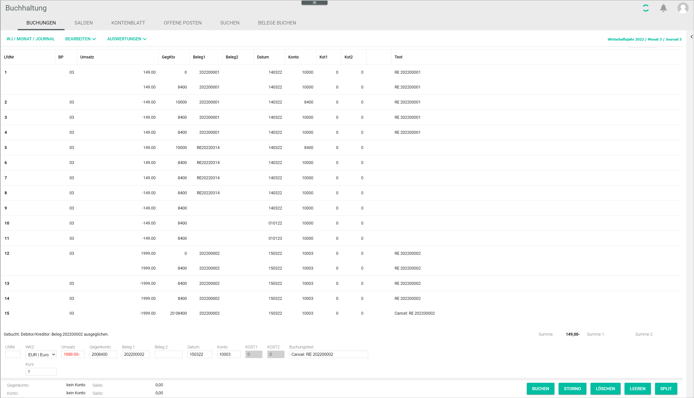

[!!User Interface bookings](../UserInterface/01a_Bookings.md)  
[!!User Interface open items](../UserInterface/01d_OpenItems.md)   

# Cancel a booking

You can cancel a booking, for example, if an invoice has been mistakenly booked to a wrong account or a booking must be corrected.   
Once an invoice has been issued and booked, it cannot be simply deleted for legal reasons. The incorrect invoice must be cancelled, recorded as reverse booking in the system, and a new correct booking must be recorded, if necessary.   
When cancelling a posting, a copy of the original posting with the negative turnover amount is created.

#### Prerequisites

- A fiscal year has been selected, see [Select fiscal year](./01_SelectFiscalYear.md).
- At least one posting has been created, see [Create a manual posting](./04_CreateManualBooking.md).

#### Procedure

*Accounting > Select fiscal year > Book > Tab BOOKINGS*

1. Select the posting to be cancelled in the postings list.
  The posting details are displayed in the input line fields.

2. Click the [CANCEL] button.   
  A new posting with a negative turnover amount of the posting to be cancelled is created. The negative posting is displayed in the postings list. The posting text **Cancel** is displayed in the *Text* column for this posting.
   
  > [Info] The open item created by the original posting is automatically cleared in the *OPEN ITEMS* tab by the cancellation posting.  

  
