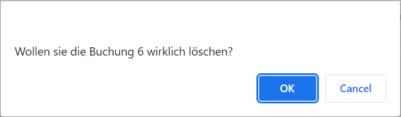

[!!User interface Postings header](../UserInterface/01_Header.md)  
[!!User interface Postings](../UserInterface/01a_Bookings.md)  

# Delete postings

You can delete postings that are no longer needed, for example, if a posting is faulty.

It is possible to delete a single posting or to delete multiple postings at once. Bear in mind, however, that the postings to be deleted must be unprocessed, as postings that have already been processed cannot be deleted. For detailed information, see [Process postings](./07_ProcessBookings.md).

## Delete a single posting

Delete a single posting from the postings list.

#### Prerequisites

- A fiscal year has been selected, see [Select fiscal year](./01_SelectFiscalYear.md).
- At least one posting has been created, see [Create a manual posting](./04_CreateManualBooking.md).

#### Procedure

*Accounting > Post > Tab POSTINGS*

1. Select the posting to be deleted in the postings list.  
    The posting details are displayed in the input line fields.

    > [Caution] **Loss of data**   
    Deleting will permanently remove the selected data. The deletion cannot be undone and the deleted data cannot be restored.       
    Problems may occur due to unresolved dependencies.   
    Make sure you really want to delete the selected data.

2. Click the [DELETE] button.  
    A confirmation window is displayed.

    

3. Click the [OK] button to confirm the deletion.  
    The posting has been deleted. The notice "Posting deleted!" is displayed above the input line. The posting has been removed from the postings list.

## Delete multiple postings

Delete several postings simultaneously from the postings list.

#### Prerequisites

- A fiscal year has been selected, see [Select fiscal year](./01_SelectFiscalYear.md).
- Several postings have been created, see [Create a manual posting](./04_CreateManualBooking.md).

#### Procedure

*Accounting > Post > Tab POSTINGS*

1. Click the [EDIT] button in the header above the postings list.  
    A context menu is displayed.

    

2. Click the *Delete...* menu entry in the context menu.     
    The *Delete postings* window is displayed.

    

3. Click the *Journal* drop-down list and select the journal where the postings to be deleted are recorded. All journals where postings are recorded are displayed in the list.

4. Enter the number range of the postings to be deleted in the *Seq. numbers* field.

    > [Caution] **Loss of data**   
    Deleting will permanently remove the selected data. The deletion cannot be undone and the deleted data cannot be restored.       
    Problems may occur due to unresolved dependencies.   
    Make sure you really want to delete the selected data.

5. Click the [DELETE] button.   
    The selected postings have been deleted.

6. Press F5 to initialize the Core1 Platform and to apply the changes.  
    The deleted postings have been removed from the postings list.
