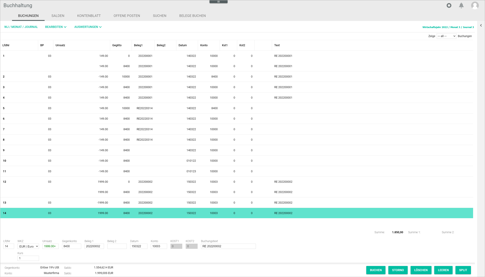
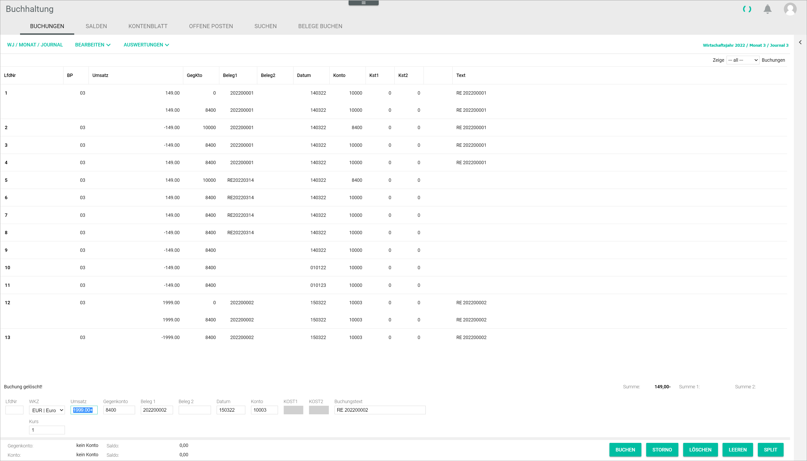
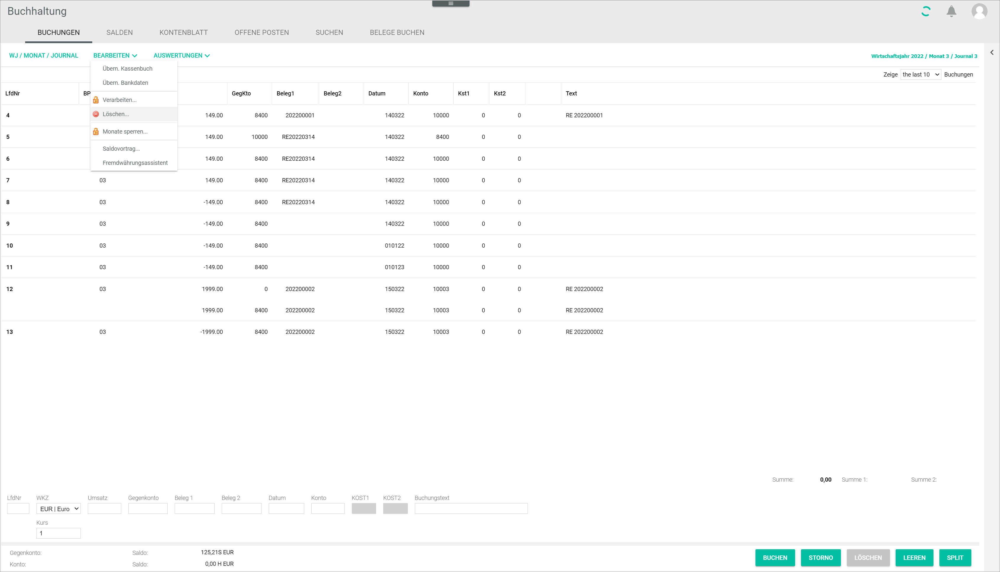
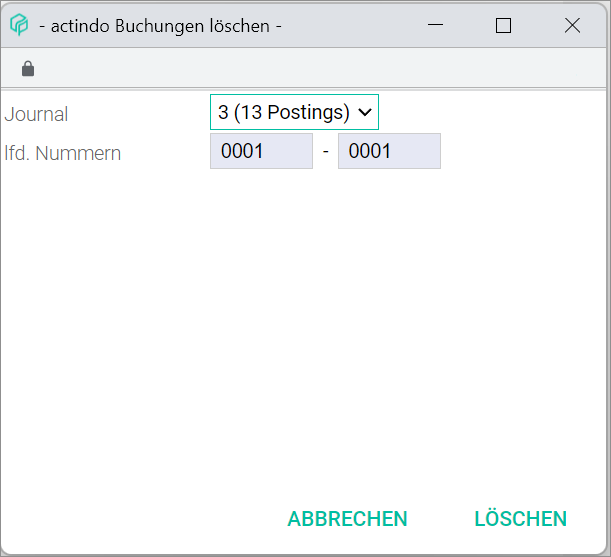
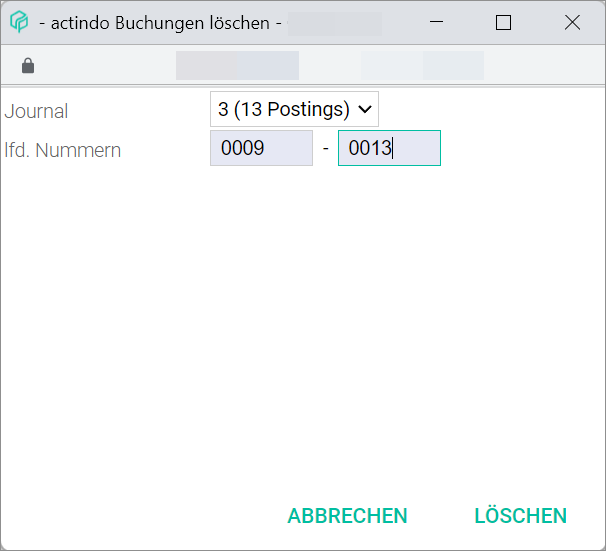

[!!User Interface bookings](../UserInterface/01a_Bookings.md)  
[!!User Interface delete](../UserInterface/01_Book.md#delete)  

# Delete bookings

You can delete postings that are no longer needed, for example, if a posting is faulty.
It is possible to delete a single posting or to delete multiple postings at once. Bear in mind, however, that the postings to be deleted must be unprocessed, as postings that have already been processed cannot be deleted. For detailed information, see [Process postings](./07_ProcessBookings.md). 

## Delete a single booking

#### Prerequisites

- A fiscal year has been selected, see [Select fiscal year](./01_SelectFiscalYear.md).
- A booking has been created, see [Create a manual booking](./04_CreateManualBooking.md).

#### Procedure

*Accounting > Select fiscal year > Book > Tab BOOKINGS*

1. Select the posting to be deleted in the postings list.
  The posting details are displayed in the input line fields.

2. Click the [DELETE] button.  
A confirmation window is displayed.

  > [Warning] Be aware that the selected posting will be deleted permanently.

3. Click the [OK] button to confirm the deletion.  
The posting has been deleted. The notice "Posting deleted!" is displayed above the input line. The posting is removed from the postings list. 

  

## Delete multiple bookings

#### Prerequisites

- A fiscal year has been selected, see [Select fiscal year](./01_SelectFiscalYear.md).
- Multiple bookings have been created, see [Create a manual booking](./04_CreateManualBooking.md).

#### Procedure

*Accounting > Select fiscal year > Book > Tab BOOKINGS*

2. Click the *Delete...* menu entry in the context menu.     
  The *Delete postings* window is displayed.

  

3. Click the *Journal* drop-down list and select the journal where the postings to be deleted are recorded. All journals where postings are recorded are displayed in the list.

4. Enter the number range of the postings to be deleted in the *Seq. numbers* field.

  > [Warning] Be aware that the selected postings will be deleted permanently.

  

4. Click the [DELETE] button.   
The selected bookings are deleted and will no longer be displayed in the bookings list.

> [Info] It may be necessary to click on a different tab and switch back the *BOOKINGS* tab to display the changes in the bookings list.
