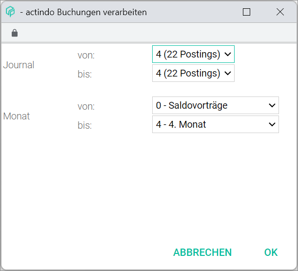

[!!User Interface process](../UserInterface/01_Book.md#process)  
[!!User Interface bookings](../UserInterface/01a_Bookings.md)  

# Process bookings

The *Process* menu entry of the *EDIT* context menu in the *BOOKINGS* tab allows to process bookings entered in several booking periods simultaneously.

All business transactions are recorded in the corresponding booking period (month and journal) as they occur. When the accounting for a particular period is finalized, the journal entries must be processed, that is, booked in the general ledger.

Once the bookings have been processed, they cannot be changed or deleted any more. If any corrections are necessary, the bookings must be first cancelled. For detailed information about cancelling a booking, see [Cancel a booking](./05_CancelBooking.md). Then, a new correct booking must be created. For detailed information about creating a manual booking, see [Create a manual booking](./04_CreateManualBooking.md).  

Nevertheless, new bookings can be entered in a booking period that has already been processed. To avoid this, it is also possible to lock one or several months for bookings by clicking the *Lock months* menu entry in the *EDIT* context menu. For detailed information about locking months, see [Lock a period for bookings](./08_LockPeriodBookings.md).

#### Prerequisites

- The accounting is configured via the configuration wizard, see [Run the accounting wizard](../Integration/01_RunAccountingWizard.md).
- A valid fiscal year is created, see [Create a fiscal year](../Integration/04_ManageFiscalYear.md#create-a-fiscal-year).
- A fiscal year is selected, see [Select fiscal year](./01_SelectFiscalYear.md).
- A booking or multiple bookings have been created, see [Create a manual booking](./04_CreateManualBooking.md).

#### Procedure

*Accounting > Select fiscal year > Book > Tab BOOKINGS > Context menu EDIT > Menu entry Process*

1. Click the *Process* menu entry in the *EDIT* context menu.   
A window opens for you to select the booking period (journal and month range) of the bookings to be processed.

  

2. Select the journal(s) where the bookings to be processed are recorded in the *Journal* drop-down lists.

3. Select the month(s) where the bookings to be processed are recorded in the *Month* drop-down lists.

  > [Info] Be aware that, once the bookings have been processed, they cannot be changed or deleted any more.

4. Click the [OK] button.   
A confirmation window is displayed. The selected bookings are processed. The [DELETE] button is now greyed out.
