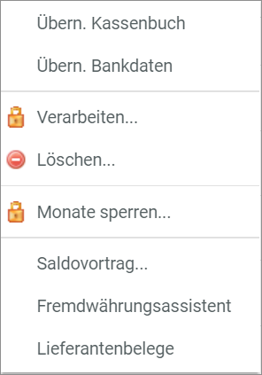
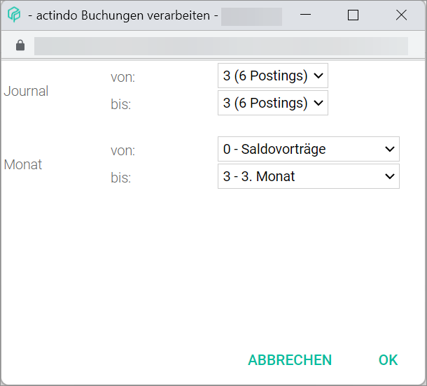

[!!User Interface Process](../UserInterface/01_Book.md#process)  
[!!User Interface Bookings](../UserInterface/01a_Bookings.md)  

# Process bookings

All business transactions are recorded in the corresponding posting period (month and journal) as they occur. When the accounting for a particular period is finalized, the journal entries must be processed, that is, posted in the general ledger.   

You can process postings entered in several booking periods simultaneously. Once the postings have been processed, they cannot be changed or deleted any more. If any corrections are necessary, the postings must be first cancelled and then, a new correct booking must be created. For detailed information about cancelling and creating a posting, see [Cancel a posting](./05_CancelBooking.md) and [Create a manual booking](./04_CreateManualBooking.md).  

Nevertheless, new postings can be entered in a posting period that has already been processed. To avoid this, it is also possible to lock one or several months for postings. For detailed information about locking months, see [Lock a period for postings](./08_LockPeriodBookings.md).

#### Prerequisites

- A fiscal year has been selected, see [Select fiscal year](./01_SelectFiscalYear.md).
- At least one posting has been created, see [Create a manual booking](./04_CreateManualBooking.md).

#### Procedure

*Accounting > Select fiscal year > Book > Tab BOOKINGS*

1. Click the [EDIT] button in the header above the postings list.
A context menu is displayed.

  

2. Click the *Process...* menu entry in the context menu.     
  The *Process postings* window is displayed.

  

3. Click the *Journal from* and the *Journal to* drop-down lists and select the journals where the bookings to be processed are recorded.

  > [Info] If you want to process only the postings from a single journal, select the same journal in both drop-down lists.

4. Click the *Month from* and the *Month to* drop-down lists and select the months where the bookings to be processed are recorded.

  > [Info] If you want to process only the postings from a single month, select the same month in both drop-down lists.

  > [Info] Be aware that, once the postings have been processed, they cannot be changed or deleted anymore.

5. Click the [OK] button.   
The selected postings have been processed. A confirmation window with the notice *Postings processed!* is displayed.
